<p align="center">
 
 <h1 align="center">Qt</h1>
 <p align="center"><b>-------</b></p>
</p>


<div align=center>


[](LICENSE)


<div align=left>
<!-- 顶部至此截止 -->


[toc]

# 项目编号及备注

| 项目名                                                       | 说明                                                         |
| ------------------------------------------------------------ | ------------------------------------------------------------ |
|                                                              |                                                              |
|                                                              |                                                              |
|                                                              |                                                              |
|                                                              |                                                              |
|                                                              |                                                              |
|                                                              |                                                              |
|                                                              |                                                              |
| 010_Layout                                                   | 【窗口布局】借助登录窗口的布局，说明 Qt 中布局的相关内容：弹簧，栅格布局，如何删除间隙等。 |
| 011_Control                                                  | Qt 中控件的介绍                                              |
| [013_Control_Item_Widgets](https://github.com/NekoSilverFox/Qt/tree/main/013_Control_Item_Widgets) | Qt 中控件的介绍                                              |
| [014_Control_Other](https://github.com/NekoSilverFox/Qt/tree/main/014_Control_Other) | [控件 Combo Box, Qlabel 显示图片等](https://github.com/NekoSilverFox/Qt/commit/027c02a4696cd13e4e66b157701b349088461d25) |
| [020_MyWidget](https://github.com/NekoSilverFox/Qt/tree/main/020_MyWidget) | 自定义控件，实现水平条与数字显示联动                         |
| [025_Qt_Event](https://github.com/NekoSilverFox/Qt/tree/main/025_Qt_Event) | Qt 中的事件过滤器                                            |
| [030_QPainter](https://github.com/NekoSilverFox/Qt/tree/main/030_QPainter) | Qt 中的绘图设备                                              |
| [031_QPainterDevice](https://github.com/NekoSilverFox/Qt/tree/main/031_QPainterDevice) | 通过读取文件中存储的命令进行绘图                             |
| [040_QFile](https://github.com/NekoSilverFox/Qt/tree/main/040_QFile) | Qt 中的文件操作                                              |
| [045_UDP_Demo](https://github.com/NekoSilverFox/Qt/tree/main/045_UDP_Demo) | UDP 通讯小案例（UDP 套接字的使用）                           |
| [047_QTcpFile](https://github.com/NekoSilverFox/Qt/tree/main/047_QTcpFile) | 传输文件案例（TCP 套接字的使用）                             |
| [050_MySelfQQ](https://github.com/NekoSilverFox/Qt/tree/main/050_MySelfQQ) | 实现类似 QQ 的聊天软件                                       |
|                                                              |                                                              |
|                                                              |                                                              |


# 简介

- widget.hpp

```c++
#ifndef WIDGET_H
#define WIDGET_H

#include <QWidget>

class Widget : public QWidget  // Widget 继承 QWidget
{
    Q_OBJECT  // Q_OBJECT 宏，写了这个宏就支持了 Qt 中的信号和槽机制

public:
    Widget(QWidget *parent = nullptr); // 构造函数
    ~Widget();
};
#endif // WIDGET_H

```


- main.cpp

```c++
#include "widget.h"

#include <QApplication>  // 包含头文件 - 应用程序

/** 程序入口
 * @brief main
 * @param argc 命令行变量数量
 * @param argv 命令行变量数组
 * @return
 */
int main(int argc, char *argv[])
{
    QApplication a(argc, argv);  // 应用程序对象 a，在 Qt 中有且仅有一个
    Widget w;  // 窗口对象
    w.show();  // 弹出窗口（窗口默认不会弹出）

    return a.exec(); // a.exec() 进入消息循环机制，避免程序一闪而过，类似死循环
}

```


## .pro 介绍

```makefile
QT       += core gui  # Qt 中包含的模块

greaterThan(QT_MAJOR_VERSION, 4): QT += widgets  # 大于 4 版本；包含 widget 模块（Qt5 之前的版本 widget 是包含在 GUI 的）

CONFIG += c++17

# You can make your code fail to compile if it uses deprecated APIs.
# In order to do so, uncomment the following line.
#DEFINES += QT_DISABLE_DEPRECATED_BEFORE=0x060000    # disables all the APIs deprecated before Qt 6.0.0

# 源文件
SOURCES += \
    main.cpp \
    widget.cpp

HEADERS += \
    widget.h

# Default rules for deployment.
qnx: target.path = /tmp/$${TARGET}/bin
else: unix:!android: target.path = /opt/$${TARGET}/bin
!isEmpty(target.path): INSTALLS += target

```


## 命名规范和快捷键

- 类名首字母大写，驼峰式命名（首字母大写）
- 函数、变量首字母小写，连接首字母大写


**快捷键：**

- Ctrl + R 运行
- Ctrl + B 编译
- Ctrl + F 查找
- F1 帮助文档
- Ctrl + 滚轮  字体缩放
- Crrl + I 自动对齐
- Ctrl + Shift + 上下 整行移动
- F4 同名之间的 .h .cpp 切换


**Qt 中所有的窗口叫 Widget**


# 控件

## Weight 窗口

| 函数名                      | 描述                                           |
| --------------------------- | ---------------------------------------------- |
| setWindowTitle(QStrging)    | 设置窗口标题                                   |
| setFixedSize(hight, weight) | 设置固定的窗口大小（设置之后窗口不能人为缩放） |
| show()                      | 显示此窗口                                     |
|                             |                                                |


**信号和槽**

| 槽    | 描述     |
| ----- | -------- |
| close | 关闭窗口 |
|       |          |
|       |          |


## QPushButton

| 函数名                | 描述           |
| --------------------- | -------------- |
| setParent(obj)        | 设置按钮的父类 |
| move(x, y)            | 移动按钮       |
| resize(hight, weight) | 设置按钮大小   |
| setText(QString)      | 设置按钮文本   |


| 信号    | 描述 |
| ------- | ---- |
| clicked | 点击 |
|         |      |
|         |      |


# 信号和槽

## connect

通过 `connect(sender, signal, receiver, slot)` 可以连接信号和槽，注意**所有的参数都应该是地址**

- `sender`：发出信号的对象
- `signal`：发送对象发出的信号
- `receiver`：接收信号的对象
- `slot`：接收对象在接收到信号之后所需要调用的函数（槽函数）


**自定义信号和槽需要注意的事项：**

- 发送者和接收者都需要是 QObject的子类（当然，槽函数是全局函数、Lambda 表达式等无需接收者的时候除外）；
- 信号和槽函数返回值是 void
- 信号只需要声明，不需要实现
- 槽函数需要声明也需要实现
- 槽函数是普通的成员函数，作为成员函数，会受到 public、private、protected 的影响；
- **使用 `emit` 在恰当的位置发送信号；**
- 使用`connect()`函数连接信号和槽。
- 任何成员函数、static 函数、全局函数和 Lambda 表达式都可以作为槽函数
- 信号槽要求信号和槽的参数一致，所谓一致，是参数类型一致。
- 如果信号和槽的参数不一致，允许的情况是，槽函数的参数可以比信号的少，即便如此，槽函数存在的那些参数的顺序也必须和信号的前面几个一致起来。这是因为，你可以在槽函数中选择忽略信号传来的数据（也就是槽函数的参数比信号的少）。


## 函数指针

但是由于有两个重名的自定义信号和自定义的槽，直接连接会报错，所以需要利用函数指针来指向函数地址，然后再做连接

比如对于一个类中的函数：

```c++
class TheClass
{
public:
  
/* 信号 */
signals:
  
  void funcSignal(QString arg);

/* 槽 */
public slots:
  void funcSloat(QString arg);
  
}
```


**函数指针的写法：**

`函数返回值 (函数所属类::*函数指针名称)(函数参数列表) = &类::函数名;`

简单来说就是定义一个指针指向函数地址


比如对于信号函数 `void funcSignal(QString arg);` **函数指针应该是这样的：**

```c++
void (TheClass::*class_signal)(QString) = &TheClass::funcSignal;
```


## 总结

- 一个信号可以连接多个槽
- 多个信号是可以连接同一个槽
- 信号可以连接信号
- **信号和槽的参数类型必须一一对应**，但**信号参数的个数可以多于槽的个数**（反之不可）
- 信号与槽直连的连接可以断开（`disconnect(发送方, 信号, 接收方, 槽)`）


# lambda 表达式

C++11中的Lambda表达式**用于定义并创建匿名的函数对象**，以简化编程工作。首先看一下Lambda表达式的基本构成：

`[函数对象参数](操作符重载函数参数) mutable -> 返回值 {函数体}`

```c++
[capture](parameters) mutable ->return-type
{
	statement
}
```


**`[]` 里的函数对象参数有以下几种：**

- `空` - 没有使用任何函数对象参数
- `=` - 函数体内可以使用**Lambda所在作用范围内所有可见的局部变量（包括Lambda所在类的this）**，并且是**==值传递方式==**（相当于编译器自动为我们按值传递了所有局部变量）==最常用==
- `&` - 函数体内可以使用**Lambda所在作用范围内所有可见的局部变量（包括Lambda所在类的this）**，并且是**==引用传递方式==**（相当于编译器自动为我们按引用传递了所有局部变量）
- `this` - 函数体内可以使用Lambda所在类中的成员变量
- `变量名` - 将变量名按**值**进行传递。按值进行传递时，**函数体内不能修改传递进来的变量的拷贝**，因为默认情况下函数是const的。**要修改传递进来的变量的拷贝**，可以添加 `mutable` 修饰符
- `&a` - 将a按引用进行传递
- `a, &b` - 将a按值进行传递，b按引用进行传递
- `=, &a, &b` - 除a和b按引用进行传递外，其他参数都按值进行传递
- `&, a, b` - 除a和b按值进行传递外，其他参数都按引用进行传递


**操作符重载函数参数：**

标识重载的()操作符的参数，没有参数时，这部分可以省略。参数可以通过按值（如：(a,b)）和按引用（如：(&a,&b)）两种方式进行传递。


**可修改标示符：**

`mutable` 声明，这部分可以省略。按值传递函数对象参数时，加上 `mutable` 修饰符后，可以修改按值传递进来的拷贝（**注意是能修改拷贝，而不是值本身**）。


**函数返回值：**

`-> 返回值类型`，标识函数返回值的类型，当返回值为 void，或者函数体中只有一处 return 的地方（此时编译器可以自动推断出返回值类型）时，这部分可以省略。


**函数体：**

{}，标识函数的实现，这部分不能省略，但函数体可以为空。


**在使用 lambda 表达式进行信号和槽链接时，要注意**：

```c++
    /* 做信号和槽连接，默认内部变量是加锁的，也就是只读状态，如果在内部进行修改，那么程序会崩溃 */
    connect(btn3, &QPushButton::clicked,
            this, [&](){
        btn3->setText("mutable 叒改名惹！");
    });
```

所以推荐使用 `[=](){}` 而不是 `[&](){}`


**lambda表达式的调用：**

- `[](){}` 仅仅是 lambda
- `[](){}()` 才是**调用** lambda 表达式


# QMainWindow

QMainWindow是一个为用户提供**主窗口程序**的类，包含：

- **一个**菜单栏（menu bar）、
- 多个工具栏(tool bars)、工具栏就是有时候可以拖拽出来的那个东西
- 多个铆接部件(dock widgets)，也是浮动窗口
- **一个**状态栏(status bar)、
- **一个**中心部件(central widget)

这是许多应用程序的基础，如文本编辑器，图片编辑器等。

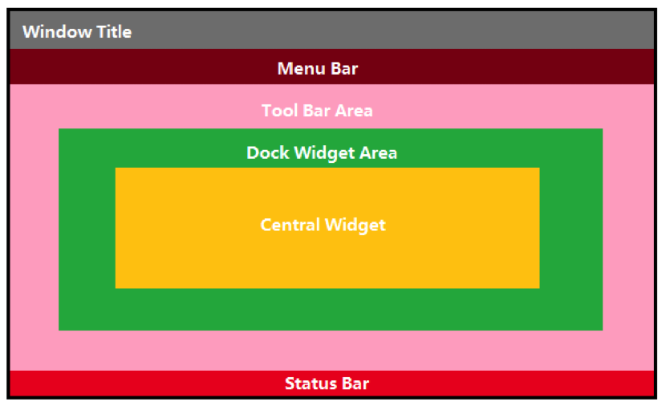

## 菜单栏

一个主窗口**最多只有==一个==菜单栏**。位于主窗口顶部、主窗口标题栏下面。

- 创建**菜单栏**，通过 QMainWindow 类的 `QMenuBar* menuBar() const` 函数获取主窗口菜单栏指针

    ```c++
    QMenuBar* menuBar = this->menuBat();
    ```

    
    
    - 创建**菜单**，调用 QMenu 的成员函数 `addMenu` 来添加菜单，他们拥有以下重载
    
        ```c++
        QAction* addMenu(QMenu * menu)
        QMenu* addMenu(const QString & title)
        QMenu* addMenu(const QIcon & icon, const QString & title)
        ```
    
        
    
        - 创建**菜单项**，调用 QMenu 的成员函数 `addAction` 来添加菜单项，他们拥有以下重载
    
            ```c++
            QAction* activeAction() const
              
            QAction* addAction(const QString & text)
              
            QAction* addAction(const QIcon & icon, const QString & text)
              
            QAction* addAction(const QString & text, const QObject * receiver, const char * member, const QKeySequence & shortcut = 0)
              
            QAction* addAction(const QIcon & icon, const QString & text, const QObject * receiver, const char * ember, 
            const QKeySequence & shortcut = 0)
            
            ```
    
            **Qt 并没有专门的菜单项类，只是使用一个QAction类，抽象出公共的动作。当我们把QAction对象添加到菜单，就显示成一个菜单项，添加到工具栏，就显示成一个工具按钮。用户可以通过点击菜单项、点击工具栏按钮、点击快捷键来激活这个动作。**
    


**总结：**

```c++
MainWindow::MainWindow(QWidget *parent)
    : QMainWindow(parent)
{
    this->resize(600, 400);

    /* 菜单栏 */
    QMenuBar* menuBar = this->menuBar();  // 菜单栏只能有一个
    this->setMenuBar(menuBar); // 将菜单栏放入到窗口中

    /* 菜单 */
    QMenu* menuFile = menuBar->addMenu("文件");  // 创建菜单
    QMenu* menuEdit = menuBar->addMenu("编辑");

    /* 菜单项 */
    QAction* actionNewFile = menuFile->addAction("新建文件");  // 添加菜单项
    menuFile->addSeparator();  // 添加分隔线
    QAction* actionOpenFile = menuFile->addAction("打开文件");
}
```


然后获得以下效果：

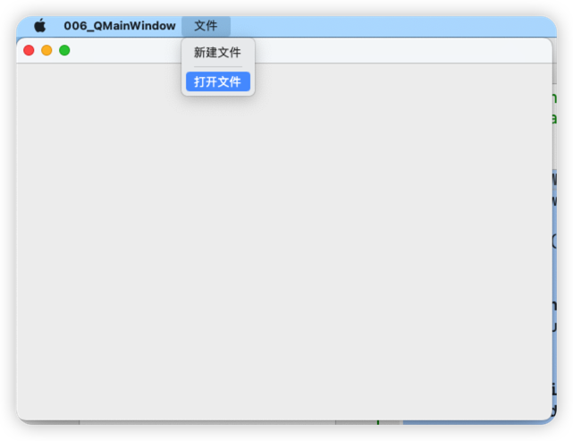


## 工具栏

主窗口的工具栏上可以有**==多个==**工具条，通常采用一个菜单对应一个工具条的的方式，也可根据需要进行工具条的划分。

- 通过 `new QToolBar(this);` 的方式创建一个 ToolBar

- 然后**直接调用 QMainWindow 类的 `this->addToolBar(QToolBar*)` 函数添加主窗口的工具条==对象==，每增加一个新的工具条都需要调用一次该函数。**

- 插入一个项属于工具条的动作，即在工具条上添加操作。通过 QToolBar 类的 `addAction` 函数添加。

- 工具条是一个可移动的窗口，它的停靠区域由 QToolBar 的 `allowAreas` 决定，包括：

    - `Qt::LeftToolBarArea`   停靠在左侧
    - `Qt::RightToolBarArea`   停靠在右侧
    - `Qt::TopToolBarArea`    停靠在顶部
    - `Qt::BottomToolBarArea`   停靠在底部
    - `Qt::AllToolBarAreas`   以上四个位置都可停靠

    

    **使用 `setAllowedAreas()`函数指定停靠区域：**

    ```c++
    toolBar->setAllowedAreas(Qt::LeftToolBarArea | Qt::RightToolBarArea)
    ```

    

    **【总开关】使用 `setMoveable(bool)` 函数设定工具栏的可[移动]性：**

    ```c++
    toolBar->setMoveable(false) //工具条不可移动, 只能停靠在初始化的位置上
    ```

    

    **【总开关】使用 `setFloatable(bool)` 函数设定工具栏的可[浮动]性：**

    ```c++
    toolBar->setFloatable(false);  // 设置工具栏不可浮动
    ```

    

**代码及结果：**

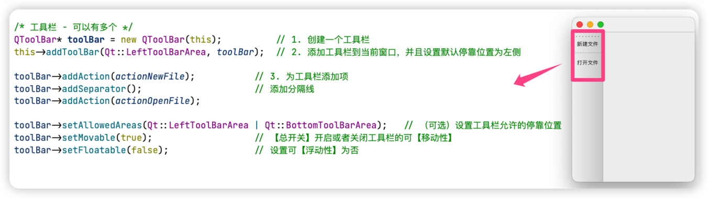


## 状态栏

**状态栏 `QStatusBar` 也只能最多有==一个==**

派生自 `QWidget` 类，使用方法与 `QWidget` 类似，`QStatusBar` 类常用成员函数：

| 函数名                                                       | 介绍                     |
| ------------------------------------------------------------ | ------------------------ |
| void addWidget(QWidget * widget, int stretch = 0)            | 添加小部件               |
| int  insertWidget(int index, QWidget * widget, int stretch = 0) | 插入小部件               |
| void removeWidget(QWidget * widget)                          | 删除小部件               |
| void addWidget(QWidget *widget, int stretch = 0);            | 在状态栏左侧添加一个控件 |
| void addPermanentWidget(QWidget *widget, int stretch = 0);   | 在状态栏右侧添加一个控件 |


代码及效果：

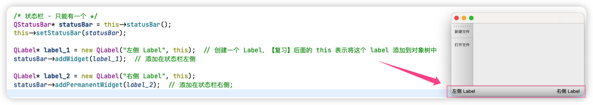


## 铆接部件


铆接部件 `QDockWidget`，也称==浮动窗口==，可以有==多个==。

**注意：铆接部件的位置是相对于核心部件的！围绕着核心部件的，而不是相对于整个窗口！**


**常用成员函数：**

| 函数名                                           | 介绍                  |
| ------------------------------------------------ | --------------------- |
| QDockWidget* dock = new QDockWidget(this);       | 创建一个铆接部件 dock |
| void setAllowedAreas(Qt::DockWidgetAreas areas); | 设置停靠位置          |

代码及效果见下一章


## 核心部件（中心部件）

核心部件顾名思义，只能有==一个==

除了以上几个部件（Widget），中心显示的部件都可以作为核心部件，例如一个记事本文件，可以利用QTextEdit做核心部件

```c++
/* 核心部件 - 只能有一个, 这里的 QTextEdit 控件作为举例使用 */
QTextEdit* textEdit = new QTextEdit(this);
this->setCentralWidget(textEdit);  // 【重点】将 TextEdit 设置为核心部件
```


**核心部件与铆接部件代码及结果：**
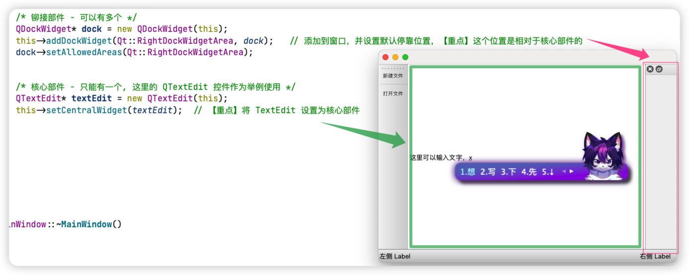


# UI 设计

**注意，我们在 ui 设计界面添加的窗体或者空间（也就是不是用过代码创建的），要通过 `ui->` 进行访问**

比如在 mainwindow.cpp 中访问我们为我们创建的按钮添加图标：

```c++
#include "mainwindow.h"
#include "ui_mainwindow.h"

MainWindow::MainWindow(QWidget *parent)
    : QMainWindow(parent)
    , ui(new Ui::MainWindow)
{
    ui->setupUi(this);

    ui->actionNewFile->setIcon(QIcon(":_文件路径__"));  // 通过 `ui->` 访问
}

MainWindow::~MainWindow()
{
    delete ui;
}


```


## 添加 Action

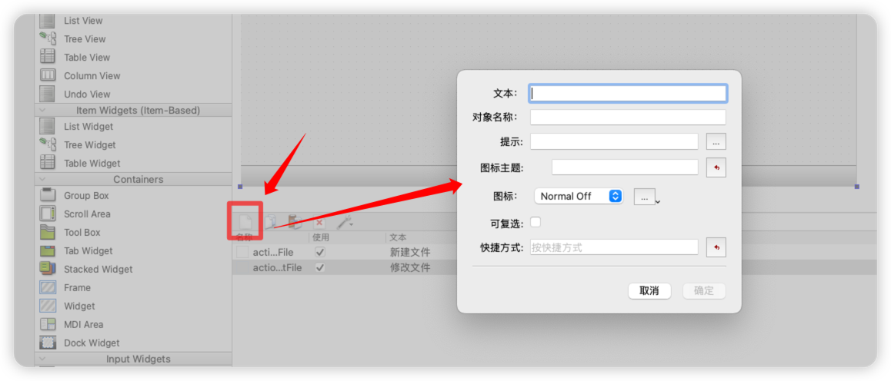


## 添加 ToolBar

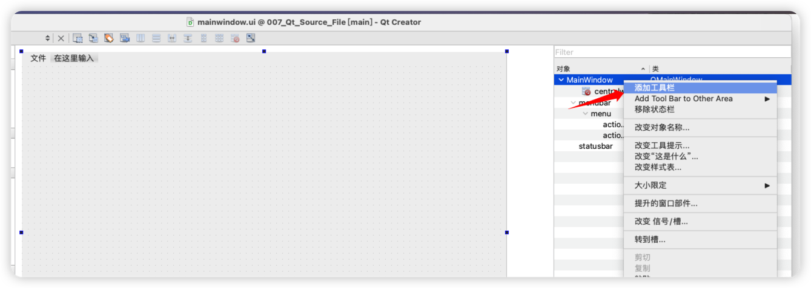

之后可以将创建好的 Action 直接拖拽到 ToolBar 中

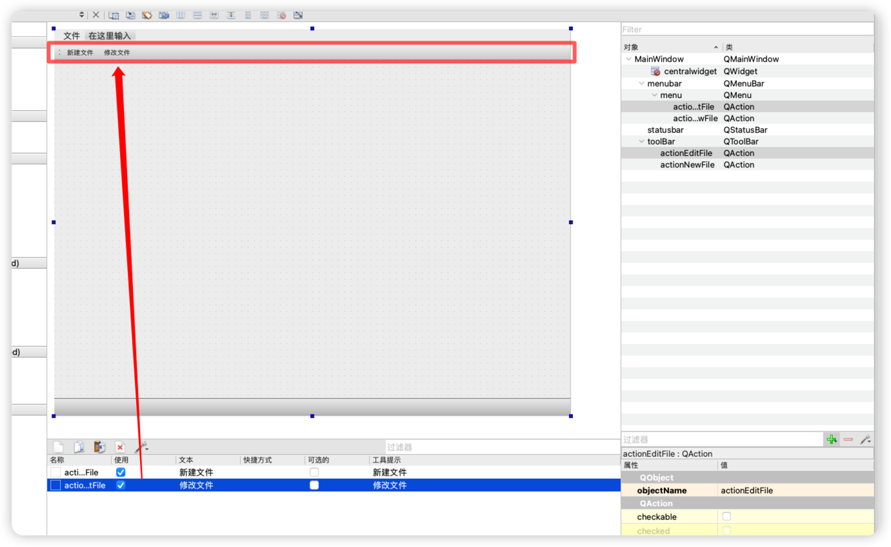


# 资源文件

**Qt 资源系统是一个跨平台的资源机制，用于将程序运行时所需要的资源以二进制的形式存储于可执行文件内部。**如果你的程序需要加载特定的资源（图标、文本翻译等），那么，将其放置在资源文件中，就再也不需要担心这些文件的丢失。也就是说，如果你将资源以资源文件形式存储，它是会编译到可执行文件内部。

使用 Qt Creator 可以很方便地创建资源文件。我们可以在工程上点右键，选择“添加新文件…”，可以在 Qt 分类下找到“Qt 资源文件”：


1. 添加 Qt 资源文件，这个文件是用于管理我们资源文件的

    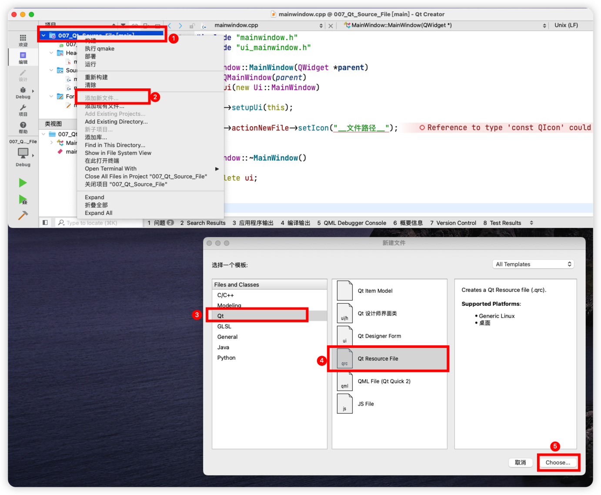

2. 为 Qt 资源文件起一个名字

    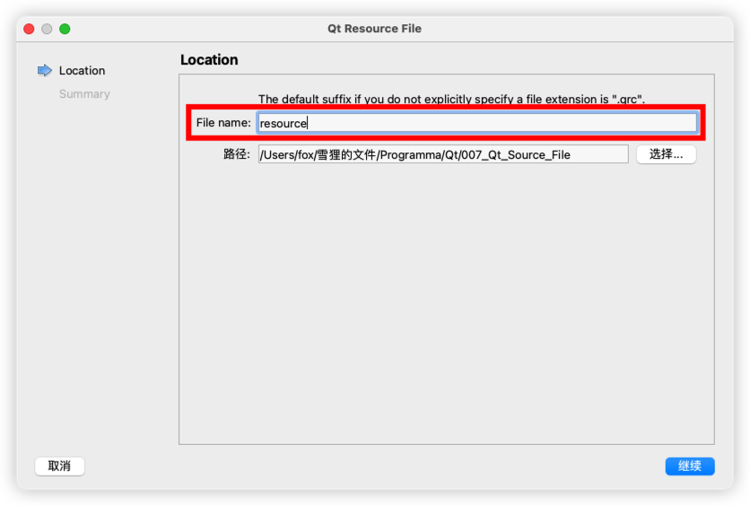

3. 以文本的形式打开刚刚创建的 `.qrc` 文件

    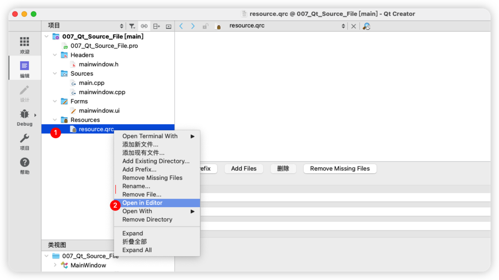

4. 将我们用到的资源（图片、视频等）放置在当前 Qt 工程的目录下

5. 添加前缀并且添加资源文件

    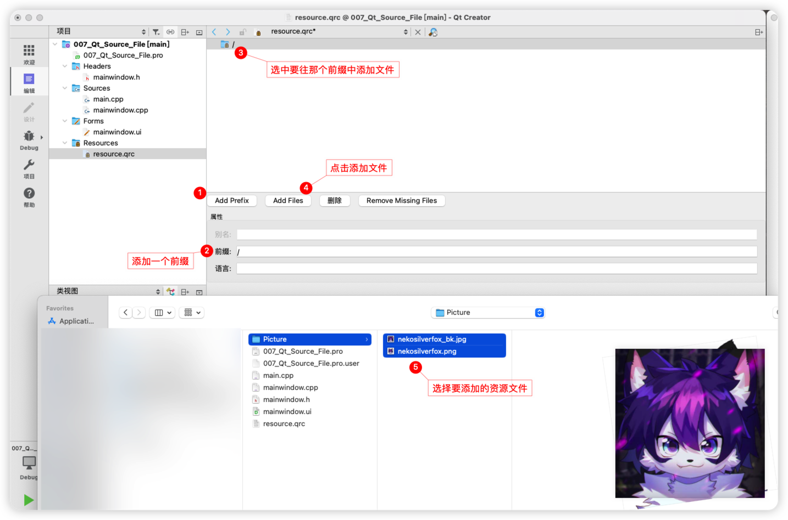

    

    **我们给这个文件取一个“别名”，以后就以这个别名来引用这个文件。使用别名的好处是，如果更改了文件名，代码中使用别名的地方不需要修改。具体做法是，选中这个文件，添加别名信息：**

    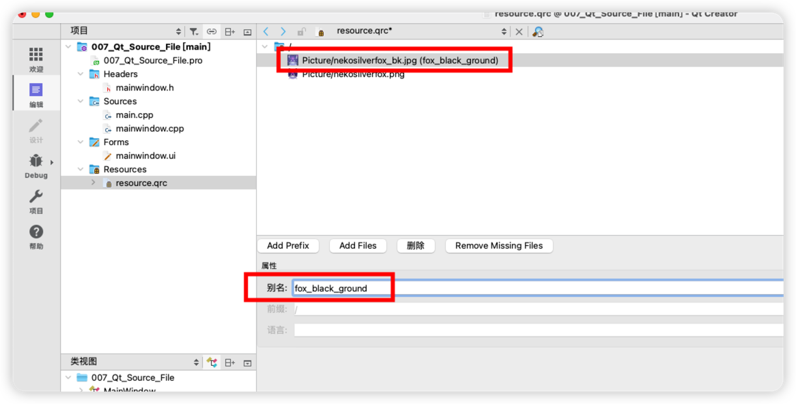

    

    添加后的资源文件将出现在 Qt 资源文件之下:

    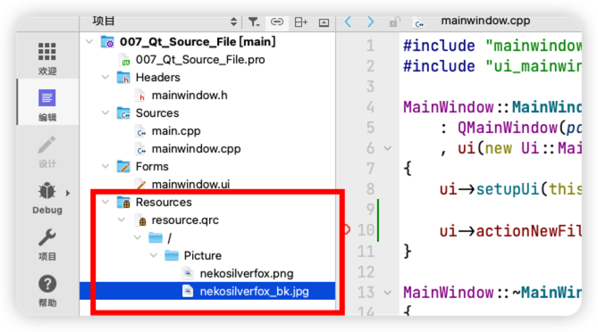

    

6. 使用资源文件

    要符合格式 `:前缀名/文件名`，我们可以直接右键文件拷贝使用

    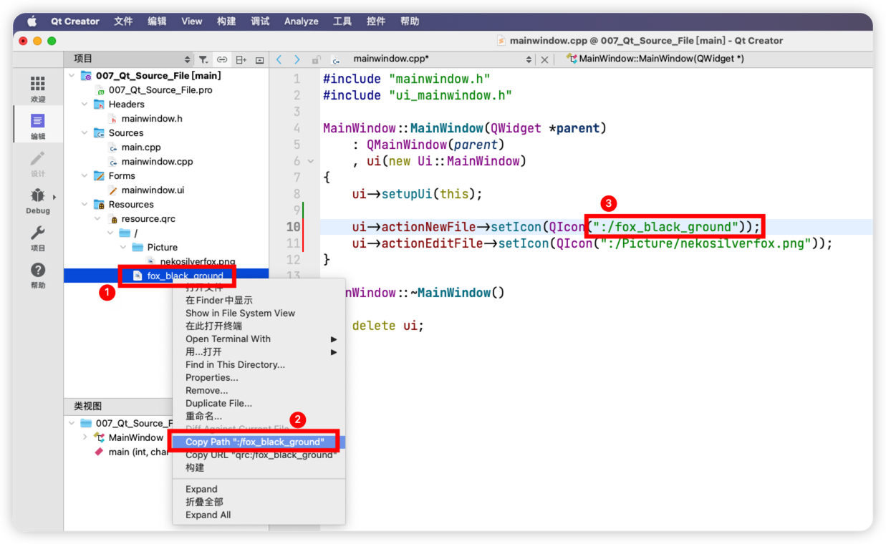

运行起来有以下效果：

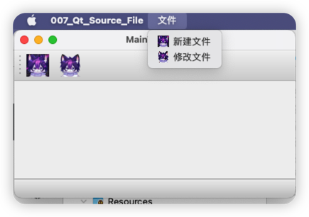


# 对话框 QDialog

对话框是 GUI 程序中不可或缺的组成部分。很多不能或者不适合放入主窗口的功能组件都必须放在对话框中设置。**对话框通常会是一个顶层窗口，出现在程序最上层，用于实现短期任务或者简洁的用户交互。**

Qt 中使用 QDialog 类实现对话框。就像主窗口一样，我们通常会设计一个类继承 QDialog。QDialog（及其子类，以及所有Qt::Dialog类型的类）的对于其 parent 指针都有额外的解释：**如果 parent 为 NULL，则该对话框会作为一个顶层窗口，否则则作为其父组件的子对话框（此时，其默认出现的位置是 parent 的中心）。顶层窗口与非顶层窗口的区别在于，顶层窗口在任务栏会有自己的位置，而非顶层窗口则会共享其父组件的位置。**

**对话框分为==模态对话框==和==非模态对话框==。**


==模态与非模态的实现：==

- 使用`QDialog::exec()`实现**应用程序级别**的模态对话框

- 使用`QDialog::open()`实现**窗口级别**的模态对话框

- 使用`QDialog::show()`实现**非模态对话框**。


- **模态对话框**，在==[栈]==上创建，对话框弹出之后会通过 `.exec()` 阻塞，**会阻塞同一应用程序中其它窗口的输入**。

    模态对话框很常见，比如“打开文件”功能。你可以尝试一下记事本的打开文件，当打开文件对话框出现时，我们是不能对除此对话框之外的窗口部分进行操作的。

    - **应用程序级别的模态**

        当该种模态的对话框出现时，用户必须首先对对话框进行交互，直到关闭对话框，然后才能访问程序中其他的窗口

        

    - **窗口级别的模态**

        该模态仅仅阻塞与对话框关联的窗口，但是依然允许用户与程序中其它窗口交互。窗口级别的模态尤其适用于**多窗口模式**

        

- 与此相反的是**非模态对话框**，在==[堆]==上创建，对话框通过 `.show()` 弹出，弹出后依旧可以操作其他窗口。

    例如查找对话框，我们可以在显示着查找对话框的同时，继续对记事本的内容进行编辑。

    > 如果对话框一闪而过：
    >
    > **show()函数不会阻塞当前线程，对话框会显示出来，然后函数立即返回，代码继续执行**。
    >
    > 所以注意，如果 dialog 是建立在栈上的，show()函数返回，MainWindow::open()函数结束，dialog 超出作用域被析构，因此对话框消失了。
    >
    > **所以非模态对话框要在[堆]上创建。**

    **注意：非模态对话框一定要通过 `dialog_2->setAttribute(Qt::WA_DeleteOnClose);`设置 Dialog 对话框在关闭时自动销毁对话框，并释放内存！如果不设置只会在 MainWindow 退出时才释放，这可能造成内存泄漏** 

    

## 自定义对话框

```c++
MainWindow::MainWindow(QWidget *parent)
    : QMainWindow(parent)
    , ui(new Ui::MainWindow)
{
    ui->setupUi(this);

    /* 我们使用 Lambda 表达式的形式弹出 Dialog对话框，并连接信号和槽 */
    connect(ui->actionopenDialog, &QAction::triggered,
            this, [=](){

        /** Dialog 对话框有两种：
         *  - 模态对话框：    在[堆]上创建，对话框弹出之后会通过 `.exec()` 阻塞，无法操作其他窗口
         *  - 非模态对话框：  在[栈]上创建，对话框通过 `.show()` 弹出，弹出后依旧可以操作其他窗口
         */

#if 0
        /* 模态对话框 */
        QDialog dialog_1(this);
        dialog_1.resize(80, 60);
        dialog_1.exec();  // 阻塞
#endif

        /* 非模态对话框 */
        QDialog* dialog_2 = new QDialog(this);  // 创建到堆上，不然 Lambda 表达式结束就会给释放了（窗口一闪而过）
        dialog_2->resize(100, 80);
        dialog_2->setAttribute(Qt::WA_DeleteOnClose);  // 【重点】设置 Dialog 对话框在关闭时释放内存！如果不设置只会在 MainWindow 退出时才释放，这可能造成内存泄漏
        dialog_2->show();


        qDebug() << "Lambda 表达式内部";

    }); // END_LAMBDA
}
```


## 消息对话框 QMessageBox

QMessageBox用于显示消息提示。我们一般会使用其提供的几个 static 函数：

| 名称                                                         | 介绍           |                                                              |
| ------------------------------------------------------------ | -------------- | ------------------------------------------------------------ |
| QMessageBox::`critical`(this, "[Title]错误！", "[Text]critical"); | 错误对话框     | 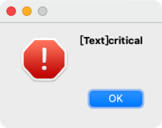 |
| QMessageBox::`warning`(this, "[Title]警告！", "[Text]warning"); | 警告对话框     | 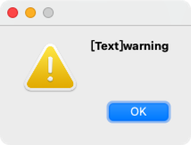 |
| QMessageBox::`information`(this, "[Title]信息！", "[Text]information"); | 信息对话框     | 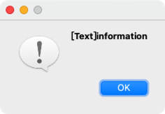 |
| QMessageBox::`about`(this, "about 函数", "text部分");        | 会弹出一段文字 | 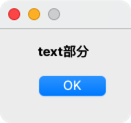 |
| **QMessageBox::`question`(this, "标题", "提示内容", QMessageBox::Save \| QMessageBox::Cancel, QMessageBox::Cancel)** | **询问对话框** | **参数为：**1. 父亲，2. 标题，3.提示内容， 4. 按键类型， 5. 关联回车按键（默认按哪个）<br />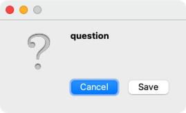<br />**返回**点击的按钮类型 |

示例代码：

```c++
    /* 标准对话框 QMessageBox 介绍（Static 成员）：*/
    connect(ui->actionQMessageBox, &QAction::triggered,
            this, [=](){
        QMessageBox::about(this, "static QMessageBox::about 函数", "text部分"); // 会弹出一段文字
        QMessageBox::aboutQt(this, "title部分");  // 会弹出 Qt 的声明

        QMessageBox::critical(this, "[Title]错误！", "[Text]critical");        // 错误对话框
        QMessageBox::warning(this, "[Title]警告！", "[Text]warning");          // 警告对话框
        QMessageBox::information(this, "[Title]信息！", "[Text]information");  // 信息对话框

        /* 询问对话框
         * 参数：1. 父亲，2. 标题，3.提示内容， 4. 按键类型， 5. 关联回车按键（默认按哪个）
         */
        if (QMessageBox::Save ==
                QMessageBox::question(this, "问题", "question", QMessageBox::Save | QMessageBox::Cancel, QMessageBox::Cancel))
        {
            qDebug() << "按键是 QMessageBox::Save";
        }
        else
        {
            qDebug() << "按键类型是 QMessageBox::Cancel";
        }


    }); // END_LAMBDA
```

QMessageBox类的 static 函数优点是方便使用，缺点也很明显：非常不灵活。我们只能使用简单的几种形式。为了能够定制QMessageBox细节，我们必须使用QMessageBox的属性设置 API。如果我们希望制作一个询问是否保存的对话框，我们可以使用如下的代码：

```c++
QMessageBox msgBox;
msgBox.setText(tr("The document has been modified."));
msgBox.setInformativeText(tr("Do you want to save your changes?"));
msgBox.setDetailedText(tr("Differences here..."));
msgBox.setStandardButtons(QMessageBox::Save
                          | QMessageBox::Discard
                          | QMessageBox::Cancel);
msgBox.setDefaultButton(QMessageBox::Save);
int ret = msgBox.exec();
switch (ret) 
{
case QMessageBox::Save:
    qDebug() << "Save document!";
    break;
case QMessageBox::Discard:
    qDebug() << "Discard changes!";
    break;
case QMessageBox::Cancel:
    qDebug() << "Close document!";
    break;
}

```

msgBox 是一个建立在栈上的QMessageBox实例。我们设置其

- 主要文本信息为“The document has been modified.”，
- informativeText 则是会在对话框中显示的简单说明文字。
- 下面我们使用了一个detailedText，也就是详细信息，当我们点击了详细信息按钮时，对话框可以自动显示更多信息。
- 我们自己定义的对话框的按钮有三个：保存、丢弃和取消。
- 然后我们使用了exec()是其成为一个模态对话框，根据其返回值进行相应的操作。


## 颜色对话框

- 包含头文件 `#include <QColorDialog>`

`QColor color = QColorDialog::getColor(QColor(0, 255, 255));`，调用系统对话框，获取颜色值

- 参数 1：默认选择的颜色值 (r, g, b)
- 返回一个 `QColor` 颜色值


**示例代码：**

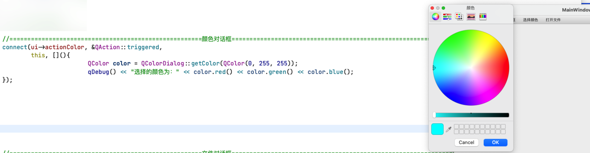


## 文件对话框

Qt 的标准对话框提供静态函数，用于返回一个模态对话框，包含头文件 `#include <QFileDialog>`

```c++
QString getOpenFileName(QWidget * parent = 0,									// 父窗口
                        const QString & caption = QString(),	// 对话框标题
                        const QString & dir = QString(),			// 对话框打开时的默认目录, “.” 代表程序运行目录
                        const QString & filter = QString(),		// 过滤器, 过滤器就是用于过滤特定的后缀名。如果我们使用“Image Files(*.jpg *.png)”，则只能显示后缀名是 jpg 或者 png 的文件。如果需要多个过滤器，使用“;;”分割，比如“JPEG Files(*.jpg);;PNG Files(*.png)”；
                        QString * selectedFilter = 0,					// 默认选择的过滤器；
                        Options options = 0)	// 对话框的一些参数设定。比如只显示文件夹等等，它的取值是enum QFileDialog::Option，每个选项可以使用 | 运算组合起来。
```

**QFileDialog::getOpenFileName()返回值是选择的文件路径。**我们将其赋值给 path。通过判断 path 是否为空，可以确定用户是否选择了某一文件。只有当用户选择了一个文件时，我们才执行下面的操作。

在saveFile()中使用的QFileDialog::getSaveFileName()也是类似的。使用这种静态函数，在 Windows、Mac OS 上面都是直接调用本地对话框，但是 Linux 上则是QFileDialog自己的模拟。这暗示了，如果你不使用这些静态函数，而是直接使用QFileDialog进行设置，那么得到的对话框很可能与系统对话框的外观不一致。这一点是需要注意的。


**示例代码：**

```c++
connect(ui->actionOpenFile, &QAction::triggered,
        this, [=](){
          QString path = QFileDialog::getOpenFileName(this, "打开文件狐", "/Users/fox/雪狸的文件", "(*.png *.jpg)");
          qDebug() << "选择的文件路径为：" << path;
        });
```


# 窗口布局

对于 Qt 中的窗口布局，建议使用 ==Containers -> Widget-> 自定义布局==。不建议使用 Latouts！

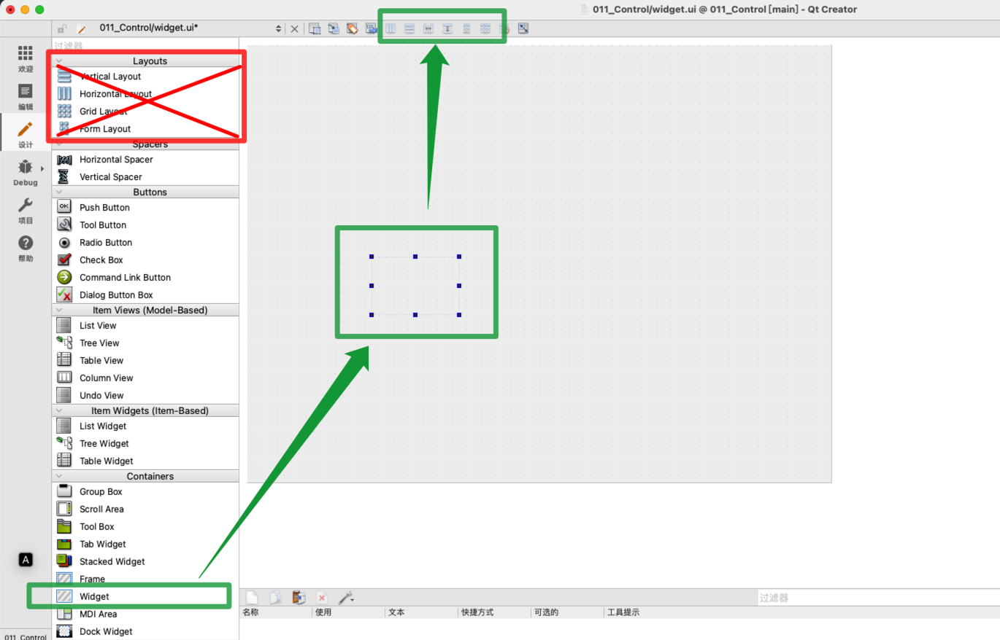


- **要想移除一个widget 上下的非常大的间隙，要将 ==sizePolicy -> 垂直策略 -> 设为Fixed==**

    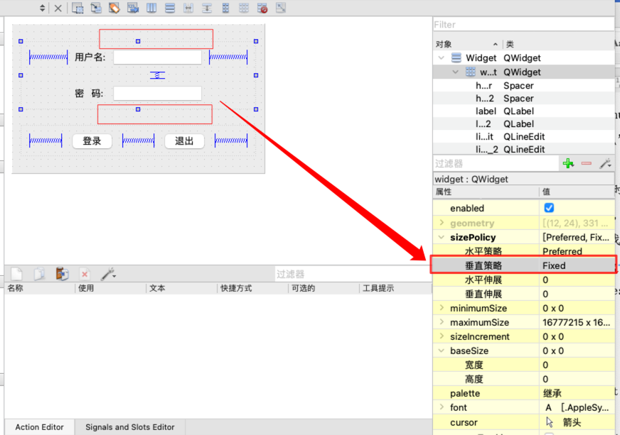
    
- **要想让 widget 保持==几行几列== 的均匀布局，点击上面的==栅格布局==按钮**

    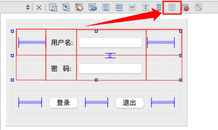
    
- 要想在改变窗口大小时还保证布局，要使用右侧的==弹簧控件==。并在右侧自定义弹簧长度

    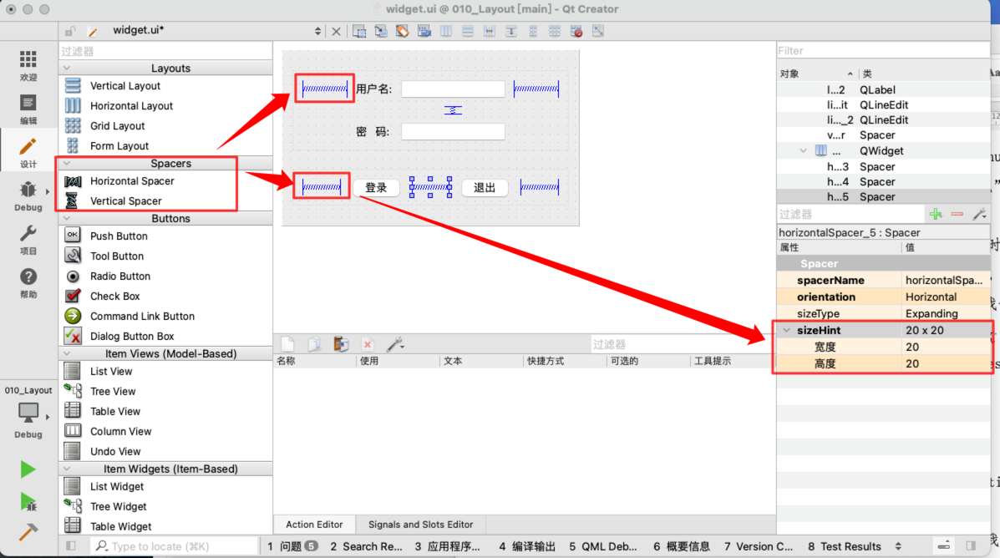
    
- **要想移除控件之间==边缘==的间隙，需要将 Layout 设置为 0**

    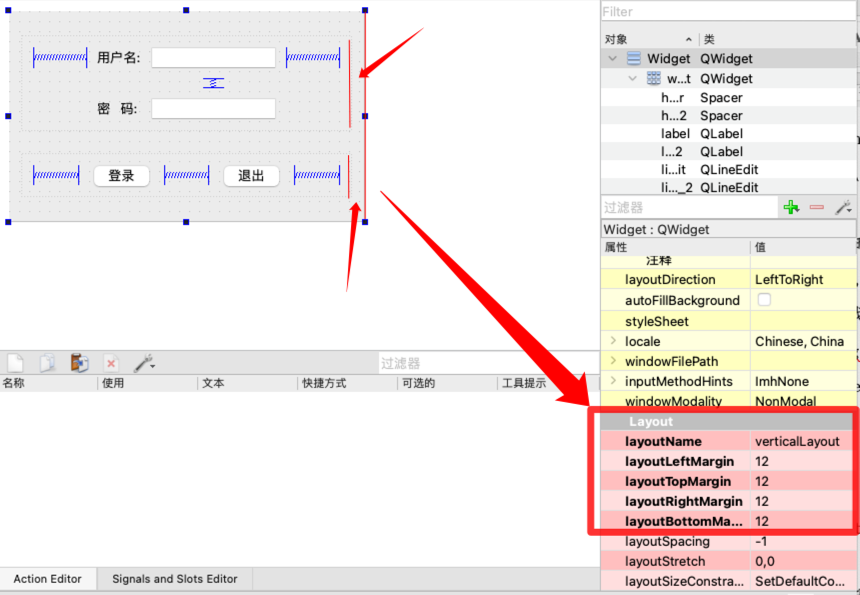

    

- **要想使窗口保持固定大小，可以将默认、最小、最大设置为一样**

    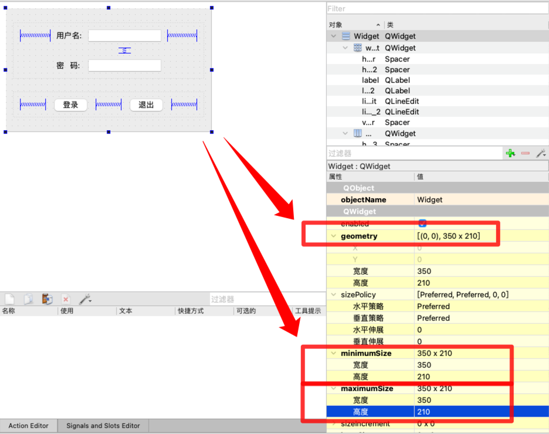

    

- 


# 控件及工具

## Buttons

| 控件                                                         | 效果                                                         | 说明                                                         |
| ------------------------------------------------------------ | ------------------------------------------------------------ | ------------------------------------------------------------ |
| 文字按钮<br />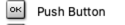 | 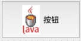 | 文字按钮（可设置图标）                                       |
| 图标按钮<br /> | 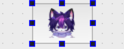 | 多用于**只显示图标**的按钮，可配置是否是透明风格或者显示按钮文字<br />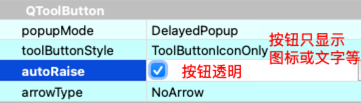 |
| 单选框<br /> | 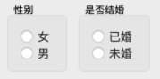 | 可与 Group Box 搭配使用进行分组，避免交叉<br />可使用代码设置默认选中那个 `ui->rBtnMan->setChecked(true)` |
| 多选框、复选框<br /> | 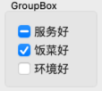 | 可与 Group Box 搭配使用进行分组，根据是否选中有不同的状态（State）<br />`0 - 未选中`，`1 - 半选中`，`2 - 全选中`。可作为 `Qt::QCheckBox::stateChanged` 进行监听，但是要想让复选框支持半选中需要开启以下选项：<br /> |
|                                                              |                                                              |                                                              |
|                                                              |                                                              |                                                              |
|                                                              |                                                              |                                                              |


## Item Widgets

### List Widget

- 

-  List Widget 可以向里面添加 Items

    - `QListWidgetItem`

        `QListWidgetItem` 可以作为一行文字或者图标。并且可以设置对齐方式

        ```c++
        /* List Widget 接受一个 QListWidgetItem */
        QListWidgetItem* item = new QListWidgetItem("我是一行文字");
        item->setTextAlignment(Qt::AlignHCenter);  // 设置为 QListWidgetItem 中的文字居中对齐
        ui->listWidget->addItem(item);
        ```

        

    - `QStringList`

        如果想让 List Widget 一次性接受多个项，可以使用 QStringList，QstringList 类似于 QList\<QString>，有自己重载的 `<<` 运算符。**所以可以使用匿名对象进行方便的传入。**但是 `QStringList` 不能设置对齐方式

        ```c++
        /* 如果想让 List Widget 一次性接受多个项，可以使用 QStringList，QstringList 类似于 QList<QString>，有自己重载的 `<<` 运算符 */
        QStringList stringList;
        stringList << "赤橙黄绿青蓝紫" << "谁持彩练当空舞" << "雨后复斜阳" << "关山阵阵苍";
        ui->listWidget->addItems(stringList);  // 【重点】函数是 addItem`S`
        
        
        /* 使用匿名对象 */
        ui->listWidget->addItems(QStringList() << "Do not go gentle into that good night"
                                 << "Old age should burn and rave at close of day"
                                 << "Rage, rage against the dying of the light");
        ```

- **示例：**
    


****

### Tree Widget


**使用方式：**

1. **设置 `Tree Widget` 的头（顶端的标签）**

    接受 Items，可以使用 `QStringList` 的匿名对象

    ```c++
    ui->treeWidget->setHeaderLabels(QStringList() << "名称" << "词");
    ```

    

    

2. **添加顶层项目（行，index）**
    顶层项目的类型是 `QTreeWidgetItem`

    ```c++
    QTreeWidgetItem* twiCat = new QTreeWidgetItem(QStringList() << "猫");
    QTreeWidgetItem* twiDog = new QTreeWidgetItem(QStringList() << "狗");
    QTreeWidgetItem* twiFox = new QTreeWidgetItem(QStringList() << "狐");
    ```

    

    

3. **将顶层项目添加到 `Tree Widget`**

    ```c++
    ui->treeWidget->addTopLevelItem(twiCat);
    ui->treeWidget->addTopLevelItem(twiDog);
    ui->treeWidget->addTopLevelItem(twiFox);
    ```

    
    
4. **为顶层项目添加子项目（孩子）**

    顶层项目的子项目类型也是 `QTreeWidgetItem`

    ```c++
    QTreeWidgetItem* orangeCat = new QTreeWidgetItem(QStringList() << "橘猫" << "橙色的猫");
    QTreeWidgetItem* blackCat = new QTreeWidgetItem(QStringList() << "橘猫" << "黑色的猫");
    QTreeWidgetItem* russiaCat = new QTreeWidgetItem(QStringList() << "俄罗斯猫" << "爱喝伏特加的猫");
    
    twiCat->addChild(orangeCat);  // 第一种方式，一次只添加一个
    twiCat->addChild(blackCat);
    twiCat->addChild(russiaCat);
    ```


**效果及代码：**

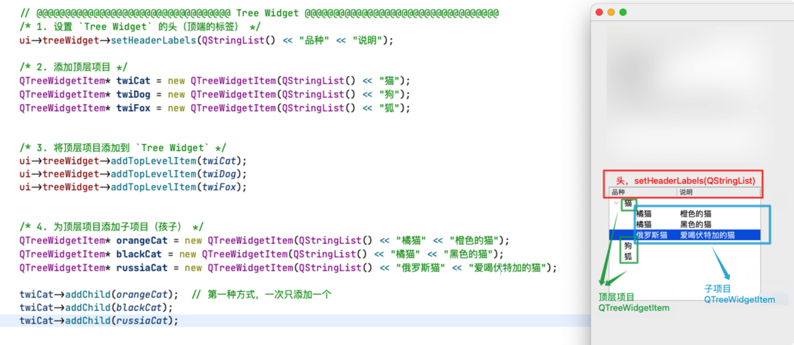


### Table Widget


**使用方式：**

1. **设置==列数==**

    `ui->tableWidget->setColumnCount(列数);`

    ```c++
    /* 1. 设置列数 */
    QStringList listHead;
    listHead << "姓名" << "性别" << "年龄";
    ui->tableWidget->setColumnCount(listHead.size());
    ```

    

2. **设置==水平头==**

    ```c++
    /* 2. 设置水平头 */
    ui->tableWidget->setHorizontalHeaderLabels(listHead);
    ```

    

3. **设置==行数==**

    ```c++
    /* 3. 行数 */
    ui->tableWidget->setRowCount(5);
    ```

    

4. **设置==正文==**，每个正文都是一项（`Item`）

    使用 `ui->tableWidget->setItem(row, col, new QTableWidgetItem(内容));` 为哪一行、哪一列指定内容

    ```c++
    /* 4. 设置正文 */
    QStringList listName;
    listName << "爱迪生" << "居里" << "特斯拉";
    
    QList<QString> listSex; // 等价于 QStringList
    listSex << "男" << "女" << "男";
    
    for (int row = 0; row < listName.size(); row++)
    {
      int col = 0;
      ui->tableWidget->setItem(row, col, new QTableWidgetItem(listName[row]));
      col++;
    
      ui->tableWidget->setItem(row, col, new QTableWidgetItem(listSex.at(row)));  // 【复习】.at(i) 越界会抛出异常，[i] 会直接挂掉
      col++;
    
      ui->tableWidget->setItem(row, col, new QTableWidgetItem(QString::number(row + 40))); // 【重点】注意 数字转 QString 的方法
    }
    ```

5. 拓展功能，实现按钮添加和删除项
    ```c++
    /* 点击按钮添加霍金 */
    connect(ui->btnAddHuoJin, &QPushButton::clicked,
            this, [=](){
              bool isEmpty = ui->tableWidget->findItems("霍金", Qt::MatchExactly).empty();  // 因为返回的是一个 List，如果没有则 List 为 empty
    
              if (isEmpty)
              {
                ui->tableWidget->insertRow(0); // 线插入新的行（行号）
                ui->tableWidget->setItem(0, 0, new QTableWidgetItem("霍金"));
                ui->tableWidget->setItem(0, 1, new QTableWidgetItem("男"));
                ui->tableWidget->setItem(0, 2, new QTableWidgetItem("77"));
              }
              else
              {
                QMessageBox::warning(this, "警告！！", "霍金已存在于 Table Widget");  // 【复习】标准提示框是 static 方法
              }
            });
    
    /* 点击按钮删除霍金 */
    connect(ui->btnDelHuoJin, &QPushButton::clicked,
            this, [=](){
              QList<QTableWidgetItem*> resFind = ui->tableWidget->findItems("霍金", Qt::MatchExactly); // findItems 返回的是一个 QList
    
              if (resFind.empty())
              {
                QMessageBox::warning(this, "你找茬？", "霍金已经不在了！！！");
              }
              else
              {
                ui->tableWidget->removeRow(resFind.first()->row());  // 根据结果第一行的行号删除
              }
            });
    ```

**效果及代码：**

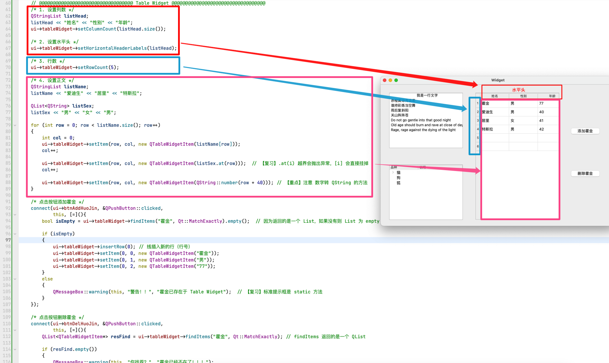


## 其他常用控件

### Scroll Area


如果控件不够大，（在做布局之后）会自动增加滚动条

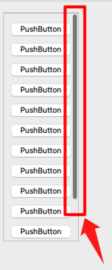

### Tool Box


- 类似于 QQ 的分组：“朋友，家人，黑名单...”

要想修改==页==的名称和插入页，采用以下方式：

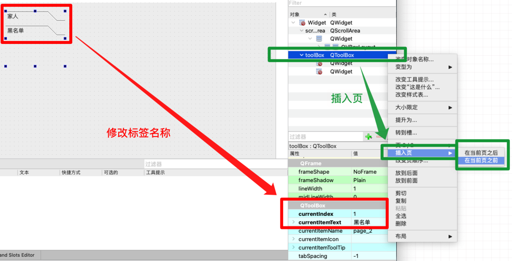


### Tab Widget

类似于浏览器的多==标签==页


要想修改标签的名称和插入标签，采用以下方式：

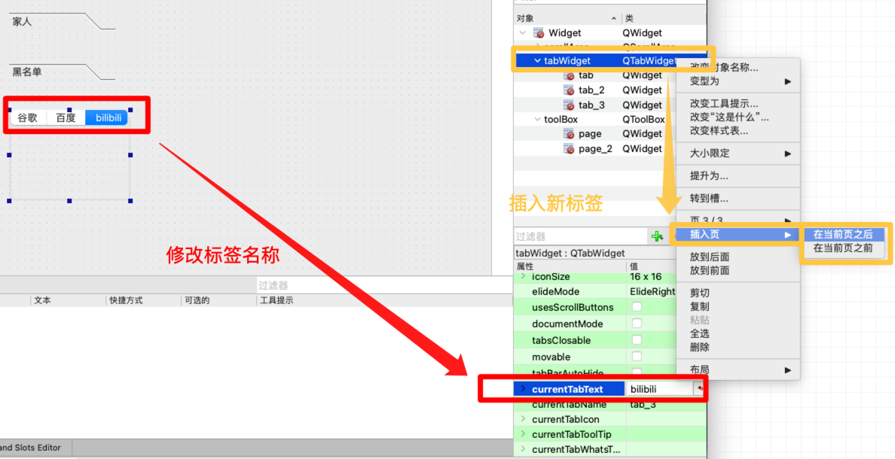


### Stacked Widget


类似于 Qt 左侧的切换窗，**每点击一个标签，其实就是切换了一个栈容器**


**我们可以把之前做的东西都放到这个 Stacked Widget 中，鼠标拖动过去就好**

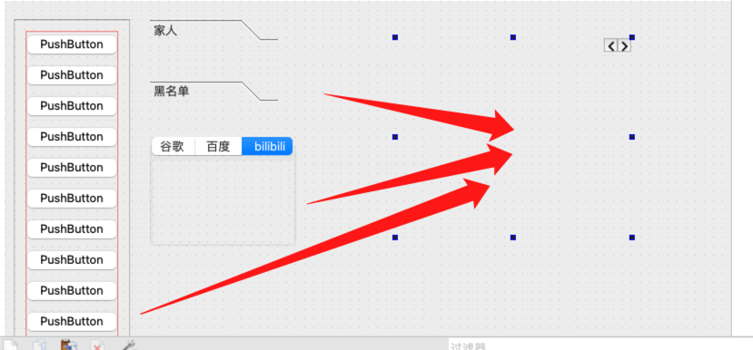


**通过小箭头切换栈容器，如果页不够用就添加一个。**但是注意，==这个小箭头只是辅助我们设计的，程序运行起来之后，并不会显示，所以我们可以通过自定义按钮，通过 `stackedWidget->setCurrentIndex(索引)` 切换栈==

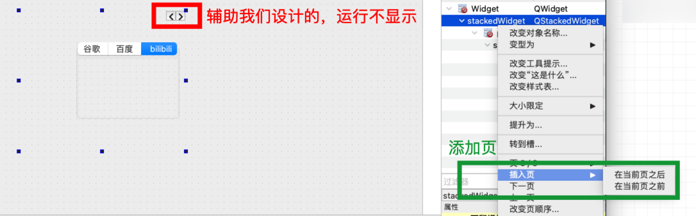


**效果及代码：**

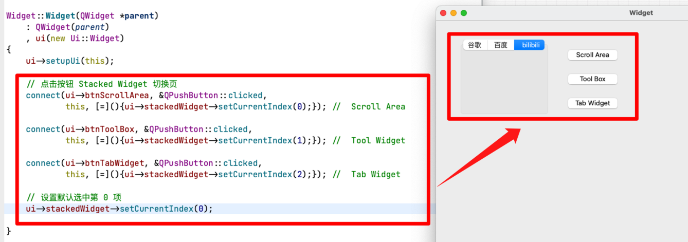


### Combo Box


**下拉框**，可以通过代码添加值：

可以通过代码选择当前选中的内容：

- 通过索引：`comboBox->setCurrentIndex(索引);`
- 通过下拉框中的文字内容：`comboBox->setCurrentText("猫子");`


**效果及代码：**

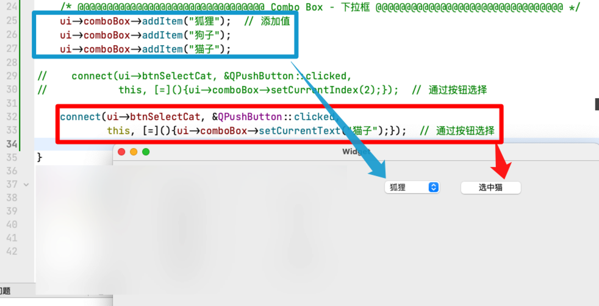


### Font Combo Box


**选择字体**

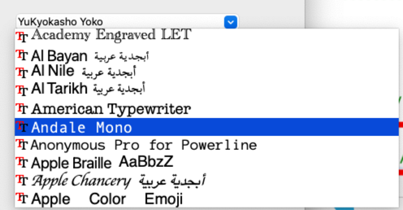


### Line Edit


**单行编辑框**


**设置焦点：** `setFocus();`


**可以对输入的内容做不同的输入模式：**

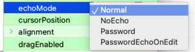

- `Normal`，可以正常输入文字内容 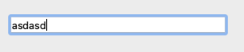
- `NoEcho`，输入内容但是不显示类似于 Linux 下输入密码的效果 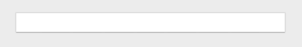
- `Password`，会变成小黑圆点 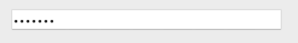
- `PasswordEchoOnEdit`，**失去焦点时**才会变成小黑圆点 


### (Plain) Text Edit

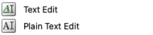

**区别：**

- `Text Edit` 输入内部的文字**可带有格式**，比如颜色、大小、加粗...
- `Plain Text Edit`  只能输入**纯文本**


### (Double) Spin Box

点击箭头可以加减，带有 Double 的是可以输入双精度的

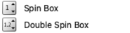


### (Date/Time) Edit

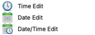

- `Time Edit`：选择时间
- `Date Edit`：选择日期
- `Date/Time Edit`：时间加日期

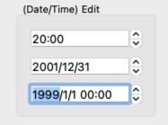

### Dial


**滚轮**

**效果及代码：**

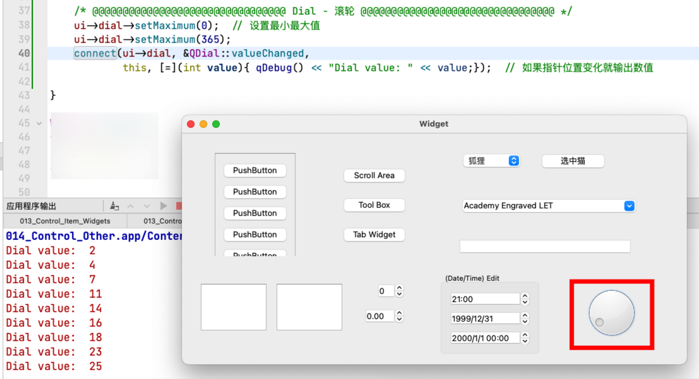


**更改样式：**


### 滚动条

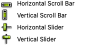

**注意：下面的那两种滚动条，父类都是 `QSpinBox`，所以在使用信号和槽的时候要调用父类的**


### Label

Label 不仅可以显示文字，还可以显示`图片（QPixMap）`和`动图（QMovie）`

**效果及代码：**

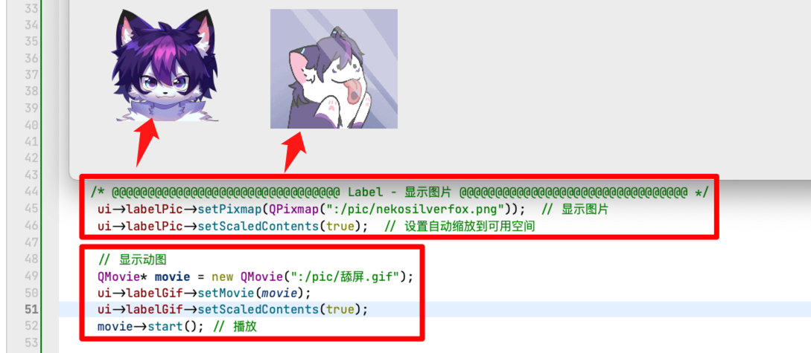


# 自定义控件

1. 新建工程

2. 添加设计师类

    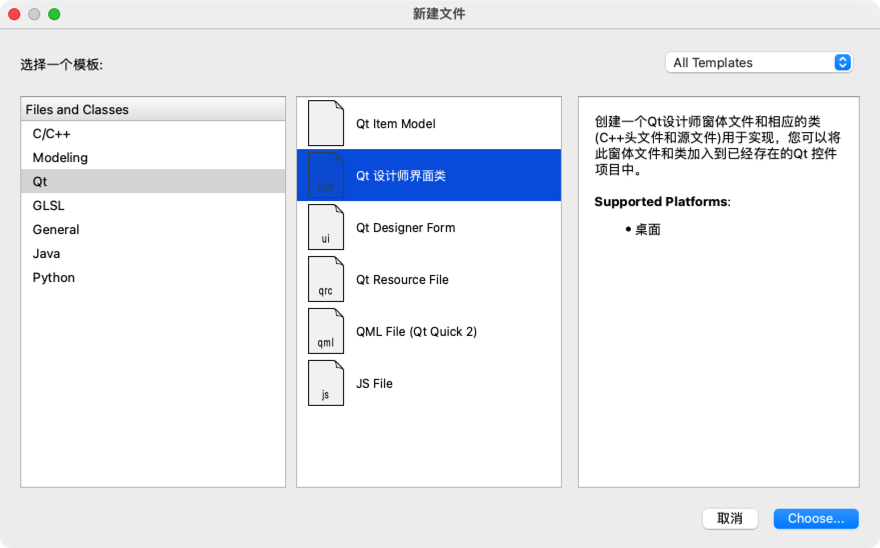

3. 如果是自己封装小控件，选择 Widget 就足够了

    
    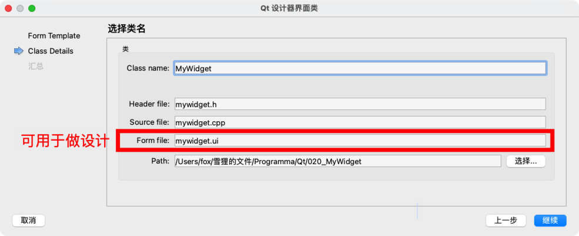

    

4. 比如我们想封装 `Spin Box` 和 `Horizontal Slider`，以实现一个数值改变控制条自动变的联动效果。

    那就先将两个控件拖动过去，自己做一个布局

    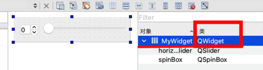

    注意，**我们自定义的窗口是继承于 `QWidget` 的**

    

    

5. **重点：使用我们的自定义控件**

    在自己做完设计之后，回到我们的主设计窗口。

    1. 拖动一个 Widget 进去

    2. **右键 -> 提升为 -> 基类名称保持与上一步的`QWidget`一致 -> 提升的类名称写自定义控件的==类名==而不是文件名 -> 开启全局包含 -> 添加**

        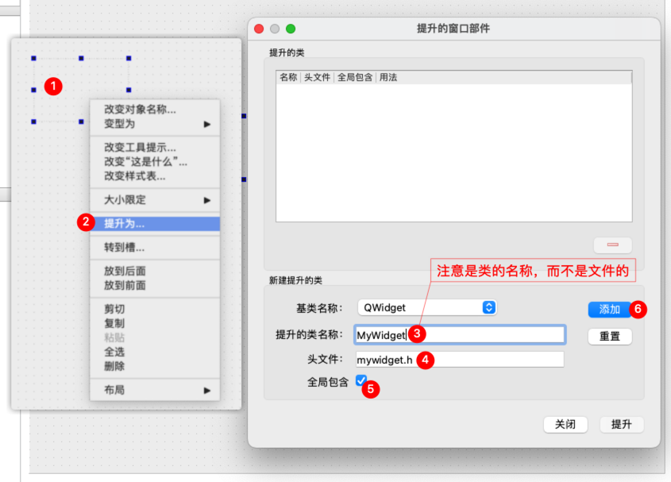

        > 全局包含的意思为：当我们下次再添加同样的自己的一个控件时，在拖拽一个新的 Widget 控件进窗口之后，可以直接右键提升为自定义控件
        >
        > 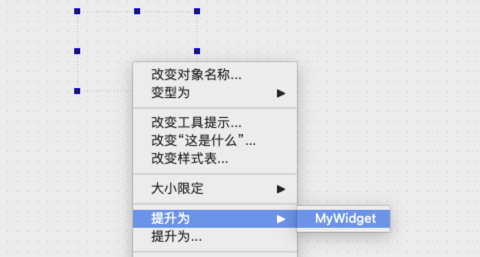

    3. ** -> 点击提升**，然后就会发现之前的 `Widget` 变成了我们自己的控件

        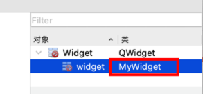

6. 自定义我们封装控件的功能，因为就是编写我们自定义控件的 .h 和 .cpp 文件

    ```c++
    MyWidget::MyWidget(QWidget *parent) :
        QWidget(parent),
        ui(new Ui::MyWidget)
    {
        ui->setupUi(this);
    
        /* QSpinBox变化， Silder 移动 */
        void(QSpinBox:: * mySpinBoxSignal)(int) = &QSpinBox::valueChanged; // 由于存在重载，所以要使用函数指针，避免调用不明确
        connect(ui->spinBox, mySpinBoxSignal,
                ui->horizontalSlider, &QSlider::setValue);
    
        /* Silder 移动,QSpinBox变化 */
        connect(ui->horizontalSlider, &QSlider::valueChanged,
                ui->spinBox, &QSpinBox::setValue);
    
    }
    ```

    

7. 自定义控件可以提供对外接口

    写在 `MyWidget.h`:

    ```c++
    public:
        explicit MyWidget(QWidget *parent = nullptr);
        ~MyWidget();
    
        // 自定义接口
        void setValue(const int value);
        int getValue();
    ```

    写在 `MyWidget.cpp`:

    ```c++
    // 自定义接口
    void MyWidget::setValue(const int value)
    {
        ui->spinBox->setValue(value);
    }
    
    
    int MyWidget::getValue()
    {
        return ui->spinBox->value();
    }
    ```


    在主窗口中使用自定义接口：
    
    ```c++
    Widget::Widget(QWidget *parent)
        : QWidget(parent)
        , ui(new Ui::Widget)
    {
        ui->setupUi(this);
    
        // 调用自定义控件的自定义接口
        connect(ui->btnGetValue, &QPushButton::clicked,
                [=](){qDebug() << "值：" << ui->widget->getValue();});  //【重点】这里的 ui->widget 就是我们的自定义控件
    
        connect(ui->btnSetHalf, &QPushButton::clicked,
                [=](){ui->widget->setValue(50);});
    }
    ```


​    

**效果及代码：**

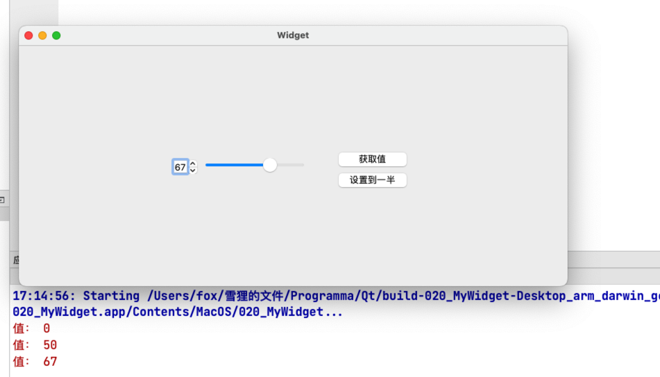


# 事件

- 所有的控件都会继承 `QWidget` 中的事件
- **所有的事件（Event）都有自己的参数，一定要把参数补全！！！具体参数看 Qt 帮助文档**
- **所有的事件都派生于 `QEvent` 类**

## 鼠标事件

对于所有控件：

| 事件     | 函数                                                         |
| -------- | ------------------------------------------------------------ |
| 鼠标进入 | [virtual protected] void QWidget::enterEvent([[QEnterEvent](https://doc.qt.io/qt-6/qenterevent.html)](https://doc.qt.io/qt-6/qenterevent.html) **event*) |
| 鼠标离开 | [virtual protected] void QWidget::leaveEvent([QEvent](https://doc.qt.io/qt-6/qevent.html) **event*) |
| 鼠标移动 | virtual void mouseMoveEvent(QMouseEvent *event);             |
| 鼠标点击 | virtual void mousePressEvent(QMouseEvent *event);            |
| 鼠标释放 | virtual void mouseReleaseEvent(QMouseEvent *event);          |

**重点：**

- 通过 `QMouseEvent *event` 可以判断按键、动作等

- 如果要判断==按下==了某个键，因为这是一个==瞬间动作==，所以要用 `event->button() == Qt::XXXXButton` 判断

- 如果要判断是否==一直按着一个键==，因为这是一个==持续动作==，所以要用 `event->buttonS() & Qt::XXXXButton` 判断，

    并且要开启 ` this->setMouseTracking(true);`


我们可以自己写一个带有鼠标事件的 MyQLabel（继承于 QLabel，QLabel 又继承于 QWidget），在编写完自己的 MyLabel 后我们对原本的 Label 进行提升

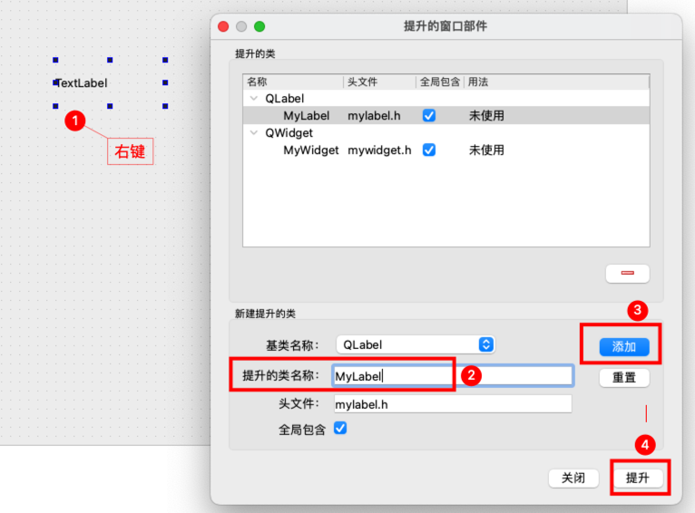


## 定时器事件

**方式一：**

1. 启动一个定时器 `this->startTimer(时间间隔-毫秒);`

    **`startTimer` 会返回一个定时器编号，每新创建一个定时器，都会返回一个新的 Id（可见 QTimerEvent 的 timeId() 方法）**

    

2. 重写 `void timerEvent(QTimerEvent* event)` 事件

    `event->timeId()` 会返回当前的调用的定时器的 Id

    

3. 然后每间隔一段时间，就会自动调用一次 `timerEvent` 函数，我们可以通过 if 判断不同的定时器 id 实现不同功能

    ```c++
    if (event->timeId() == id2)
    {
      ...
    }
    ```

    


**方式二（推荐）：**

```c++
/* 定时器第二种方式（推荐） */
QTimer* timer3 = new QTimer(this);
timer3->start(500);  // 启动定时器
connect(timer3, &QTimer::timeout,
        this, [=](){
            static int num3 = 0;
            ui->label_4->setText(QString::number(num3++));
        });

/* 点击按钮暂停 */
connect(ui->btnStop, &QPushButton::clicked,
        this, [=](){timer3->stop();});
```


## event

QEvent 的 event 可以做事件的分发和拦截（主要做事件分发，不建议拦截）

**在 Qt 中的所有事件，都会先经过 QEvent，然后 QEvent 再向下进行分发**

对于 `QEvent::event()` 函数，如果返回 true 则代表用户自己处理（也就是被拦截了，不再向下分发）

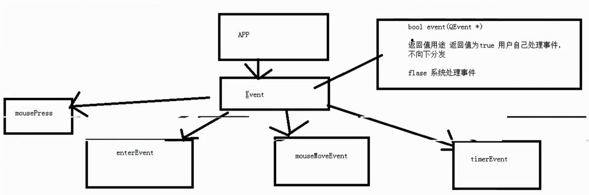


**示例：拦截鼠标点击事件**

```c++
/* 事件拦截 (鼠标点击) */
bool MyLabel::event(QEvent* event)
{
    /* 拦截鼠标[按下]事件，也就是不会调用上面写的函数了 */
    if (event->type() == QEvent::MouseButtonPress)
    {
        QMouseEvent* mouseEv = static_cast<QMouseEvent*>(event);  // 【复习】将父类转换为子类
        qDebug() << "Event::鼠标[按下]了 - " << QString("鼠标当前位置 x: %1, y: %2").arg(mouseEv->x()).arg(mouseEv->y());
        return true;  // 返回 true 代表拦截
    }

    return QLabel::event(event);  // 其他事件，让父亲做默认处理
}
```


## 事件过滤器

> 代码的 diff：
>
> https://github.com/NekoSilverFox/Qt/commit/9e780456729bd09f4238a293444573f57ab7b1f6

其实 App 和 Event 之间还可以再进行一层拦截，也就是**事件过滤器**

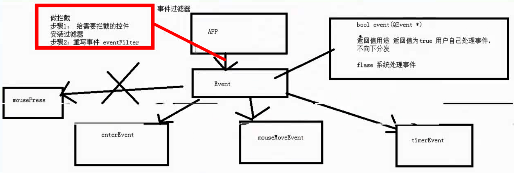

**使用步骤：**

1. 那个控件需要事件过滤器就给它安装事件过滤器

    ```c++
    ui->label->installEventFilter(this);
    ```

    

2. 重写 `eventFilter` 事件

    ```c++
    /* 事件过滤器 */
    bool Widget::eventFilter(QObject *object, QEvent *event)
    {
        /* 过滤在 `label` 上的`点击`事件 */
        if (object == ui->label)
        {
            if (event->type() == QEvent::MouseButtonPress)
            {
                QMouseEvent* mouseEv = static_cast<QMouseEvent*>(event);  // 【复习】将父类转换为子类
                qDebug() << "事件过滤器::鼠标[按下]了 - " << QString("鼠标当前位置 x: %1, y: %2").arg(mouseEv->x()).arg(mouseEv->y());
                return true;  // 返回 true 代表拦截
            }
        }
    
        return QWidget::eventFilter(object, event);  // 其他的事件，交给父类处理
    }
    ```

    

# 绘图和绘图设备

## QPainter

因为就是重写 `paintEvent`事件

**效果及代码：**

```c++
/* QPainter，不需要手动调用。系统自己会调用。并且我们的 Widget 也可以充当绘图窗口（画纸） */
void Widget::paintEvent(QPaintEvent *)
{
    /* 1.创建画家，并且指定绘图设备 */
    QPainter painter(this);

    /* 2.设置笔的风格（设置风格一定要在使用笔之前） */
    QPen pen(QColor(255, 0, 255));
    pen.setWidth(3);  // 笔的宽度
    pen.setStyle(Qt::DotLine);  // 笔的风格

    /* 设置画刷（对于封闭图形的填充） */
    QBrush brush(Qt::cyan);
    brush.setStyle(Qt::Dense3Pattern);

    /* 3.让画家用这个笔 */
    painter.setPen(pen);
    painter.setBrush(brush);

    /* 4.让画家画画 */
    painter.drawLine(QPoint(0, 0), QPoint(100, 100));  // 线
    painter.drawEllipse(QPoint(100, 100), 100, 50);  // 椭圆
    painter.drawRect(QRect(QPoint(10, 10), QPoint(50, 50)));  // 矩形
    painter.drawText(QRect(10, 200, 150, 50), "我是文本框中的一段文字");  // 字体
}
```

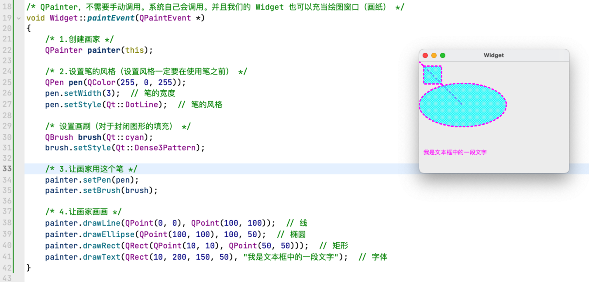


**高级效果：**

| 效果         | 函数                                             | 备注                               |
| ------------ | ------------------------------------------------ | ---------------------------------- |
| 抗锯齿       | `QPainter.setRenderHint(抗锯齿能力)`             | 设置抗锯齿会降低绘制效率           |
| 移动画家     | `QPainter.translate(QPoint(相对于当前的新位置))` | 默认画家在 QPoint(0, 0) 处开始绘制 |
| 保存画家状态 | `QPainter.save()`                                |                                    |
| 恢复画家状态 | `QPainter.restore()`                             | 恢复到上次保存的位置的效果         |
| 绘制图片     | `QPainter.drawPixmap(x, y, "FILE")`              |                                    |

> **注意：如果后期对绘图版的状态做了更改，要使用 `update()` 进行更新，就像 OpenGL 那样**


# 文件读写


# QTest

> QTest 单元测试框架
>
> https://www.cnblogs.com/lsgxeva/p/12564481.html
>
> https://blog.csdn.net/u011942101/article/details/124074075

**QTestLib简介:**

QTestLib是Qt提供的一种针对基于Qt编写的程序或库的单元测试框架。QTestLib提供了单元测试框架的基本功能，并**提供了针对GUI测试的扩展功能**。


**QTestLib特性：**

所有公有的方法都在QTest命名空间中。另外，QSignalSpy类为Qt的信号和槽提供了简单的内省机制。

QTestLib是为了简化QT程序或库的单元测试工作而设计的。

QTestLib特性如下：

A、轻量级：QTestlib只包含6000行代码和60个导出符号
B、自包含：对于非GUI测试，QTestlib只需要Qt核心库的几个符号。
C、快速测试：QTestlib不需要特殊的测试执行程序，不需要为测试而进行特殊的注册。
D、数据驱动测试：一个测试程序可以在不同的测试数据集上执行多次。
E、基本的GUI测试：QTestlib提供了模拟鼠标和键盘事件的功能。
F、基准测试：QTestLIB支持基准测试并提供多种测量后端。
G、IDE友好：QTestlib的输出信息可以被Visual Studio和KDevelop解析。
H、线程安全：错误报告是线程安全的、原子性的。
J、类型安全：对模板进行了扩展使用，防止由隐式类型转换引起的错误。
K、易扩展：用户自定义类型可以容易地加入到测试数据和测试输出中。


**AutoTest插件：**

默认测试结果以纯文本形式显示在控制台（应用程序输出标签），不够直观，可使用AutoTest插件实现可视化效果。

通过Help->About Plugins->Utilities，选中 AutoTest，重启Qt Creator，然后在下方会多出TestResults的标签，可直接在此标签点击上方的运行按钮运行所有测试，同时在“Tools-Tests-Run All Tests”也可运行所有测试。

此插件可以在运行单元测试后以红、绿色表示明确标记处运行结果，并且以Case为单位显示，可以展开看到具体每一个测试用例的结果。


## QTestLib单元测试原理

**QTestLib单元测试原理简介：**

原理：输入测试数据表和结果数据表，与实际值比较。


**测试类：**

测试类需要从`QObject`类继承，类中需要加入一个或者多个私有槽。**每一个私有槽都是一个测试函数**，但有 4 种私有槽不能作为测试函数，它们由测试框架执行，可为整个测试程序或当前测试函数进行初始化和清除操作。

- `initTestCase()`：在第一个测试函数执行前调用

    如果initTestCase()函数执行失败，任何测试函数都不会执行。

- `init()`：在每一个测试函数执行前调用

    如果init()函数执行失败，紧随其后的测试函数不会被执行，测试会继续处理下一个测试函数。

- `cleanup()`：在每一个测试函数执行后调用

- `cleanupTestCase()`：在最后一个测试函数执行后调用

- `QTest::qExec(QObject* testClassObject)` 函数用于执行测试对象中所有的测试函数。


如果您将qmake其用作构建工具，只需将以下内容添加到您的项目文件中：

```qmake
QT += testlib
```


**测试函数：**

对于一个要测试的目标函数，需要使用两个函数进行测试:`testFunctionName()`和`testFunctionName_data()`。

`testFunctionName_data`:数据提供，在函数体中写入测试数据。

`testFunctionName`：测试的实体，读取`testFunctionName_data`函数中的数据表，并逐行进行测试。如果测试结果与数据表中的结果不同，则认为测试失败。


**测试数据构建：**

数据由 `QTest::addColumn<T>(name)` 和 `QTest::newRow(name) << input << result` 来构建一个数据表，其中的列可以被获取，然后将表中对应的数据按行测试，并与表中的结果列进行对比。


**GUI测试：**

对于GUI交互操作的测试，则将数据设置为事件列表，供模拟测试。QTestlib提供了模拟鼠标和键盘事件的功能。


## 使用

1. 如果 qmake 其用作构建工具，将以下内容添加到 `.pro` 中：

    ```qmake
    QT += testlib
    ```

    

2. **添加测试类**，比如：`TestString`

3. **配置测试类，并添加测试**

    - **让测试类继承于 `QObject`**
    - **包含QTest头文件 `#include <QtTest/QtTest>`**
    - **在私有槽 `private slots` 里编写测试类**，便于测试框架找到并执行它们。

    **比如：**

    ```c++
    #ifndef TESTQSTRING_H
    #define TESTQSTRING_H
    
    #include <QtTest/QtTest>
    #include <QObject>
    
    class TestQString : public QObject
    {
        Q_OBJECT
    
    private slots:
        void initTestCase()
        {
            qDebug() << "开始执行单元测试";
        }
    
      void TestQString::to_upper()
      {
          QString str = "Hello";
          QVERIFY(str.toUpper() == "HELLO");
      }
    
      void TestQString::cleanupTestCase()
      {
          qDebug() << "单元测试全部测试结束";
      }
      
    #endif // TESTQSTRING_H
    ```

4. **在 main 里调用 `QTest::qExec(对象)` 进行测试**

    QTest 提供了 `QTEST_MAIN()` 作为测试的启动宏，构建一个 main 函数，在 main 函数内调用 `QTest::qExec(QObject testClassObject)`，也可以直接调用 `QTest::qExec(QObject testClassObject)` 来启动测试。

    ```c++
    int main(int argc, char *argv[])
    {
        TestQString testQString;
    
        /* 调用 QTest::qExec(对象) 进行测试 */
        QTest::qExec(&testQString);
        QTest::qExec(new TestQString);
    
        QApplication a(argc, argv);
        Widget w;
        w.show();
        return a.exec();
    }
    ```

    

**通讯：**

QTest 提供一系列宏来进行数据的通信

| 宏                 | 说明                                                         |
| ------------------ | ------------------------------------------------------------ |
| QVERIFY(condition) | 判断表达式是否为 true，通常用于判断值相等<br />比如：`QVERIFY(QString("fox").toUpper() == "FOX")` |
|                    |                                                              |
|                    |                                                              |
|                    |                                                              |
|                    |                                                              |
|                    |                                                              |
|                    |                                                              |
|                    |                                                              |
|                    |                                                              |
|                    |                                                              |
|                    |                                                              |
|                    |                                                              |
|                    |                                                              |
|                    |                                                              |


```c++
QBENCHMARK
QBENCHMARK_ONCE
QCOMPARE(actual, expected)
QEXPECT_FAIL(dataIndex, comment, mode)
QFAIL(message)
QFETCH(type, name)
QFINDTESTDATA(filename)
QSKIP(description)
QTEST(actual, testElement)
QTEST_APPLESS_MAIN(TestClass)
QTEST_GUILESS_MAIN(TestClass)
QTEST_MAIN(TestClass)
QTRY_COMPARE(actual, expected)
QTRY_COMPARE_WITH_TIMEOUT(actual, expected, timeout)
QTRY_VERIFY2(condition, message)
QTRY_VERIFY(condition)
QTRY_VERIFY2_WITH_TIMEOUT(condition, message, timeout)
QTRY_VERIFY_WITH_TIMEOUT(condition, timeout)
QVERIFY2(condition, message)

QVERIFY_EXCEPTION_THROWN(expression, exceptiontype)
QWARN(message)
```


