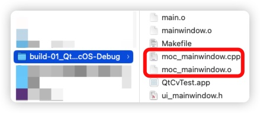
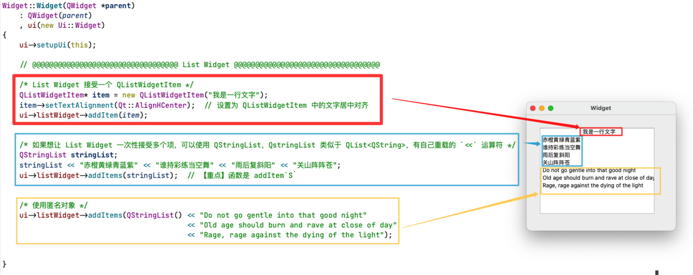
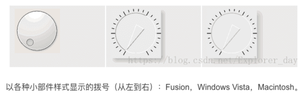
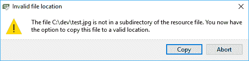

<p align="center">
 
 <h1 align="center">Qt</h1>
 <p align="center"><b>【🔧更新中🔧】Qt 教程及案例实现</b></p>
</p>


<div align=center>


[](LICENSE)


<div align=left>
<!-- 顶部至此截止 -->


[toc]

# 项目编号及备注

> 注意：如果你是用的是 MacOS 系统开发 Qt。不建议使用 homebrew 所安装的 Qt 环境，因为其存在很多未修复的 bug。比如（有时候）在调用 QMessageBox 的时候会造成程序崩溃：https://bugreports.qt.io/browse/QTBUG-61660

| 项目名                                                       | 说明                                                         |
| ------------------------------------------------------------ | ------------------------------------------------------------ |
|                                                              |                                                              |
|                                                              |                                                              |
|                                                              |                                                              |
|                                                              |                                                              |
|                                                              |                                                              |
|                                                              |                                                              |
|                                                              |                                                              |
| 010_Layout                                                   | 【窗口布局】借助登录窗口的布局，说明 Qt 中布局的相关内容：弹簧，栅格布局，如何删除间隙等。 |
| 011_Control                                                  | Qt 中控件的介绍                                              |
| [013_Control_Item_Widgets](https://github.com/NekoSilverFox/Qt/tree/main/013_Control_Item_Widgets) | Qt 中控件的介绍                                              |
| [014_Control_Other](https://github.com/NekoSilverFox/Qt/tree/main/014_Control_Other) | [控件 Combo Box, Qlabel 显示图片等](https://github.com/NekoSilverFox/Qt/commit/027c02a4696cd13e4e66b157701b349088461d25) |
| [020_MyWidget](https://github.com/NekoSilverFox/Qt/tree/main/020_MyWidget) | 自定义控件，实现水平条与数字显示联动                         |
| [025_Qt_Event](https://github.com/NekoSilverFox/Qt/tree/main/025_Qt_Event) | Qt 中的事件过滤器                                            |
| [030_QPainter](https://github.com/NekoSilverFox/Qt/tree/main/030_QPainter) | Qt 中的绘图设备                                              |
| [031_QPainterDevice](https://github.com/NekoSilverFox/Qt/tree/main/031_QPainterDevice) | 通过读取文件中存储的命令进行绘图                             |
| [040_QFile](https://github.com/NekoSilverFox/Qt/tree/main/040_QFile) | Qt 中的文件操作                                              |
| [045_UDP_Demo](https://github.com/NekoSilverFox/Qt/tree/main/045_UDP_Demo) | UDP 通讯小案例（UDP 套接字的使用）                           |
| [047_QTcpFile](https://github.com/NekoSilverFox/Qt/tree/main/047_QTcpFile) | 传输文件案例（TCP 套接字的使用）                             |
| [050_MySelfQQ](https://github.com/NekoSilverFox/Qt/tree/main/050_MySelfQQ) | 实现类似 QQ 的聊天软件                                       |
|                                                              |                                                              |
| [070_QChartView_2D_Plot](https://github.com/NekoSilverFox/Qt/tree/main/070_QChartView_2D_Plot) | 借助 Qt 的 ChartView 绘制动态 2D 折线图                      |


# 简介


## 命名规范和快捷键

- 类名首字母大写，驼峰式命名（首字母大写）
- 函数、变量首字母小写，连接首字母大写


**默认快捷键：**

- Ctrl + R 运行
- Ctrl + B 编译
- Ctrl + F 查找
- F1 帮助文档
- Ctrl + 滚轮  字体缩放
- Crrl + I 自动对齐
- Ctrl + Shift + 上下 整行移动
- F4 同名之间的 .h .cpp 切换


**Qt 中所有的窗口都继承于 QWidget**


## 初始工程

新建一个工程后，初始包含以下文件：

- `widget.hpp`

```c++
#ifndef WIDGET_H
#define WIDGET_H

#include <QWidget>

class Widget : public QWidget  // Widget 继承 QWidget
{
    Q_OBJECT  // Q_OBJECT 宏，写了这个宏就支持了 Qt 中的信号和槽机制（由元对象编译器 moc 解析，这在后面章节中提到）

public:
    Widget(QWidget *parent = nullptr); // 构造函数
    ~Widget();
};
#endif // WIDGET_H

```


- `main.cpp`

```c++
#include "widget.h"

#include <QApplication>  // 包含头文件 - 应用程序

/** 程序入口
 * @brief main
 * @param argc 命令行变量数量
 * @param argv 命令行变量数组
 * @return
 */
int main(int argc, char *argv[])
{
    QApplication a(argc, argv);  // 【重点】应用程序对象 a，在 Qt 中有且仅有一个
    Widget w;  // 窗口对象
    w.show();  // 弹出窗口（窗口默认不会弹出）

    return a.exec(); // a.exec() 进入消息循环机制，避免程序一闪而过，类似死循环
}

```

- `.pro` 文件，这在下一小节介绍


## qmake/.pro 介绍

**`qmake` 工具是一个帮助使用 `*.pro` 文件中的信息创建 `makefile` 的程序。这简单地意味着，使用非常简单的语法（与其他 `make` 系统中的更复杂语法相比），`qmake` 生成了编译和构建应用程序所需的所有必要命令，并将所有这些生成的文件放在 `Build` 文件夹中。**

当构建 Qt 项目时，它首先创建一个新的构建文件夹，默认情况下，该文件夹与项目文件夹位于同一级别。在我们的例子中，这个文件夹应该有一个类似于 `build-Hello_Qt_OpenCV-Desktop_Qt_5_9_1_*-Debug` 的名称，其中 `*` 可能会有所不同，取决于平台，你可以在项目文件夹所在的同一个文件夹中找到它。Qt（使用 `qmake` 和本章中您将了解到的一些其他工具）和 C++ 编译器生成的所有文件位于此文件夹及其子文件夹中。这称为项目的构建文件夹。这也是您的应用程序被创建和执行的地方。例如，如果您使用的是 Windows，您可以在 `Build` 文件夹的 `debug` 或 `release` 子文件夹中找到 `Hello_Qt_OpenCV.exe` 文件（以及许多其他文件）。因此，从现在开始我们将称这个文件夹（及其子文件夹）为**构建文件夹**。

例如，我们已经知道在我们的 Qt 项目文件中包含以下行会导致将 Qt 的 `core` 和 `gui` 模块添加到我们的应用程序中：

```makefile
QT += core gui
```

让我们进一步查看 `Hello_Qt_OpenCV.pro` 文件；以下几行立即引人注意：

```makefile
TARGET = Hello_Qt_OpenCV
TEMPLATE = app
```

这几行简单地意味着 `TARGET` 名称是 `Hello_Qt_OpenCV`，这是我们项目的名称，`TEMPLATE` 类型 `app` 意味着我们的项目是一个**应用程序**。我们还有以下内容：

```makefile
SOURCES += \
    main.cpp \
    mainwindow.cpp
HEADERS += \
    mainwindow.h
FORMS += \
    mainwindow.ui
```

很明显，这就是头文件、源文件和用户界面文件（表单）如何包含在我们的项目中的方式。

在 `qmake` 处理了我们的 Qt 项目文件后，它开始寻找项目中提到的源文件。自然地，每个 C++ 程序在其源文件中都有一个 `main` 函数（一个单一且唯一的 `main` 函数）（不在头文件中），我们的应用程序也不例外。我们应用程序的 `main` 函数由 Qt Creator 自动生成，它位于 `main.cpp` 文件中。让我们打开 `main.cpp 文件`，看看它包含什么：

```cpp
#include "mainwindow.h"
#include <QApplication>
int main(int argc, char *argv[])
{
  QApplication a(argc, argv); // 应用程序对象 a，在 Qt 中有且仅有一个
  MainWindow w;  // 窗口对象
  w.show();  // 弹出窗口，以新窗口的的方式弹出（窗口默认不会弹出）
  return a.exec(); // a.exec() 进入消息循环机制，避免程序一闪而过，类似死循环
}
```

前两行用于包含我们当前的 `mainwindow.h` 头文件和 `QApplication` 头文件。**`QApplication` 类是负责控制应用程序的控制流、设置等的主类。**您在 `main` 函数中看到的，是 Qt 创建事件循环以及其底层信号/槽机制和事件处理系统工作方式的基础：

```cpp
QApplication a(argc, argv); // 应用程序对象 a，在 Qt 中有且仅有一个
MainWindow w;  // 窗口对象
w.show();  // 弹出窗口，以新窗口的的方式弹出（窗口默认不会弹出）
return a.exec(); // a.exec() 进入消息循环机制，避免程序一闪而过，类似死循环
```

最简单地描述：

1. 就是创建了 `QApplication` 类的一个实例，并将应用程序参数（通常通过命令行或终端传递）传递给名为 `a` 的新实例。
2. 然后，创建了我们的 `MainWindow` 类的一个实例 `w`，然后通过 `.show()` 显示它。
3. 最后，调用 `QApplication` 类的 `.exec()` 函数，以便应用程序进入主循环，并保持打开状态，直到窗口关闭。


要了解事件循环的真正工作方式，请尝试删除最后一行，看看会发生什么。当你运行你的应用程序时，你可能会注意到窗口实际上显示了非常短暂的时间，然后立即关闭。这是因为我们的应用程序不再有**事件循环**，它立即到达应用程序的结尾，内存中的所有内容都被清除了，因此窗口被关闭。现在，重新写回那行代码，正如你所期待的，窗口保持打开状态，因为 `.exec()` 函数只有在代码中某处（任何地方）调用了 `.exit()` 函数时才返回，并且它返回 `.exit()` 设置的值。


现在，让我们继续讨论另外==两个 Qt 内部工具==，称为**元对象编译器(moc)**和**用户界面编译器(uic)**。

## 元对象编译器（moc）

> 元对象编译器（moc, **Meta-Object Compiler**）

我们已经知道，在标准 C++ 代码中并不存在信号和槽这样的东西。那么，使用 Qt，我们是如何在 C++ 代码中拥有这些额外能力的呢？而且这还不是全部。正如你稍后将学到的，你甚至可以向 Qt 对象添加新属性（称为**动态属性**）并执行许多类似的操作，这些都不是标准 C++ 编程的能力。嗯，这些是通过使用一个名为 `moc` 的 Qt 内部编译器实现的。**在你的 Qt 代码实际传递给真正的 C++ 编译器之前，`moc` 工具会处理你的类头文件**（在我们的案例中是 `mainwindow.h` 文件），以生成启用刚刚提到的 Qt 特定能力所需的代码。你可以在构建文件夹中找到这些生成的源文件。它们的名称以 `moc_` 开头。



你可以在 Qt 文档中阅读关于 `moc` 工具的所有信息，但值得一提的是，`moc` 会搜索**所有**包含 `Q_OBJECT 宏`的 Qt 类定义的头文件。**这个宏必须始终包含在希望支持信号、槽和其他 Qt 支持功能的 Qt 类中。**

这是我们在 `mainwindow.h` 文件中的内容：

```cpp
...
class MainWindow : public QMainWindow
{
  Q_OBJECT // <-- 这里
    
  public:
   explicit MainWindow(QWidget *parent = 0);
 ~MainWindow();
...
```

如你所见，我们自动生成的类头文件已经在其私有部分包含了 `Q_OBJECT` 宏。因此，这基本上是创建类的标准方式（不仅仅是窗口类，而是一般的任何 Qt 类），**这些类是 `QObject`（或任何其他 Qt 对象）的子类，将支持 Qt 支持的功能，如信号和槽。**

现在，让我们继续看看我们是**如何通过 C++ 代码访问 Qt 用户界面文件中的小部件的**。如果你尝试在编辑模式或任何其他文本编辑器中查看 `mainwindow.ui` 文件，你会注意到它们实际上是 `XML` 文件，只包括属性和一些其他仅与小部件显示方式相关的信息。答案在于你将在本章中了解的最后一个 Qt 内部编译器。

## 用户界面编译器（uic）

> 用户界面编译器（uic， User Interface Compiler）

每当构建具有用户界面的 Qt 应用程序时，都会执行一个名为 `uic` 的 Qt 内部工具来处理和转换 `*.ui` 文件，使其成为 C++ 代码中可用的类和源代码。在我们的案例中，`mainwindow.h `被转换为 `ui_mainwindow.h` 文件，同样，你可以在构建文件夹中找到它。你可能已经注意到了这一点，但让我们提一下，你的 `mainwindow.cpp` 文件已经包含了这个头文件。检查文件的最顶部部分，你会找到以下两个 `include` 行：

```cpp
#include "mainwindow.h"
#include "ui_mainwindow.h"
```

你已经知道 `mainwindow.h` 文件是什么以及在哪里（在你的项目文件夹中），现在你刚刚了解到 `ui_mainwindow.h` 实际上是位于构建文件夹内的生成的源文件。

如果你查看 `ui_mainwindow.h` 文件的内容，你会注意到一个名为 `Ui_MainWindow` 的类，其中有两个函数：`setupUi` 和 `retranslateUi`。

- `setupUi` 函数被自动添加到 `mainwindow.h` 中的 `MainWindow` 类**构造函数**中。该函数主要负责根据 `mainwindow.ui` 文件中的设置来设置用户界面上的所有内容。
- 本章稍后将介绍 `retranslateUi` 函数，以及在制作多语言 Qt 应用程序时如何使用该函数。

当所有 Qt 生成的文件都放入 `Build` 文件夹后，它们就会像其他 C++ 程序一样，被传递给 C++ 编译器进行编译，然后链接到 `Build` 文件夹中创建我们的应用程序。Windows 用户应注意，当你使用 Qt Creator 运行应用程序时，所有 `DLL` 文件（**动态链接库（Dynamic Link Library）文件**）路径都会被 Qt Creator 解析，但如果你试图从 `Build` 文件夹内运行程序，你将会看到多个错误信息，应用程序会崩溃或根本无法启动。你将在"调试和测试*"中学习如何解决这个问题，在那里你将学习如何正确地将你的应用程序交付给你的用户。

---

**总结：**

Qt中的`moc`（Meta-Object Compiler）和`uic`（User Interface Compiler）是特定的工具，它们在Qt应用程序的构建过程中起着重要的角色。

1. **moc (Meta-Object Compiler)**：
    - `moc`是Qt的一个元对象编译器。它用于处理Qt的**信号和槽机制**，以及Qt中的一些其他元编程机制如属性系统、运行时类型信息和动态对象通信。
    - 当你在类声明中使用`Q_OBJECT`宏时，`moc` 会处理这个类，并生成一个附加的C++源文件，这个源文件包含了实现元对象所需的元信息和标准的信号和槽机制。
2. **uic (User Interface Compiler)**：
    - `uic`是用于转换由Qt Designer创建的用户界面文件（`.ui`文件）为C++代码的工具。
    - 当你设计一个界面并保存为`.ui`文件时，`uic`会将这个文件转换成一个或多个头文件，这些文件将在编译时包含在你的应用程序中。


编译成最终应用程序的流程通常如下：

1. **编写源代码**：你写好C++源代码和Qt特有的标记（如`Q_OBJECT`）。
2. **预处理**：运行`moc`来处理所有定义了`Q_OBJECT`宏的类，生成含有元信息的C++源文件。
3. **设计UI**：在Qt Designer中创建GUI，并保存为`.ui`文件。
4. **UI编译**：运行`uic`将`.ui`文件转换为C++头文件。
5. **资源编译**：如果你使用了Qt资源系统，`rcc`（Qt Resource Compiler）会被用来将资源文件（如图片、翻译文件）编译成为应用程序可用的二进制形式。
6. **编译**：编译器（如g++, clang++）编译`源代码`和由`moc`和`uic`生成的代码。
7. **链接**：链接器将编译后的代码和所有相关的库（包括Qt库）链接在一起，生成最终的可执行文件。


## 设计模式

> 设计模式 - Design pattern

非常有必要提醒我们自己设计模式存在的原因，以及为什么像 Qt 这样成功的框架会广泛使用不同的设计模式。首先，**设计模式只是软件开发任务的众多解决方案之一，它不是唯一的解决方案**；事实上，大多数时候它甚至不是最快的解决方案。然而，设计模式绝对是解决软件开发问题最有结构的方式，它有助于确保你对程序中添加的每件事都使用一些预定义的模板式结构。

设计模式有不同种类的问题的名称，例如创建对象、它们的运行方式、它们如何处理数据等。Eric Gamma、Richard Helm、Ralph E. Johnson 和 John Vlissides（被称为 *四人帮*）在他们的书 *设计模式：可复用面向对象软件的基础* 中描述了许多最广泛使用的设计模式，这本书被认为是计算机科学中设计模式的事实上的参考书。如果你不熟悉设计模式，你绝对应该花一些时间了解这个主题。学习软件开发中的**反模式（Anti-Pattern）**也是一个好主意。如果你是这个话题的新手，你可能会惊讶地发现一些反模式有多常见，确保你始终避免它们是至关重要的。

> “反模式”（Anti-Pattern）是一种**常见的但低效或有问题的设计、编程或管理实践**，这些实践表面上看似提供了一个解决方案，但实际上可能会引入更多的问题。反模式通常是因为缺乏经验或对现有问题理解不足而产生的，而且它们可能会在团队或项目中不知不觉地得到推广。
>
> 反模式的关键特征包括：
>
> 1. **反生产性**：它们可能会阻碍过程的效率，导致产出质量下降。
> 2. **反直觉**：虽然表面上解决了问题，但实际上可能会掩盖根本问题，使得问题更加难以解决。
> 3. **重复性**：它们往往会在不同的项目或团队中重复出现，因为人们可能不认识到它们的负面影响。
> 4. **教训性**：识别和理解反模式可以作为学习工具，帮助人们避免在未来犯同样的错误。
>
> 一些常见的反模式例子包括：
>
> - **金锤子（Golden Hammer）**：对某一技术或工具有过度的依赖，认为它可以解决所有问题。
> - **货物崇拜（Cargo Cult Programming）**：程序员盲目地复制某些代码或做法，而没有理解其背后的原理。
> - **剪贴板编程（Copy-Paste Programming）**：频繁地复制和粘贴代码，而不是理解代码的功能或考虑代码重用。
> - **神对象（God Object）**：创建一个过分庞大和复杂的对象，它几乎控制了程序中的所有过程。
> - **过早优化（Premature Optimization）**：在理解性能瓶颈之前过分关注优化。
>
> 反模式的提出目的是为了帮助开发者识别和避免这些常见的错误做法，从而改进他们的软件设计和开发过程。了解反模式同样重要，因为它们提供了不良实践的有力例子，从而使开发者能够学习如何采取更好的策略。

以下是 Qt 框架中使用的一些最重要的设计模式（按字母顺序排列），以及对这些设计模式的简要描述和实现这些设计模式的一些类或函数的示例。请仔细注意以下表格中的示例案例，以了解与每种设计模式相关的一些类或函数的概述。然而，在本书的过程中，通过各种示例，你将通过实践经验了解到使用的类。

| 设计模式                     | 英文名                                          | 描述                                                         | 示例案例                                                     |
| ---------------------------- | ----------------------------------------------- | ------------------------------------------------------------ | ------------------------------------------------------------ |
| 抽象工厂模式                 | Abstract Factory                                | 用来创建所谓的工厂类，这些类可以创建各种对象，并控制新对象的创建，如**防止创建一个对象的多个实例。** | 我们将学习如何使用此设计模式来编写**基于插件**的 Qt 应用程序 |
| 命令模式                     | Command                                         | 使用此设计模式，动作可以表示为对象。这些对象的功能包括组织动作的顺序、记录日志、撤销动作等。 | `QAction`：这个类允许创建特定动作并将它们分配给小部件。例如，`QAction` 类可以用来创建一个带有图标和文本的打开文件动作，并且可以分配主菜单项和键盘快捷键（如 Ctrl+O 等） |
| 组合模式                     | Composite                                       | 此模式用来创建由子对象组成的对象。这对于管理复杂对象非常有用，这些复杂对象本身可以由许多更简单的对象构成。 | `QObject`：这是所有 Qt 类的基础。`QWidget`：这是所有 Qt 小部件的基类。任何具有树状设计架构的 Qt 类都是组合模式的示例。（Qt 中对象树的概念） |
| 门面模式/外观模式            | Facade                                          | 可用于**封装较低级别的功能**，如操作系统或任何系统的接口，提供更简单的接口。外观和适配器设计模式通常被认为在定义上是相似的。 | `QFile`：这些可用于读取/写入文件。基本上，所有 Qt 类中作为包装器围绕较低级别的 API 的类都是外观设计模式的例子 |
| 享元模式（或桥接或私有实现） | Flyweight (or Bridge or Private-Implementation) | 设计模式的目标是**避免数据复制**并使用共享数据之间的相关对象（除非另有需要）。 | `QString`：这个类可以用来存储和操作 Unicode 字符串。实际上，许多 Qt 类享有这些设计模式，帮助将指针指向共享数据，以便在不需要复制对象时进行更快的复制并减少内存使用。当然，具有更复杂的代码 |
| 备忘录模式                   | Memento                                         | 这可以用来保存和（稍后）加载对象的状态。                     | 这个设计模式会保存涉及对象的所有属性的类的元信息，以便恢复它们以创建一个新的 |
| 元对象（或反射）             | MetaObject (or Reflection)                      | 在这个设计模式中，所谓的元对象用来描述对象，以获得更强大的访问权限。 | `QMetaObject`：这可能是包含有关 Qt 类的元信息的类。每个 Qt 程序都首先使用 Qt 元对象编译器（`MOC`）进行编译以生成所需的元对象，然后再由实际的C++ 编译器进行编译 |
| 单状态                       | Monostate                                       | 这允许同一类的多个实例以相同的方式行为，比如**访问相同的数据或执行相同的函数**。 | `QSettings`：这用于提供应用程序设置的保存/加载。             |
| MVC（模型-视图-控制器）      | MVC (Model-view-controller)                     | 这是一个广泛使用的设计模式，用于将应用程序或数据存储机制（模型）从用户界面（视图）和数据操纵（控制器）分离。 | `QTreeView`：这是一个树形实现的模型-视图。`QFileSystemModel`：用于基于本地文件系统的内容获取数据模型。`QFileSystemModel`（或任何其他`QAbstractItemModel`）与`QTreeView`（或任何其他`QAbstractItemView`）的组合可以是 MVC 设计模式的实现。 |
| 观察者（或发布/订阅）        | Observer (or Publish/Subscribe)                 | 此设计模式用于使对象能够**监听**（或观察）其他对象中的变化并相应地做出反应。 | `QEvent`：这是所有 Qt 事件类的基础（信号和槽的实现机制）。将`QEvent`（及其所有众多子类）视为观察者设计模式的低级实现。 另一方面，Qt 支持`signal`和`slot`机制，这是使用观察者设计模式的更方便，更高级的方法。 |
| 序列化                       | Serializer                                      | 当创建类（或对象）时，可以使用此模式，用于读取或写入其他对象。 | `QTextStream`：可用于在文件或其他 IO 设备中读取和写入**文本**。`QDataStream`：可用于从 IO 设备和文件读取或写入**二进制**数据。 |
| 单例模式                     | Singleton                                       | 可以用来限制一个类只有一个实例。                             | `QApplication`：可用于以各种方式处理 Qt 小部件应用。确切地说，`QApplication`中的`instance()`函数（或全局`qApp`指针）是单例设计模式的示例。OpenCV 中的`cv::theRNG()`函数（用于获取默认的**随机数生成器**（**RNG**））是单例实现的示例。 请注意，RNG 类本身不是单例。 |

参考文献：

```cpp
Design Patterns: Elements of Reusable Object-Oriented Software, by Eric Gamma, Richard Helm, Ralph E. Johnson and John Vlissides (referred to as the Gang of Four)

An Introduction to Design Patterns in C++ with Qt, second Edition, by Alan Ezust and Paul Ezust
```

通常，前面的列表不应该被视为设计模式的完整列表，因为它仅关注 Qt 设计模式，而仅针对本书而言就足够了。 如果您对该主题感兴趣，请考虑阅读提到的参考书，但是正如前面所提到的，就本书而言，您只需要上述清单即可。

检查上一个列表中提到的每个类的文档页面是一个很好的主意。 您可以为此使用 Qt Creator 帮助模式，并在索引中搜索每个类，查看每个类的代码示例，甚至尝试自己使用它们。 这不仅是学习 Qt 的最佳方法，而且是学习不同设计模式的实际实现和行为的最佳方法之一。


# 信号和槽

> **信号和槽是 Qt 中最最最最最最重要的机制**

## 通过图形界面创建信号和槽连接（自动连接机制）

> 不推荐使用这种方式创建新号和槽连接！！

1. 我们可以通过在 Ui Designer 中选中控件，然后点击右键，选择 `Go to slot` 

    

2. 然后选择对应的信号和槽

    

3. Qt 会自动生成 `on_<objectName>_<signalName>`形式命名的槽函数。比如对于按钮 `btnInput` 发出的 `clicked` 信号，自动创建的槽函数为：

    ```cpp
    // 这里当我们点击 btnInput 按钮的时候，将用户选择的文件名写入到 LineEdit 中
    void Hello_Qt_OpenCV::on_btnInput_clicked()
    {
        QString fileName = QFileDialog::getOpenFileName(this, "Open Input Image", QDir::currentPath(), "Images (*.jpg *.png *.bmp)");
    
        if (QFile::exists(fileName))
        {
            ui->leInput->setText(fileName);
        }
    }
    ```


但是注意，这种创建方式是不推荐的，因为这是使用 **Qt 的==自动连接机制==**：

在Qt中，存在一种自动连接信号和槽的机制，这是通过QObject的`QMetaObject::connectSlotsByName()`函数实现的。当一个QWidget（包括其子类）对象被创建时，Qt会自动查找该对象中==**所有**==的槽函数，**如果槽函数的命名遵循`on_<objectName>_<signalName>`的模式，Qt将==自动==将这些槽连接到名称为`<objectName>`的对象发出的名为`<signalName>`的信号（也就是不通过写 `connect` 他就自动连接上了）。**


**为什么是错误倾向的？**

虽然这个特性可以简化某些情况下的信号与槽的连接过程，减少编码工作量，但它也带来了一些潜在的问题，这就是为什么Clazy（一个静态代码分析器）会发出警告：

1. **隐式行为可能导致错误**：自动连接是一个**隐式过程**，开发者可能不清楚某个槽函数是否被自动连接，或者错误地认为某个槽函数会被自动连接。这可能导致调试困难，因为行为的预期与实际可能不符。
2. **重构风险**：**如果对象名称或信号名称在未来发生变化，与之相关的自动连接也会受到影响**，可能会导致槽不再被正确连接，而编译器不会报错，因为这些连接是在运行时解析的。
3. **代码可读性降低**：对于不熟悉Qt自动连接机制的开发者来说，可能会对这种隐式的连接方式感到困惑，这影响了代码的清晰度和可维护性。


**解决方案：** 

为了避免这些问题，Clazy推荐避免使用自动连接的命名约定，而是显式地连接信号和槽。使用Qt 5引入的新信号槽语法（基于函数指针的连接），可以提高类型安全性，并在编译时就发现潜在的问题：

```cpp
connect(sender, &SenderClass::signalName, receiver, &ReceiverClass::slotFunction);
```

这种方式不仅避免了隐式连接可能引入的问题，还提高了代码的可读性和健壮性，使得信号和槽之间的关系在代码中更加明确。


## connect

通过 `connect(sender, signal, receiver, slot)` 可以连接信号和槽，注意**所有的参数都应该是地址**

- `sender`：发出信号的对象
- `signal`：发送对象发出的信号
- `receiver`：接收信号的对象
- `slot`：接收对象在接收到信号之后所需要调用的函数（槽函数）


**自定义信号和槽需要注意的事项：**

- 发送者和接收者都需要是 QObject的子类（当然，槽函数是全局函数、Lambda 表达式等无需接收者的时候除外）；
- 信号和槽函数返回值是 void
- 信号只需要声明，不需要实现
- 槽函数需要声明也需要实现
- 槽函数是普通的成员函数，作为成员函数，会受到 public、private、protected 的影响；
- **使用 `emit` 在恰当的位置发送信号；**
- 使用`connect()`函数连接信号和槽。
- 任何成员函数、static 函数、全局函数和 Lambda 表达式都可以作为槽函数
- 信号槽要求信号和槽的参数一致，所谓一致，是参数类型一致。
- 如果信号和槽的参数不一致，允许的情况是，槽函数的参数可以比信号的少，即便如此，槽函数存在的那些参数的顺序也必须和信号的前面几个一致起来。这是因为，你可以在槽函数中选择忽略信号传来的数据（也就是槽函数的参数比信号的少）。


## 函数指针

但是由于有两个重名的自定义信号和自定义的槽，直接连接会报错，所以需要利用函数指针来指向函数地址，然后再做连接

比如对于一个类中的函数：

```c++
class TheClass
{
public:
  
/* 信号 */
signals:
  void funcSignal(QString arg);

/* 槽 */
public slots:
  void funcSloat(QString arg);
  
}
```


**函数指针的写法：**

`函数返回值 (函数所属类::*函数指针名称)(函数参数列表) = &类::函数名;`

简单来说就是定义一个指针指向函数地址


比如对于信号函数 `void funcSignal(QString arg);` **函数指针应该是这样的：**

```c++
void (TheClass::*class_signal)(QString) = &TheClass::funcSignal;
```


## 总结

- 一个信号可以连接多个槽
- 多个信号是可以连接同一个槽
- 信号可以连接信号
- **信号和槽的参数类型必须一一对应**，但**信号参数的个数可以多于槽的个数**（反之不可）
- 信号与槽直连的连接可以断开（`disconnect(发送方, 信号, 接收方, 槽)`）


# lambda 表达式

C++11中的Lambda表达式**用于定义并创建匿名的函数对象**，以简化编程工作。首先看一下Lambda表达式的基本构成：

`[函数对象参数](操作符重载函数参数) mutable -> 返回值 {函数体}`

```c++
[capture](parameters) mutable ->return-type
{
	statement
}
```


**`[]` 里的函数对象参数有以下几种：**

- `空` - 没有使用任何函数对象参数
- `=` - 函数体内可以使用**Lambda所在作用范围内所有可见的局部变量（包括Lambda所在类的this）**，并且是**==值传递方式==**（相当于编译器自动为我们按值传递了所有局部变量）==最常用==
- `&` - 函数体内可以使用**Lambda所在作用范围内所有可见的局部变量（包括Lambda所在类的this）**，并且是**==引用传递方式==**（相当于编译器自动为我们按引用传递了所有局部变量）
- `this` - 函数体内可以使用Lambda所在类中的成员变量
- `变量名` - 将变量名按**值**进行传递。按值进行传递时，**函数体内不能修改传递进来的变量的拷贝**，因为默认情况下函数是const的。**要修改传递进来的变量的拷贝**，可以添加 `mutable` 修饰符
- `&a` - 将a按引用进行传递
- `a, &b` - 将a按值进行传递，b按引用进行传递
- `=, &a, &b` - 除a和b按引用进行传递外，其他参数都按值进行传递
- `&, a, b` - 除a和b按值进行传递外，其他参数都按引用进行传递


**操作符重载函数参数：**

标识重载的()操作符的参数，没有参数时，这部分可以省略。参数可以通过按值（如：(a,b)）和按引用（如：(&a,&b)）两种方式进行传递。


**可修改标示符：**

`mutable` 声明，这部分可以省略。按值传递函数对象参数时，加上 `mutable` 修饰符后，可以修改按值传递进来的拷贝（**注意是能修改拷贝，而不是值本身**）。


**函数返回值：**

`-> 返回值类型`，标识函数返回值的类型，当返回值为 void，或者函数体中只有一处 return 的地方（此时编译器可以自动推断出返回值类型）时，这部分可以省略。


**函数体：**

{}，标识函数的实现，这部分不能省略，但函数体可以为空。


**在使用 lambda 表达式进行信号和槽链接时，要注意**：

```c++
    /* 做信号和槽连接，默认内部变量是加锁的，也就是只读状态，如果在内部进行修改，那么程序会崩溃 */
    connect(btn3, &QPushButton::clicked,
            this, [&](){
        btn3->setText("mutable 叒改名惹！");
    });
```

所以推荐使用 `[=](){}` 而不是 `[&](){}`


**lambda表达式的调用：**

- `[](){}` 仅仅是 lambda
- `[](){}()` 才是**调用** lambda 表达式


# 常用控件的信号和槽

## Weight 窗口

| 函数名                      | 描述                                           |
| --------------------------- | ---------------------------------------------- |
| setWindowTitle(QStrging)    | 设置窗口标题                                   |
| setFixedSize(hight, weight) | 设置固定的窗口大小（设置之后窗口不能人为缩放） |
| show()                      | 显示此窗口                                     |
|                             |                                                |


**信号和槽**

| 槽    | 描述     |
| ----- | -------- |
| close | 关闭窗口 |
|       |          |
|       |          |


## QPushButton

| 函数名                | 描述           |
| --------------------- | -------------- |
| setParent(obj)        | 设置按钮的父类 |
| move(x, y)            | 移动按钮       |
| resize(hight, weight) | 设置按钮大小   |
| setText(QString)      | 设置按钮文本   |


| 信号    | 描述 |
| ------- | ---- |
| clicked | 点击 |
|         |      |
|         |      |


# QMainWindow

QMainWindow是一个为用户提供**主窗口程序**的类（**继承于 QWidget，可以理解为包含了以下控件的 Widget**），包含：

- **一个**菜单栏（menu bar）、
- 多个工具栏(tool bars)、工具栏就是有时候可以拖拽出来的那个东西
- 多个铆接部件(dock widgets)，也是浮动窗口
- **一个**状态栏(status bar)、
- **一个**中心部件(central widget)

这是许多应用程序的基础，如文本编辑器，图片编辑器等。


Qt 窗口共有 3 种不同类型的条，它们在小部件工具箱中不可用，但是可以通过右键单击 Windows 中的窗口来创建，添加或删除它们。 设计器模式，然后从右键菜单中选择相关项目。 它们是：


1. **菜单栏**（`QMenuBar`）**菜单栏**是显示在窗口顶部的典型水平主菜单栏。 菜单中可以有任意数量的项目和子项目，每个项目和子项目都可以触发一个动作（`QAction`）。 您将在接下来的章节中了解有关操作的更多信息。 以下是菜单栏示例：


2. **工具栏**（`QToolBar`）**工具栏**是一个**可移动面板**，其中可以包含与特定任务相对应的工具按钮。 这是一个示例工具栏。 请注意，它们可以在 Qt 窗口内移动甚至移出：


3. **状态栏**（`QStatusBar`) 状态栏**是底部的一个简单的水平信息栏，对于大多数基于窗口的应用是通用的。 **


**每当在 Qt 中创建一个新的主窗口时，这三种类型的条形都将添加到该窗口中。 **请注意，一个窗口上只能有一个菜单栏和一个状态栏，但是可以有任意数量的状态栏。 如果不需要它们，则需要将它们从“设计器”窗口右侧的对象层次结构中删除。现在您已经熟悉了 Qt 中的三个不同的条形，可以从“Qt 欢迎”模式中的示例中搜索`Application Example`，以进一步了解它们，以及是否可以进一步自定义它们。

**注意，我们在 ui 设计界面添加的窗体或者空间（也就是不是用过代码创建的），要通过 `ui->` 进行访问**

比如在 mainwindow.cpp 中访问我们为我们创建的按钮添加图标：

```c++
#include "mainwindow.h"
#include "ui_mainwindow.h"

MainWindow::MainWindow(QWidget *parent)
    : QMainWindow(parent)
    , ui(new Ui::MainWindow)
{
    ui->setupUi(this);

    ui->actionNewFile->setIcon(QIcon(":__文件路径__"));  // 通过 `ui->` 访问
}

MainWindow::~MainWindow()
{
    delete ui;
}
```

## 添加 Action（菜单/选项）


## 菜单栏 Menu Bar

一个主窗口**最多只有==一个==菜单栏**。位于主窗口顶部、主窗口标题栏下面。

> **平台特定的行为：**
>
> - **Mac OS X：** 在 Mac OS X 上，`QMenuBar` 会被系统移动到屏幕的顶部，作为全局菜单栏存在，而不是作为应用程序窗口的一部分。**这意味着，即使应用程序的主窗口被关闭，菜单栏可能仍然可见**。这是 Mac OS X 的标准行为，以保持一致的用户体验。
> - **Windows 和 Linux：** 在 Windows 和 Linux 上，`QMenuBar` 通常作为窗口的一部分，当窗口关闭时，菜单栏也会随之消失。

- 创建**菜单栏**，通过 QMainWindow 类的 `QMenuBar* menuBar() const` 函数获取主窗口菜单栏指针

    ```c++
    QMenuBar* menuBar = qMainWindow->menuBar();
    ```

    
    
    - 创建**菜单**，调用 QMenu 的成员函数 `addMenu` 来添加菜单，他们拥有以下重载
    
        ```c++
        QAction* addMenu(QMenu * menu)
        QMenu* addMenu(const QString & title)
        QMenu* addMenu(const QIcon & icon, const QString & title)
        ```
    
        
    
        - 创建**菜单项**，调用 QMenu 的成员函数 `addAction` 来添加菜单项，他们拥有以下重载
    
            ```c++
            QAction* activeAction() const
              
            QAction* addAction(const QString & text)
              
            QAction* addAction(const QIcon & icon, const QString & text)
              
            QAction* addAction(const QString & text, const QObject * receiver, const char * member, const QKeySequence & shortcut = 0)
              
            QAction* addAction(const QIcon & icon, const QString & text, const QObject * receiver, const char * ember, const QKeySequence & shortcut = 0)
            ```
            
            **Qt 并没有专门的菜单项类，只是使用一个QAction类，抽象出公共的动作。当我们把QAction对象添加到菜单，就显示成一个菜单项，添加到工具栏，就显示成一个工具按钮。用户可以通过点击菜单项、点击工具栏按钮、点击快捷键来激活这个动作。**
    


**总结：**

```c++
MainWindow::MainWindow(QWidget *parent)
    : QMainWindow(parent)
{
    this->resize(600, 400);

    /* 菜单栏 */
    QMenuBar* menuBar = this->menuBar();  // 菜单栏只能有一个
    this->setMenuBar(menuBar); // 将菜单栏放入到窗口中

    /* 菜单 */
    QMenu* menuFile = menuBar->addMenu("文件");  // 创建菜单
    QMenu* menuEdit = menuBar->addMenu("编辑");

    /* 菜单项 */
    QAction* actionNewFile = menuFile->addAction("新建文件");  // 添加菜单项项
    menuFile->addSeparator();  // 添加分隔线
    QAction* actionOpenFile = menuFile->addAction("打开文件");
}
```


然后获得以下效果：


## 工具栏 Tool Bar

**通过设计器创建：**


之后可以将创建好的 Action 直接拖拽到 ToolBar 中


**通过代码创建：**

主窗口的工具栏上可以有**==多个==**工具条，通常采用一个菜单对应一个工具条的的方式，也可根据需要进行工具条的划分。

- 通过 `new QToolBar(this);` 的方式创建一个 ToolBar

- 然后**直接调用 QMainWindow 类的 `this->addToolBar(QToolBar*)` 函数添加主窗口的工具条==对象==，每增加一个新的工具条都需要调用一次该函数。**

- 插入一个项属于工具条的动作，即在工具条上添加操作。通过 QToolBar 类的 `addAction` 函数添加。

- 工具条是一个可移动的窗口，它的停靠区域由 QToolBar 的 `allowAreas` 决定，包括：

    - `Qt::LeftToolBarArea`   停靠在左侧
    - `Qt::RightToolBarArea`   停靠在右侧
    - `Qt::TopToolBarArea`    停靠在顶部
    - `Qt::BottomToolBarArea`   停靠在底部
    - `Qt::AllToolBarAreas`   以上四个位置都可停靠

    

    **使用 `setAllowedAreas()`函数指定停靠区域：**

    ```c++
    toolBar->setAllowedAreas(Qt::LeftToolBarArea | Qt::RightToolBarArea)
    ```

    

    **【总开关】使用 `setMoveable(bool)` 函数设定工具栏的可[移动]性：**

    ```c++
    toolBar->setMoveable(false) //工具条不可移动, 只能停靠在初始化的位置上
    ```

    

    **【总开关】使用 `setFloatable(bool)` 函数设定工具栏的可[浮动]性：**

    ```c++
    toolBar->setFloatable(false);  // 设置工具栏不可浮动
    ```

    

**代码及结果：**


## 状态栏 Status Bar

**状态栏 `QStatusBar` 也只能最多有==一个==**

派生自 `QWidget` 类，使用方法与 `QWidget` 类似，`QStatusBar` 类常用成员函数：

| 函数名                                                       | 介绍                     |
| ------------------------------------------------------------ | ------------------------ |
| void addWidget(QWidget * widget, int stretch = 0)            | 添加小部件               |
| int  insertWidget(int index, QWidget * widget, int stretch = 0) | 插入小部件               |
| void removeWidget(QWidget * widget)                          | 删除小部件               |
| void addWidget(QWidget *widget, int stretch = 0);            | 在状态栏左侧添加一个控件 |
| void addPermanentWidget(QWidget *widget, int stretch = 0);   | 在状态栏右侧添加一个控件 |


代码及效果：


## 铆接部件 Dock Widget


铆接部件 `QDockWidget`，也称==浮动窗口==，可以有==多个==。

**注意：铆接部件的位置是相对于核心部件的！围绕着核心部件的，而不是相对于整个窗口！**


**常用成员函数：**

| 函数名                                           | 介绍                  |
| ------------------------------------------------ | --------------------- |
| QDockWidget* dock = new QDockWidget(this);       | 创建一个铆接部件 dock |
| void setAllowedAreas(Qt::DockWidgetAreas areas); | 设置停靠位置          |

代码及效果见下一章


## 核心部件（中心部件）

核心部件顾名思义，只能有==一个==

除了以上几个部件（Widget），中心显示的部件都可以作为核心部件，例如一个记事本文件，可以利用QTextEdit做核心部件

```c++
/* 核心部件 - 只能有一个, 这里的 QTextEdit 控件作为举例使用 */
QTextEdit* textEdit = new QTextEdit(this);
this->setCentralWidget(textEdit);  // 【重点】将 TextEdit 设置为核心部件
```


**核心部件与铆接部件代码及结果：**


# UI 控件及工具

以下是Qt设计器中所提供的控件：


- 可以拖动某一个控件到设计器中

- 右键已经使用的控件可以将其更改为同类型的其他控件

    

## Layouts & Spacers

> 窗口布局 Layouts & Spacers

**Layouts - 布局**：这些布局用于管理窗口小部件的显示方式。在外观上，它们是不可见的（因为它们不是`QWidget`子类），并且它们仅影响添加到它们的小部件。 请注意，布局根本不是小部件，它们是用来管理小部件的显示方式的逻辑类。 尝试在用户界面上放置任何布局小部件，然后在其中添加一些按钮或显示小部件，以查看其布局如何根据布局类型进行更改。 


**【重点】**：但是对于 Qt 中的窗口布局，建议使用 ==Containers -> Widget-> 自定义布局（在Widget内部排列）==。**不建议直接使用 Latouts！因为这样方便后期增加新的控件**


| 布局（英）        | 布局（中） | 说明                                                         | 效果                                                         | Qt等价类（相当于哪个类） |
| ----------------- | ---------- | ------------------------------------------------------------ | ------------------------------------------------------------ | ------------------------ |
| Vertical Layout   | 垂直布局   | 它们用于具有垂直布局，即一列小部件                           |  | `QVBoxLayout`            |
| Horizontal Layout | 水平布局   | 用于水平排列小部件                                           |  | `QHBoxLayout`            |
| Grid Layout       | 网格布     | 可用于创建具有任意行和列数的小部件网格                       |  | `QGridLayout`            |
| Form Layout       | 表单布局   | 可用于使用一些标签和它们对应的输入小部件呈现类似**表单的外观**（2列n行，并且其中某一行可以对应多个列）。想象一下填写表单，您就会明白 |  | `QFormLayout`            |

---

**Spacers - 分隔符**：类似于弹簧，它们在视觉上不可见，但会影响将其他窗口小部件添加到布局时的显示方式。在用户更改窗口大小时候小控件间隙可以动态缩放。间隔符的类型为`QSpacerItem`，但是通常，它们绝不能直接在代码中使用。

| 分隔符（英）      | 分隔符（中） | 效果                                                         |
| ----------------- | ------------ | ------------------------------------------------------------ |
| Horizontal Spacer | 水平分隔符   |  |
| Vertical Spacer   | 垂直分隔符   |  |

---

以下是常用的设置说明及操作方法：

- **要想移除一个widget 上下的非常大的间隙，要将 ==sizePolicy -> 垂直策略 -> 设为Fixed==**

    
    
- **要想让 widget 保持==几行几列== 的均匀布局，点击上面的==栅格布局==按钮**

    
    
- 要想在改变窗口大小时还保证布局，要使用右侧的==弹簧控件==。并在右侧自定义弹簧长度

    
    
- **要想移除控件之间==边缘==的间隙，需要将 Layout 设置为 0**

    

    

- **要想使窗口保持固定大小，可以将默认、最小、最大设置为一样**

    

---

## Buttons

> 按钮 Buttons


**Buttons - 按钮**：这些只是按钮。 它们用于提示操作。 您可能会注意到，单选按钮和复选框也在该组中，这是因为它们都继承自`QAbstractButton`类，该类是一个抽象类，提供了类按钮小部件所需的所有接口。

| 控件                                                         | 效果                                                         | 说明                                                         |
| ------------------------------------------------------------ | ------------------------------------------------------------ | ------------------------------------------------------------ |
| 文字按钮<br /> |  | 文字按钮（可设置图标）                                       |
| 图标按钮<br /> |  | 多用于**只显示图标**的按钮，可配置是否是透明风格或者显示按钮文字<br /> |
| 单选框<br /> |  | 可与 Group Box 搭配使用进行分组，避免交叉<br />可使用代码设置默认选中那个 `ui->rBtnMan->setChecked(true)`<br />（此小部件的等效 Qt 类称为`QCommandLinkButton`） |
| 多选框、复选框<br /> |  | 可与 Group Box 搭配使用进行分组，根据是否选中有不同的状态（State）<br />`0 - 未选中`，`1 - 半选中`，`2 - 全选中`。可作为 `Qt::QCheckBox::stateChanged` 进行监听，但是要想让复选框支持半选中需要开启以下选项：<br /> |
| 命令链接按钮<br /> |                                                              | 这是一个 Windows Vista 风格的命令链接按钮。它们基本上是推按钮，旨在替代向导中的单选按钮，因此，当按下命令链接按钮时，它类似于在向导对话框上使用单选框选择选项，然后单击“下一步”（相当于 Qt 中的 QCommandLinkButton 类）。 |
| 对话框按钮框<br /> |  | 如果您希望您的按钮在对话框中适应操作系统的样式，那么这个功能非常有用。它有助于以更适合当前系统样式的方式在对话框上呈现按钮（相当于 Qt 中的 `QDialogButtonBox` 类）。 |


## Item Views (Model-based)

> **项目视图（基于模型）- Item Views (Model-based)**
>
> 
>
> https://cloud.tencent.com/developer/article/1845045
>
> Item Views（表项视图）和Item Widgets（部件）区别
>
> - **两者的关系**：Item Views（Model-Based）类内的控件是Item Widgets（Item-Based）内对应控件的父类，如QTreeWidget是从QTreeView派生的。
> - **两者的区别**：
>     - Item Views（Model-Based）的对象进行数据操作相对比较复杂，但**处理及展示[大数据](https://cloud.tencent.com/solution/bigdata?from_column=20065&from=20065)量时性能高**；
>     - Item Widgets（Item-Based）的数据操作比较简单，但处理及展示大数据量时性能相对低。Item Widgets在开发中没有Item Views灵活，实际上Item Widgets就是在Item Views的基础上绑定了一个默认的存储并提供了相关方法。


**项目视图（基于模型）Item Views (Model-based)**：这==基于**模型-视图-控制器（MVC, Model-view-controller）设计模式**==； 它们可用于表示不同类型容器中的模型数据。

如果您完全不熟悉 MVC 设计模式，那么我建议您在这里停顿一下，首先通读一本综合性的文章，**Qt 文档中名为“[模型/视图编程（Model/View Programming）](https://doc.qt.io/qt-6/model-view-programming.html)”的文章**。 它是非常重要的架构，您肯定会在以后的项目中遇到它，因此我建议您花一些时间来学习它。

- **列表视图 - List View**：这以一个简单的列表形式展示模型中的项，没有任何层次结构（对应的Qt类为`QListView`）。
- **树视图 - Tree View**：这以层次化的树视图展示模型中的项。（对应的Qt类为`QTreeView`）。
- **表视图 - Table View**：这用于以表格形式展示模型中的数据，可以有任意数量的行和列。这在展示SQL数据库或查询的表格时特别有用（对应的Qt类为`QTableView`）。
- **列视图 - Column View**：这与列表视图相似，不同之处在于列视图还展示存储在模型中的层次化数据（对应的Qt类为`QColumnView`）。
- **撤销视图 - Undo View**：`QUndoView` 是一个展示撤销堆栈内容的Qt小部件。通过点击视图中的命令，可以使文档的状态向前或向后回滚到该命令。这提供了一个直观的方式，让用户可以轻松地浏览并选择撤销或重做的操作。更多详情，请访问[官方文档](https://doc.qt.io/qt-6/qundoview.html#details)。


## Item Widgets


### List Widget


- List Widget 可以向里面添加 Items

    - `QListWidgetItem`

        `QListWidgetItem` 可以作为一行文字或者图标。并且可以设置对齐方式

        ```c++
        /* List Widget 接受一个 QListWidgetItem */
        QListWidgetItem* item = new QListWidgetItem("我是一行文字");
        item->setTextAlignment(Qt::AlignHCenter);  // 设置为 QListWidgetItem 中的文字居中对齐
        ui->listWidget->addItem(item);
        ```

        

    - `QStringList`

        如果想让 List Widget 一次性接受多个项，可以使用 QStringList，QstringList 类似于 QList\<QString>，有自己重载的 `<<` 运算符。**所以可以使用匿名对象进行方便的传入。**但是 `QStringList` 不能设置对齐方式

        ```c++
        /* 如果想让 List Widget 一次性接受多个项，可以使用 QStringList，QstringList 类似于 QList<QString>，有自己重载的 `<<` 运算符 */
        QStringList stringList;
        stringList << "赤橙黄绿青蓝紫" << "谁持彩练当空舞" << "雨后复斜阳" << "关山阵阵苍";
        ui->listWidget->addItems(stringList);  // 【重点】函数是 addItem`S`
        
        
        /* 使用匿名对象 */
        ui->listWidget->addItems(QStringList() << "Do not go gentle into that good night"
                                 << "Old age should burn and rave at close of day"
                                 << "Rage, rage against the dying of the light");
        ```

- **示例：**
    


****

### Tree Widget


**使用方式：**

1. **设置 `Tree Widget` 的头（顶端的标签）**

    接受 Items，可以使用 `QStringList` 的匿名对象

    ```c++
    ui->treeWidget->setHeaderLabels(QStringList() << "名称" << "词");
    ```

    

    

2. **添加顶层项目（行，index）**
    顶层项目的类型是 `QTreeWidgetItem`

    ```c++
    QTreeWidgetItem* twiCat = new QTreeWidgetItem(QStringList() << "猫");
    QTreeWidgetItem* twiDog = new QTreeWidgetItem(QStringList() << "狗");
    QTreeWidgetItem* twiFox = new QTreeWidgetItem(QStringList() << "狐");
    ```

    

    

3. **将顶层项目添加到 `Tree Widget`**

    ```c++
    ui->treeWidget->addTopLevelItem(twiCat);
    ui->treeWidget->addTopLevelItem(twiDog);
    ui->treeWidget->addTopLevelItem(twiFox);
    ```

    
    
4. **为顶层项目添加子项目（孩子）**

    顶层项目的子项目类型也是 `QTreeWidgetItem`

    ```c++
    QTreeWidgetItem* orangeCat = new QTreeWidgetItem(QStringList() << "橘猫" << "橙色的猫");
    QTreeWidgetItem* blackCat = new QTreeWidgetItem(QStringList() << "橘猫" << "黑色的猫");
    QTreeWidgetItem* russiaCat = new QTreeWidgetItem(QStringList() << "俄罗斯猫" << "爱喝伏特加的猫");
    
    twiCat->addChild(orangeCat);  // 第一种方式，一次只添加一个
    twiCat->addChild(blackCat);
    twiCat->addChild(russiaCat);
    ```


**效果及代码：**


### Table Widget


**使用方式：**

1. **设置==列数==**

    `ui->tableWidget->setColumnCount(列数);`

    ```c++
    /* 1. 设置列数 */
    QStringList listHead;
    listHead << "姓名" << "性别" << "年龄";
    ui->tableWidget->setColumnCount(listHead.size());
    ```

    

2. **设置==水平头==**

    ```c++
    /* 2. 设置水平头 */
    ui->tableWidget->setHorizontalHeaderLabels(listHead);
    ```

    

3. **设置==行数==**

    ```c++
    /* 3. 行数 */
    ui->tableWidget->setRowCount(5);
    ```

    

4. **设置==正文==**，每个正文都是一项（`Item`）

    使用 `ui->tableWidget->setItem(row, col, new QTableWidgetItem(内容));` 为哪一行、哪一列指定内容

    ```c++
    /* 4. 设置正文 */
    QStringList listName;
    listName << "爱迪生" << "居里" << "特斯拉";
    
    QList<QString> listSex; // 等价于 QStringList
    listSex << "男" << "女" << "男";
    
    for (int row = 0; row < listName.size(); row++)
    {
      int col = 0;
      ui->tableWidget->setItem(row, col, new QTableWidgetItem(listName[row]));
      col++;
    
      ui->tableWidget->setItem(row, col, new QTableWidgetItem(listSex.at(row)));  // 【复习】.at(i) 越界会抛出异常，[i] 会直接挂掉
      col++;
    
      ui->tableWidget->setItem(row, col, new QTableWidgetItem(QString::number(row + 40))); // 【重点】注意 数字转 QString 的方法
    }
    ```

5. 拓展功能，实现按钮添加和删除项
    ```c++
    /* 点击按钮添加霍金 */
    connect(ui->btnAddHuoJin, &QPushButton::clicked,
            this, [=](){
              bool isEmpty = ui->tableWidget->findItems("霍金", Qt::MatchExactly).empty();  // 因为返回的是一个 List，如果没有则 List 为 empty
    
              if (isEmpty)
              {
                ui->tableWidget->insertRow(0); // 线插入新的行（行号）
                ui->tableWidget->setItem(0, 0, new QTableWidgetItem("霍金"));
                ui->tableWidget->setItem(0, 1, new QTableWidgetItem("男"));
                ui->tableWidget->setItem(0, 2, new QTableWidgetItem("77"));
              }
              else
              {
                QMessageBox::warning(this, "警告！！", "霍金已存在于 Table Widget");  // 【复习】标准提示框是 static 方法
              }
            });
    
    /* 点击按钮删除霍金 */
    connect(ui->btnDelHuoJin, &QPushButton::clicked,
            this, [=](){
              QList<QTableWidgetItem*> resFind = ui->tableWidget->findItems("霍金", Qt::MatchExactly); // findItems 返回的是一个 QList
    
              if (resFind.empty())
              {
                QMessageBox::warning(this, "你找茬？", "霍金已经不在了！！！");
              }
              else
              {
                ui->tableWidget->removeRow(resFind.first()->row());  // 根据结果第一行的行号删除
              }
            });
    ```

**效果及代码：**


## Containers

**Containers - 容器**：用于在用户界面上分组组件。正如它们名称所暗示的，**容器可以包含组件**。


| 布局（英）                                                   | 布局（中） | 说明                                                         | 效果/使用                                                    | 对应的Qt类       |
| ------------------------------------------------------------ | ---------- | ------------------------------------------------------------ | ------------------------------------------------------------ | ---------------- |
| **Group Box**                                                | 分组框     | 一个简单的带有标题和边框的分组框                             |  | `QGroupBox`      |
| <br />**Scroll Area** | 滚动区域   | 提供一个可滚动区域，非常适合显示由于屏幕尺寸小或可查看数据量巨大而无法完全显示的内容（比如一个地方需要塞很多按钮）。如果控件不够大，（在做布局之后）会自动增加滚动条 |  | `QScrollArea`    |
| <br />**Tool Box** | 工具箱     | 可用于在不同标签的列中==【上下】==分组组件。点击每个标签将（展开）显示其包含的组件，并隐藏（折叠）其他标签的内容。类似于老版 QQ 的分组：“朋友，家人，黑名单...” | 要想修改==页==的名称和插入页，采用以下方式：<br /> | `QToolBox`       |
| <br />**Tab Widget** | 标签小部件 | 类似于浏览器的多==标签==页。可用于在==【横向】==标签页中显示不同组的组件。通过点击相关标签，可以切换到每个页面（或组件组） | 要想修改标签的名称和插入标签，采用以下方式：<br /> | `QTabWidget`     |
| <br />**Stacked Widget** | 堆叠小部件 | *[具体效果及使用见此章节](#Stacked Widget)*，与标签小部件类似，但一次只显示一个页面（或组件组）。当您想将不同的用户界面设计到一个文件中，并根据用户操作（通过代码或者自定义按下某个按钮）在它们之间切换时，这特别有用 |  | `QStackedWidget` |
| **Frame**                                                    | 空框架     | 可以用作我们想要为其加框的组件的占位符。这个组件也是所有具有框架的组件的基类。效果上类似一个**带框**的空 `Widget` |  | `QFrame`         |
| **Widget**                                                   | 空部件     | 与`QWidget`类相同，这是所有Qt组件的基类型。这个组件本身几乎不包含任何内容，当我们想要创建我们自己类型的组件（除了现有的Qt组件）时，它很有用。正如上面说的，我们一般以此为基础在里面排列自己的控件 | [具体效果及使用见此章节](#Layouts & Spacers)                 | -                |
| **MDI Area**                                                 | MDI区域    | 可以用于在窗口或Qt组件内**创建所谓的多文档接口**。在MDI区域内使用设计器创建新窗口时，您可以简单地右键单击一个空白处并从菜单中选择“添加子窗口”。同样地，“下一个子窗口”、“上一个子窗口”、“级联”、“平铺”和“子窗口/删除”都是当您在MDI区域组件上右键单击时才有效的选项。 |  | `QMdiArea`       |
| <br />**Dock Widget** | 铆接部件   | 铆接部件，也称==浮动窗口==，可以有==多个==。**注意：铆接部件的位置是相对于核心部件的！围绕着核心部件的，而不是相对于整个窗口！** | [具体效果及使用见此章节](#铆接部件 Dock Widget)              | `QDockWidget`    |

部分小控件的具体说明在以下小节中：


### Stacked Widget

Stacked Widget - 类似于 Qt 左侧的切换窗，**每点击一个标签，其实就是切换了一个栈容器**


**我们可以把之前做的东西都放到这个 Stacked Widget 中，鼠标拖动过去就好**


**通过小箭头切换栈容器，如果页不够用就添加一个。**但是注意，==这个小箭头只是辅助我们设计的，程序运行起来之后，并不会显示，所以我们可以通过自定义按钮，通过 `stackedWidget->setCurrentIndex(索引)` 切换栈==


**效果及代码：**

点击右侧按钮会跳转到不同页面


## Input Widget

正如其名，你可以使用以下小部件来**获取用户输入数据**。


### Combo Box


**组合框**：有时被称为**下拉列表**；它可以用来在很小的屏幕空间内选择列表中的一个选项。任何时候都只显示所选的选项。用户甚至可以根据其配置输入自己的值。（此小部件对应的 Qt 类称为 `QComboBox`）。

**下拉框**，可以通过代码添加值：

可以通过代码选择当前选中的内容：

- 通过索引：`comboBox->setCurrentIndex(索引);`
- 通过下拉框中的文字内容：`comboBox->setCurrentText("猫子");`


**效果及代码：**


### Font Combo Box


**字体组合框**：与组合框类似，但它可以用来选择一个字体家族。字体列表是使用计算机上可用的字体创建的。

**选择字体**


### Line Edit


**单行编辑框**，**行编辑**：可以用来输入和显示单行文本（此小部件对应的 Qt 类称为 `QLineEdit`）。

**设置焦点：** `setFocus();`

**可以对输入的内容做不同的输入模式：**


| 模式                 | 说明                                                    | 效果                                                         |
| -------------------- | ------------------------------------------------------- | ------------------------------------------------------------ |
| `Normal`             | 可以正常输入文字内容                                    |  |
| `NoEcho`             | 可以输入**内容但是不显示**类似于 Linux 下输入密码的效果 |  |
| `Password`           | 任何输入实时会变成小黑圆点                              |  |
| `PasswordEchoOnEdit` | **失去焦点时**才会变成小黑圆点                          |  |


### (Plain) Text Edit


**区别：**

- `Text Edit` ：**文本编辑**，可以用来输入和显示多行**富文本**。输入内部的文字**可带有格式**，比如颜色、大小、加粗...。（此小部件对应的 Qt 类称为 `QTextEdit`）。
- `Plain Text Edit`： **纯文本编辑**，可以用来查看和编辑多行**纯文本（不带任何格式）**。把它想象成一个简单的记事本类小部件（此小部件对应的 Qt 类称为 `QPlainTextEdit`）。


### (Double) Spin Box


点击箭头可以加减，带有 Double 的是可以输入双精度的

- **SpinBox 微调框**：用于输入一个整数或者离散的值集合，如月份名称（此小部件对应的 Qt 类称为 `QSpinBox`）。
- **Double Spin Box双精度微调框**：与微调框类似，但它接受双精度值（此小部件对应的 Qt 类称为 `QDoubleSpinBox`）。


### (Date/Time) Edit


- `Time Edit`**时间编辑**：可以用来输入时间值。（此小部件对应的 Qt 类称为 `QTimeEdit`）。
- `Date Edit` **日期编辑**：可以用来输入日期值（此小部件对应的 Qt 类称为 `QDateEdit`）。
- `Date/Time Edit`**日期/时间编辑**：可以用来输入日期和时间值（此小部件对应的 Qt 类称为 `QDateTimeEdit`）。


### Dial


**滚轮**,**刻度盘**：类似于滑块，但形状是圆的，类似于刻度盘。它可以用来**输入指定范围内的整数值**（此小部件对应的 Qt 类称为 `QDial`）。

**效果及代码：**


**更改样式：**




### 滚动条


- **Horizontal/Vertical Bar 水平/垂直滚动条**：可以用来添加滚动功能，包括水平和垂直方向（此小部件对应的 Qt 类称为 `QScrollBar`）。
- **Horizontal/Vertical Slider 水平/垂直滑块**：可以用来在指定范围内输入一个整数值（此小部件对应的 Qt 类称为 `QSlider`）。

==**注意：下面的那两种滚动条，父类都是 `QSpinBox`，所以在使用信号和槽的时候要调用父类的**==


### Key Sequence Edit


**Key Sequence Edit 键序列编辑**：可以用来输入键盘快捷键（此小部件对应的 Qt 类称为 `QKeySequenceEdit`）。

不应将其与 `QKeySequence` 类混淆，后者根本不是一个小部件。`QKeySequenceEdit` 用于从用户那里获取 `QKeySequence`。获得 `QKeySequence` 后，我们可以将其与 `QShortcut` 或 `QAction` 类一起使用，以触发不同的功能/槽。本章后面将介绍信号/槽的基础知识。


## Display Widget

**显示小部件**：可用于显示输出数据，如数字、文本、图片、日期等：


### Label

**Label 标签** -  不仅可以显示文字，还可以显示`图片（QPixMap）`和`动图（QMovie）` （此小部件对应的 Qt 类称为 `QLabel`）

**效果及代码：**


### Text Browser


**文本浏览器**：与文本编辑小部件几乎相同，但增加了在链接之间导航的功能。可以想想该部件为 QQ 的聊天窗口（此小部件对应的 Qt 类称为 `QTextBrowser`）。

右键控件可以将其更改为其他类型的控件，比如允许编辑的 `TextEdit`（类似于聊天窗口的输入框）。


使用实例：[使用控件更改文本框中的字体样式](https://github.com/NekoSilverFox/PolyChat/blob/main/App/uil_chatboxwidget.cpp#L60)


```cpp
 /* 字体 */
  connect(ui->cbxFontType, &QFontComboBox::currentFontChanged,
          this, [=](const QFont& font){
                      ui->msgTextEdit->setCurrentFont(font);
                      ui->msgTextEdit->setFocus();
  });

  /* 字号 */
  void(QComboBox::* cbxSingal)(const QString &text) = &QComboBox::currentTextChanged;
  connect(ui->cbxFontSize, cbxSingal,
          this, [=](const QString &text){
                      ui->msgTextEdit->setFontPointSize(text.toDouble());
                      ui->msgTextEdit->setFocus();
  });

  /* 加粗 */
  connect(ui->btnBold, &QToolButton::clicked,
          this, [=](bool isCheck){
                      if (isCheck) ui->msgTextEdit->setFontWeight(QFont::Bold);
                      else ui->msgTextEdit->setFontWeight(QFont::Normal);
  });

  /* 倾斜 */
  connect(ui->btnItalic, &QToolButton::clicked,
          this, [=](bool isCheck){ ui->msgTextEdit->setFontItalic(isCheck);
  });


  /* 下划线 */
  connect(ui->btnUnderLine, &QToolButton::clicked,
          this, [=](bool isCheck){ ui->msgTextEdit->setFontUnderline(isCheck);
  });

  /* 更改颜色 */
  connect(ui->btnColor, &QToolButton::clicked,
          this, [=](){
                      QColor color = QColorDialog::getColor(Qt::black);
                      ui->msgTextEdit->setTextColor(color);
  });

  /* 清空聊天 */
  connect(ui->btnClean, &QToolButton::clicked,
          this, [=](){

      if (QMessageBox::Ok ==
              QMessageBox::question(this,
                                    "Clean all message",
                                    "Are you sure you want to clear all messages?",
                                    QMessageBox::Ok | QMessageBox::Cancel,
                                    QMessageBox::Cancel))
      {
          ui->msgTextBrowser->clear();
      }});

  /* 保存聊天记录 */
  connect(ui->btnSave, &QToolButton::clicked,
          this, [=](){
      if (ui->msgTextBrowser->document()->isEmpty())
      {
          QMessageBox::warning(this, "Warning", "Can not save!\nMessage box is empty");
          return;
      }

      QString path = QFileDialog::getSaveFileName(this, "Save file", "PolyChat-MsgLog", "(*.txt)");
      if (path.isEmpty())
      {
          QMessageBox::warning(this, "Warning", "Save cancel");
          return;
      }

      QFile file(path);
      file.open(QIODevice::WriteOnly | QIODevice::Text);  // 支持换行
      QTextStream textStream(&file);
      textStream << ui->msgTextBrowser->toPlainText();
      file.close();
  });
```

### Graphics View


**图形视图**：可用于显示图形场景的内容（此小部件对应的 Qt 类称为 `QGraphicsView`）。

我们在书《Computer Vision with OpenCV 3 and Qt5》中将会使用到的最重要的小部件可能是图形场景（或 `QGraphicsScene`），并且将在[第5章](#23154d9b-43b1-411a-874a-d82e2a904927.xhtml)，*图形视图框架*中进行介绍。


### Calendar Widget


**日历小部件**：可用于从月历中查看和选择日期（此小部件对应的 Qt 类称为 `QCalendarWidget`）。


### LCD Number


**LCD数字**：可用于在类似LCD的显示屏上显示数字（此小部件对应的 Qt 类称为 `QLCDNumber`）。


### Progress Bar


**进度条**：可用于显示垂直或水平的进度指示器（此小部件对应的 Qt 类称为 `QProgressBar`）。


### Horizontal/Vertical Line

**水平/垂直线**：可用于绘制简单的垂直或水平线。特别适用于不同小部件组之间的分隔线。


### OpenGL Widget


> 请注意，OpenGL是计算机图形学中一个完全独立和高级的主题，完全超出了本书的范围；然而，如前所述，了解Qt中存在的工具和小部件对于可能的进一步学习是一个好主意。
>
> OpenGL 教程可以参考这里：https://github.com/NekoSilverFox/opengl

**OpenGL小部件**：此类可用作渲染OpenGL输出的表面（此小部件对应的 Qt 类称为 `QOpenGLWidget`）。


### QQuickWidget


**QQuickWidget**：此小部件可用于显示Qt Quick用户界面。Qt Quick界面使用QML语言来设计用户界面（此小部件对应的 Qt 类称为 `QQuickWidget`）。

之后的章节，Qt Quick应用程序中将介绍QML。现在，让我们确保我们的用户界面中不添加任何QQuickWidget小部件，因为我们需要向项目中添加额外的模块才能使其工作


## 其他高级控件

###  [ActiveX](https://so.csdn.net/so/search?q=ActiveX控件&spm=1001.2101.3001.7020)

> 原文链接：https://blog.csdn.net/qq_37529913/article/details/132819695

ActiveX控件是一种可重用的二进制组件，用于在**Windows操作系统上提供特定的功能和服务**（比如 Qt 中直接打开 word 文章）。以下是一些常见的ActiveX控件的示例：

1. Internet Explorer Web Browser Control：用于在应用程序中嵌入和显示Web浏览器。
2. Microsoft Office组件（如Word、Excel、PowerPoint）：用于在应用程序中嵌入和操作Office文档。
3. Windows Media Player Control：用于在应用程序中嵌入和播放音频和视频文件。
4. Adobe Flash Player Control：用于在应用程序中嵌入和播放Flash动画和视频。
5. Crystal Reports Viewer Control：用于在应用程序中显示和打印Crystal Reports报表
6. Windows Common Controls（如TreeView、ListView、ProgressBar）：用于在应用程序中创建常见的用户界面控件。
7. Microsoft DataGrid Control：用于在应用程序中显示和编辑数据表格。
8. Microsoft Windows Image Acquisition Control：用于在应用程序中获取和处理图像。
9. Microsoft Windows Media Encoder Control：用于在应用程序中进行音频和视频编码。


`QAxWidget`仅**适用于 Windows**。 但是，即使在 Windows 上，仅将`QAxWidget`添加到窗口中也无法使它正常工作，因为它依赖于称为`axcontainer`的 Qt 模块。 目前，您可以跳过将此小部件添加到窗口的操作，但是在本章稍后介绍了如何向您的 Qt 项目中添加不同的 Qt 模块之后，您可以稍后再次尝试。


# 自定义控件

1. 新建工程

2. 添加设计师类

    

3. 如果是自己封装小控件，选择 Widget 就足够了

    
    

    

4. 比如我们想封装 `Spin Box` 和 `Horizontal Slider`，以实现一个数值改变控制条自动变的联动效果。

    那就先将两个控件拖动过去，自己做一个布局

    

    注意，**我们自定义的窗口是继承于 `QWidget` 的**

    

    

5. **重点：使用我们的自定义控件**

    在自己做完设计之后，回到我们的主设计窗口。

    1. 拖动一个 Widget 进去

    2. **右键 -> 提升为 -> 基类名称保持与上一步的`QWidget`一致 -> 提升的类名称写自定义控件的==类名==而不是文件名 -> 开启全局包含 -> 添加**

        

        > 全局包含的意思为：当我们下次再添加同样的自己的一个控件时，在拖拽一个新的 Widget 控件进窗口之后，可以直接右键提升为自定义控件
        >
        > 

    3. **-> 点击提升**，然后就会发现之前的 `Widget` 变成了我们自己的控件

        

6. 自定义我们封装控件的功能，因为就是编写我们自定义控件的 .h 和 .cpp 文件

    ```c++
    MyWidget::MyWidget(QWidget *parent) :
        QWidget(parent),
        ui(new Ui::MyWidget)
    {
        ui->setupUi(this);
    
        /* QSpinBox变化， Silder 移动 */
        void(QSpinBox:: * mySpinBoxSignal)(int) = &QSpinBox::valueChanged; // 由于存在重载，所以要使用函数指针，避免调用不明确
        connect(ui->spinBox, mySpinBoxSignal,
                ui->horizontalSlider, &QSlider::setValue);
    
        /* Silder 移动,QSpinBox变化 */
        connect(ui->horizontalSlider, &QSlider::valueChanged,
                ui->spinBox, &QSpinBox::setValue);
    
    }
    ```

    

7. 自定义控件可以提供对外接口

    写在 `MyWidget.h`:

    ```c++
    public:
        explicit MyWidget(QWidget *parent = nullptr);
        ~MyWidget();
    
        // 自定义接口
        void setValue(const int value);
        int getValue();
    ```

    写在 `MyWidget.cpp`:

    ```c++
    // 自定义接口
    void MyWidget::setValue(const int value)
    {
        ui->spinBox->setValue(value);
    }
    
    
    int MyWidget::getValue()
    {
        return ui->spinBox->value();
    }
    ```


    在主窗口中使用自定义接口：
    
    ```c++
    Widget::Widget(QWidget *parent)
        : QWidget(parent)
        , ui(new Ui::Widget)
    {
        ui->setupUi(this);
    
        // 调用自定义控件的自定义接口
        connect(ui->btnGetValue, &QPushButton::clicked,
                [=](){qDebug() << "值：" << ui->widget->getValue();});  //【重点】这里的 ui->widget 就是我们的自定义控件
    
        connect(ui->btnSetHalf, &QPushButton::clicked,
                [=](){ui->widget->setValue(50);});
    }
    ```


​    

**效果及代码：**


# 资源文件

**Qt 资源系统是一个跨平台的资源机制，用于将程序运行时所需要的资源以二进制的形式存储于可执行文件内部。**如果你的程序需要加载特定的资源（图标、文本翻译等），那么，将其放置在资源文件中，就再也不需要担心这些文件的丢失。也就是说，如果你将资源以资源文件形式存储，它是会编译到可执行文件内部。

使用 Qt Creator 可以很方便地创建资源文件。我们可以在工程上点右键，选择`添加新文件…`，可以在 Qt 分类下找到“Qt 资源文件”：


1. 添加 Qt 资源文件，这个文件是用于管理我们资源文件的

    

2. 为 Qt 资源文件起一个名字

    

3. 以文本的形式打开刚刚创建的 `.qrc` 文件

    

4. 将我们用到的资源（图片、视频等）放置在当前 Qt 工程的目录下

5. 添加前缀并且添加资源文件

    前缀基本上是一个**伪文件夹**（或者您可以称之为容器），它包含了许多文件。**注意，这并不一定代表您项目文件夹中的文件夹或子文件夹，而仅仅是一种表示方式和分组您的资源文件的方式。**

    

    

    **我们给这个文件取一个“别名”，以后就以这个别名来引用这个文件。使用别名的好处是，如果更改了文件名，代码中使用别名的地方不需要修改。具体做法是，选中这个文件，添加别名信息：**

    

    

    添加后的资源文件将出现在 Qt 资源文件之下:

    

    请注意，您的资源文件应该在您的项目文件夹或其内部的子文件夹中。否则，您将如下图所示得到一个确认；如果是这种情况，请点击复制并将资源文件保存在您的项目文件夹中：

    

6. 使用资源文件

    要符合格式 `:前缀名/文件名`，我们可以直接右键文件拷贝使用

    

运行起来有以下效果：


# 对话框 QDialog

对话框是 GUI 程序中不可或缺的组成部分。很多不能或者不适合放入主窗口的功能组件都必须放在对话框中设置。**对话框通常会是一个顶层窗口，出现在程序最上层，用于实现短期任务或者简洁的用户交互。**

Qt 中使用 QDialog 类实现对话框。就像主窗口一样，我们通常会设计一个类继承 QDialog。QDialog（及其子类，以及所有Qt::Dialog类型的类）的对于其 parent 指针都有额外的解释：**如果 parent 为 NULL，则该对话框会作为一个顶层窗口，否则则作为其父组件的子对话框（此时，其默认出现的位置是 parent 的中心）。顶层窗口与非顶层窗口的区别在于，顶层窗口在任务栏会有自己的位置，而非顶层窗口则会共享其父组件的位置。**

**对话框分为==模态对话框==和==非模态对话框==。**


==模态与非模态的实现：==

- 使用`QDialog::exec()`实现**应用程序级别**的模态对话框

- 使用`QDialog::open()`实现**窗口级别**的模态对话框

- 使用`QDialog::show()`实现**非模态对话框**。


- **模态对话框**，在==[栈]==上创建，对话框弹出之后会通过 `.exec()` 阻塞，**会阻塞同一应用程序中其它窗口的输入**。

    模态对话框很常见，比如“打开文件”功能。你可以尝试一下记事本的打开文件，当打开文件对话框出现时，我们是不能对除此对话框之外的窗口部分进行操作的。

    - **应用程序级别的模态**

        当该种模态的对话框出现时，用户必须首先对对话框进行交互，直到关闭对话框，然后才能访问程序中其他的窗口

        

    - **窗口级别的模态**

        该模态仅仅阻塞与对话框关联的窗口，但是依然允许用户与程序中其它窗口交互。窗口级别的模态尤其适用于**多窗口模式**

        

- 与此相反的是**非模态对话框**，在==[堆]==上创建，对话框通过 `.show()` 弹出，弹出后依旧可以操作其他窗口。

    例如查找对话框，我们可以在显示着查找对话框的同时，继续对记事本的内容进行编辑。

    > 如果对话框一闪而过：
    >
    > **show()函数不会阻塞当前线程，对话框会显示出来，然后函数立即返回，代码继续执行**。
    >
    > 所以注意，如果 dialog 是建立在栈上的，show()函数返回，MainWindow::open()函数结束，dialog 超出作用域被析构，因此对话框消失了。
    >
    > **所以非模态对话框要在[堆]上创建。**

    **注意：非模态对话框一定要通过 `dialog_2->setAttribute(Qt::WA_DeleteOnClose);`设置 Dialog 对话框在关闭时自动销毁对话框，并释放内存！如果不设置只会在 MainWindow 退出时才释放，这可能造成内存泄漏** 

    

## 自定义对话框

```c++
MainWindow::MainWindow(QWidget *parent)
    : QMainWindow(parent)
    , ui(new Ui::MainWindow)
{
    ui->setupUi(this);

    /* 我们使用 Lambda 表达式的形式弹出 Dialog对话框，并连接信号和槽 */
    connect(ui->actionopenDialog, &QAction::triggered,
            this, [=](){

        /** Dialog 对话框有两种：
         *  - 模态对话框：    在[堆]上创建，对话框弹出之后会通过 `.exec()` 阻塞，无法操作其他窗口
         *  - 非模态对话框：  在[栈]上创建，对话框通过 `.show()` 弹出，弹出后依旧可以操作其他窗口
         */

#if 0
        /* 模态对话框 */
        QDialog dialog_1(this);
        dialog_1.resize(80, 60);
        dialog_1.exec();  // 阻塞
#endif

        /* 非模态对话框 */
        QDialog* dialog_2 = new QDialog(this);  // 创建到堆上，不然 Lambda 表达式结束就会给释放了（窗口一闪而过）
        dialog_2->resize(100, 80);
        dialog_2->setAttribute(Qt::WA_DeleteOnClose);  // 【重点】设置 Dialog 对话框在关闭时释放内存！如果不设置只会在 MainWindow 退出时才释放，这可能造成内存泄漏
        dialog_2->show();


        qDebug() << "Lambda 表达式内部";

    }); // END_LAMBDA
}
```


## 消息对话框 QMessageBox

QMessageBox用于显示消息提示。我们一般会使用其提供的几个 static 函数：

| 名称                                                         | 介绍           |                                                              |
| ------------------------------------------------------------ | -------------- | ------------------------------------------------------------ |
| QMessageBox::`critical`(this, "[Title]错误！", "[Text]critical"); | 错误对话框     |  |
| QMessageBox::`warning`(this, "[Title]警告！", "[Text]warning"); | 警告对话框     |  |
| QMessageBox::`information`(this, "[Title]信息！", "[Text]information"); | 信息对话框     |  |
| QMessageBox::`about`(this, "about 函数", "text部分");        | 会弹出一段文字 |  |
| **QMessageBox::`question`(this, "标题", "提示内容", QMessageBox::Save \| QMessageBox::Cancel, QMessageBox::Cancel)** | **询问对话框** | **参数为：**1. 父亲，2. 标题，3.提示内容， 4. 按键类型， 5. 关联回车按键（默认按哪个）<br /><br />**返回**点击的按钮类型 |

示例代码：

```c++
/* 标准对话框 QMessageBox 介绍（Static 成员）：*/
connect(ui->actionQMessageBox, &QAction::triggered,
        this, [=](){
    QMessageBox::about(this, "static QMessageBox::about 函数", "text部分"); // 会弹出一段文字
    QMessageBox::aboutQt(this, "title部分");  // 会弹出 Qt 的声明

    QMessageBox::critical(this, "[Title]错误！", "[Text]critical");        // 错误对话框
    QMessageBox::warning(this, "[Title]警告！", "[Text]warning");          // 警告对话框
    QMessageBox::information(this, "[Title]信息！", "[Text]information");  // 信息对话框

    /* 询问对话框
     * 参数：1. 父亲，2. 标题，3.提示内容， 4. 按键类型， 5. 关联回车按键（默认按哪个）
     */
    if (QMessageBox::Save ==
            QMessageBox::question(this, "问题", "question", QMessageBox::Save | QMessageBox::Cancel, QMessageBox::Cancel))
    {
        qDebug() << "按键是 QMessageBox::Save";
    }
    else
    {
        qDebug() << "按键类型是 QMessageBox::Cancel";
    }


}); // END_LAMBDA
```

QMessageBox类的 static 函数优点是方便使用，缺点也很明显：非常不灵活。我们只能使用简单的几种形式。为了能够定制QMessageBox细节，我们必须使用QMessageBox的属性设置 API。如果我们希望制作一个询问是否保存的对话框，我们可以使用如下的代码：

```c++
QMessageBox msgBox;
msgBox.setText(tr("The document has been modified."));
msgBox.setInformativeText(tr("Do you want to save your changes?"));
msgBox.setDetailedText(tr("Differences here..."));
msgBox.setStandardButtons(QMessageBox::Save
                          | QMessageBox::Discard
                          | QMessageBox::Cancel);
msgBox.setDefaultButton(QMessageBox::Save);
int ret = msgBox.exec();
switch (ret) 
{
case QMessageBox::Save:
    qDebug() << "Save document!";
    break;
case QMessageBox::Discard:
    qDebug() << "Discard changes!";
    break;
case QMessageBox::Cancel:
    qDebug() << "Close document!";
    break;
}

```

msgBox 是一个建立在栈上的QMessageBox实例。我们设置其

- 主要文本信息为“The document has been modified.”，
- informativeText 则是会在对话框中显示的简单说明文字。
- 下面我们使用了一个detailedText，也就是详细信息，当我们点击了详细信息按钮时，对话框可以自动显示更多信息。
- 我们自己定义的对话框的按钮有三个：保存、丢弃和取消。
- 然后我们使用了exec()是其成为一个模态对话框，根据其返回值进行相应的操作。


## 颜色对话框

- 包含头文件 `#include <QColorDialog>`

`QColor color = QColorDialog::getColor(const QColor &initial, QWidget *parent，const QString &title);`，调用系统对话框，获取颜色值

- 参数 `const QColor &initial`：在颜色对话框打开的时候默认选择的颜色值 (r, g, b)，可以使用 `QColor(0, 255, 255)` 选择颜色，当然也可以使用通过 `Qt::black` 使用这类预设的颜色值
- 参数 `QWidget *parent`：颜色对话框的父类，使用默认的 `nullptr` 可能会造成内存泄漏
- 返回一个 `QColor` 颜色值


**示例代码：**


## 文件对话框

> **可以通过 [QDir类中的方法](https://doc.qt.io/qt-6/qdir.html) 来获取/设置相关文件路径**，此类可用于访问计算机上的文件夹并获取有关它们的各种信息。

Qt 的标准对话框提供静态函数，用于返回一个模态对话框，包含头文件 `#include <QFileDialog>`。它使用底层操作系统 API，因此对话框的外观可能有所不同，具体取决于操作系统。

```c++
QString getOpenFileName(
  QWidget * parent = 0,									// 父窗口
  const QString & caption = QString(),	// 对话框标题
  onst QString & dir = QString(),			// 对话框打开时的默认目录, “.” 或 `QDir::currentPath()` 代表程序当前运行目录
  const QString & filter = QString(),		// 过滤器, 过滤器就是用于过滤特定的后缀名。如果我们使用“Image Files(*.jpg *.png)”，则只能显示后缀名是 jpg 或者 png 的文件。如果需要多个过滤器，使用“;;”分割，比如“JPEG Files(*.jpg);;PNG Files(*.png)”；
  QString * selectedFilter = 0,					// 默认选择的过滤器；
                        Options options = 0)	// 对话框的一些参数设定。比如只显示文件夹等等，它的取值是enum QFileDialog::Option，每个选项可以使用 | 运算组合起来。
```

- 对于第三个参数“默认路径”，我们可以**通过 `QDir::currentPath()` 来获取当前目录的绝对路径**。当前目录是使用 `QDir::setCurrent()` 设置的最后一个目录，如果从未调用过，则是父进程启动此应用程序时的目录。
- `QFileDialog::getOpenFileName()`返回值是选择的==文件路径==。**我们将其赋值给 `QString path`。然后通过使用 `QFile::exists(path)` 判断 `path` 是否为空，可以确定用户是否选择了某一文件；如果用户没有选择文件的话路径将会是 `QFile::exists(path)` 将会是 `false`**。只有当用户选择了一个文件时，我们才执行下面的操作。

**示例代码：**

```c++
QString path;

connect(ui->actionOpenFile, &QAction::triggered,
        this, [=](){
          path = QFileDialog::getOpenFileName(this, "打开文件狐", QDir::currentPath(), "(*.png *.jpg)");  // 注意：不使用`,`分隔，而是使用空格！！
        });

// 一定记得判断下目录是否为空
if(QFile::exists(path)) // 如果存在该文件（也就是path不为空）
{ 
 	qDebug() << "选择的文件路径为：" << path;
} 
else
{
  qDebug() << "未选择文件";
}

```

使用这种静态函数，在 Windows、Mac OS 上面都是直接调用本地对话框，但是 Linux 上则是QFileDialog自己的模拟。这暗示了，如果你不使用这些静态函数，而是直接使用QFileDialog进行设置，那么得到的对话框很可能与系统对话框的外观不一致。这一点是需要注意的。

# 应用程序的样式设置

Qt 使用 `QStyle` 类和 Qt 样式表支持应用程序的样式设置。`QStyle` 是 Qt 中所有样式的基类，它封装了 Qt 用户界面的样式。虽然本书不涵盖 `QStyle` 类，但仍应注意，创建一个 `QStyle` 的子类并在其中实现不同的样式能力，最终是改变 Qt 应用程序外观和感觉的最强大方法。然而，Qt 也提供了样式表来设置应用程序的样式。Qt 样式表在语法上几乎与 HTML **CSS**（**层叠样式表**）相同，CSS 是网页样式设置中不可分割的一部分。

CSS 是一种样式语言，可以用来定义用户界面上对象的外观。通常，**使用 CSS 文件有助于将网页的样式与底层实现分离**。Qt 使用非常相似的方法在其样式表中描述小部件的外观。如果您熟悉 CSS 文件，那么 Qt 样式表对您来说将是小菜一碟；然而，即使您是第一次被介绍到这个概念，也请放心，这是一种旨在简单、易学的方法。

让我们看看什么是样式表，以及在 Qt 中如何使用样式表的一个简单示例。让我们再次回到我们的 [Hello_Qt_OpenCV](https://github.com/NekoSilverFox/OpenCV/tree/main/02_Hello_Qt_OpenCV) 项目。打开项目并转到设计器。选择窗口上的任何小部件，或点击一个空白处以选择窗口小部件本身，您会找到一个叫做 `styleSheet` 的属性。基本上，每个 Qt 小部件（或换句话说，`QWidget` 子类)都包含一个可以设置的 `styleSheet` 属性，以定义每个小部件的外观和感觉。

点击 `inputPushButton` 小部件，并将其 `styleSheet` 属性设置为以下内容：

```css
border: 2px solid #222222; 
border-radius: 10px; 
background-color: #9999ff; 
min-width: 80px; 
min-height: 35px; 
```

对 `outputPushButton` 做同样的设置；然而，这次在 styleSheet 属性中使用以下内容：

```css
border: 2px solid #222222; 
border-radius: 10px; 
background-color: #99ff99; 
min-width: 80px; 
min-height: 35px; 
```

当您在设计器中设置这些样式表时，您会看到两个按钮的新外观。这就是 Qt 中的简单样式设置。唯一需要的是知道可以对任何特定小部件类型应用哪些样式更改。在我们之前的示例中，我们能够改变 `QPushButton` 的边框、背景颜色和最小接受尺寸。要获取可以应用于任何小部件的样式概述，您可以在 Qt 帮助模式下阅读 Qt 样式表参考。它应该已经在您的计算机上，并且您可以随时从帮助索引中离线访问它。在那里，您将找到所有可能的 Qt 小部件样式，配有您可以复制和修改以适应自己需要的清晰示例，以及您希望在应用程序中拥有的外观和感觉。以下是我们刚刚使用的两个简单样式表的结果。如您所见，我们的浏览按钮现在有了不同的外观：


在前面的示例中，我们还避免设置适当的样式规则。**Qt 样式表中的样式规则由选择器和声明组成。**选择器指定将使用样式的小部件，声明简单地是样式本身。再次，在我们之前的示例中，我们只使用了声明，选择器是（隐式地）获取样式表的小部件。这里是一个示例：

```css
QPushButton 
{ 
  border: 2px solid #222222; 
  border-radius: 10px; 
  background-color: #99ff99; 
  min-width: 80px; 
  min-height: 35px; 
}
```

这里，`QPushButton`（或实际上，`{`之前的所有内容）是选择器，`{` 和 `}` 之间的代码部分是声明。

现在，让我们了解在 Qt 中设置样式表时一些重要的概念。

## 选择器类型

以下是你可以在 Qt 样式表中使用的选择器类型。明智且高效地使用它们可以极大地减少样式表所需的代码量，并改变 Qt 应用程序的外观和感觉：

| **选择器类型** | **示例**                       | **描述**                       |
| -------------- | ------------------------------ | ------------------------------ |
| 通用           | `*`                            | 所有的小部件                   |
| 类型           | `QPushButton`                  | 指定类型及其子类的小部件       |
| 属性           | `QPushButton[text='Browse']`   | 设置了特定属性为特定值的小部件 |
| 类             | `.QPushButton`                 | 指定类型但不包括其子类的小部件 |
| ID             | `QPushButton# inputPushButton` | 指定类型及`objectName`的小部件 |
| 后代           | `QDialog QPushButton`          | 另一小部件的后代（子部件）     |
| 子部件         | `QDialog > QPushButton`        | 另一小部件的直接子部件         |

## 子控件

或者更好的说法是，子控件是复杂小部件内部的子小部件。一个例子是 `QPinBox` 小部件上的向下和向上箭头按钮。它们可以使用 `::` 运算符选择，如下例所示：

```cpp
QSpinBox::down-button 
```

始终记得参考 Qt Creator 帮助模式中可用的 Qt 样式表参考文章，以获得每个小部件的子控件的（或多或少）完整列表。Qt 是一个不断发展的框架，定期添加新功能，因此没有比它自己的文档更好的参考资料了。

## 伪状态

每个小部件都可以有一些伪状态，例如 `hover`（悬停）、`pressed`（按下）等。它们可以使用 `:` 运算符在样式表中选择，如下例所示：

```css
QRadioButton:!hover { color: black } 
```

就像子控件一样，始终参考 Qt Creator 帮助模式中的 Qt 样式表参考，以获取每个小部件适用的伪状态列表。

## 层叠

你可以为整个应用程序、父小部件或子小部件设置样式表。在我们前面的例子中，我们简单地为两个子小部件设置了样式表。每个小部件的样式将根据层叠规则决定，这简单**意味着如果为父小部件或应用程序设置了样式表，每个小部件也将获得在父小部件或应用程序中设置的样式规则**。我们可以利用这一事实，避免反复在每个小部件中设置整个应用程序或特定窗口共有的样式规则。

现在，让我们在 `MainWindow` 中尝试以下样式表，这将结合你所学的所有内容，提供一个简单的示例。确保删除所有之前设置的样式表（对于两个浏览按钮），只需在窗口小部件的 `stylesheet` 属性中使用以下内容：

```css
* 
{ 
  font: 75 11pt; 
  background-color: rgb(220, 220, 220); 
} 
QPushButton, QLineEdit, QGroupBox 
{ 
  border: 2px solid rgb(0, 0, 0); 
  border-radius: 10px; 
  min-width: 80px; 
  min-height: 35px; 
} 
QPushButton 
{ 
  background-color: rgb(0, 255, 0); 
} 
QLineEdit 
{ 
  background-color: rgb(0, 170, 255); 
} 
  QPushButton:hover, QRadioButton:hover, QCheckBox:hover 
{ 
   color: red; 
} 
QPushButton:!hover, QRadioButton:!hover, QCheckBox:!hover 
{ 
  color: black; 
} 
```

如果你现在运行你的应用程序，你可以看到外观的变化。你还会注意到，即使关闭确认对话框小部件的样式也发生了变化，原因很简单，我们在其父窗口中设置了样式表。这里有一个截图：


不用说，你也可以通过保存样式表到一个文本文件中，并在运行时加载和设置它，正如我们将在本章后面构建我们的综合计算机视觉应用程序的基础时所做的那样。**你甚至可以存储一个默认样式表在应用程序内部，正如你在本章早些时候学到的（参考 Qt 资源系统），并默认加载它，也许如果计算机的特定位置存储了一个自定义文件则跳过它。**这样，你可以轻松地拥有可定制的应用程序。你甚至可以分担任务，要求专业设计师简单地为你提供一个样式表，以便你在你的应用程序中使用。这基本上展示了在 Qt 应用程序中样式设计的简便性。

为了获取更多关于样式表特定语法和帮助，始终最好关注 Qt Creator 帮助模式中的样式表语法文章，因为 Qt 样式表基本上是特定于 Qt 的，并且在某些情况下与标准 CSS 有所不同。


# 实用开发功能

## 保存程序设置

> https://doc.qt.io/qt-6/qsettings.html

`QSettings` 是一个 Qt 模块，用于在应用程序中**保存和恢复设置**。这使得开发人员可以轻松地存储用户偏好、应用程序配置等，无论是在 Windows 注册表中、macOS 的 plist 文件中，还是在 Unix/Linux 系统的 INI 文件中。**`QSettings`的接口独立于后端存储机制，提供了一种统一的方式来处理设置。**

使用`QSettings`，你可以进行如下操作：

- **读取设置**：通过指定键来获取之前存储的值。
- **写入设置**：为指定的键设置值。
- **删除设置**：删除某个键及其对应的值。


**具体存储方式：**

`QSettings` 使用了键值对（Key-Value Pairs）的方式进行存储，其中 Key 对应我们想存储的**对象名称**，Value 对应了存储对象的值。使用时我们需要初始化一个 `QSettings` 对象，然后根据**对象名**保存或者加载设置。

**节和键的语法**：

设置键可以包含任何 Unicode 字符。Windows 注册表和 `INI` 文件使用不区分大小写的键，而 macOS 和 iOS 上的 `CFPreferences API` 使用区分大小写的键。**为了避免可移植性问题，请遵循以下简单规则：**

- **总是使用相同的大小写来引用同一个键**。例如，如果在代码的一个地方你将某个键称为 `text fonts`，在其他地方就不要将它称为 `Text Fonts`。 
- **避免除大小写外名称相同的键名**。例如，如果你有一个名为 `MainWindow` 的键，就不要尝试保存另一个名为 `mainwindow` 的键。
- **不要在节或键的名称中使用斜杠**（`/` 和 `\`）；**因为反斜杠是用于分隔子键的**（见下文）。在 Windows 上，`\` 会被 `QSettings` 转换为 `/`，这使它们变得相同。 **你可以使用 `/` 字符作为分隔符来形成层次结构的键，类似于 Unix 文件路径**。例如：

```cpp
settings.setValue("mainwindow/size", win->size());
settings.setValue("mainwindow/fullScreen", win->isFullScreen());
settings.setValue("childwindow/visible", child->isVisible());
```

如果你想要保存或恢复许多具有相同前缀的设置，你可以使用 `beginGroup()` 指定前缀，并在结束时调用 `endGroup()`。这里是相同的例子，但这次使用了组机制：

```cpp
settings.beginGroup("mainwindow");
settings.setValue("size", win->size());  // 对应了 "mainwindow/size"
settings.setValue("fullScreen", win->isFullScreen());  // 对应了 "mainwindow/fullScreen"
settings.endGroup();

settings.beginGroup("childwindow");
settings.setValue("visible", panel->isVisible());  // 对应了 "childwindow/visible"
settings.endGroup();
```

如果使用 `beginGroup()` 设置了一个组，则大多数函数的行为随之改变。可以递归地设置组。

除了组，`QSettings` 还支持“数组”概念。详见 `beginReadArray()` 和 `beginWriteArray()`。比如存储多个用户（class Login）的信息。

---

普通用法的具体流程如下：

1. **初始化一个 `QSettings` 对象**

    - 对于单个 `QSettings`（简单的单窗口应用程序）

        ```cpp
        // 创建QSettings对象，指定组织和应用名称
        QSettings settings("MyOrganization", "MyApp");
        ```

    - 如果您在应用程序中的许多地方（多个窗口）使用 `QSettings`，您可能需要使用 `QCoreApplication::setOrganizationName()` 和 `QCoreApplication::setApplicationName()` 指定组织名称和应用程序名称，**然后使用默认的 QSettings 构造函数**：

        ```cpp
        QCoreApplication::setOrganizationName("MySoft");  // 组织名
        QCoreApplication::setOrganizationDomain("mysoft.com");  // 组织的 Internet 域名
        QCoreApplication::setApplicationName("Star Runner");  // 程序名
        	...
        QSettings settings;
        ```

        这里，我们还指定了组织的 Internet 域名。**设置 Internet 域名后，macOS 和 iOS 将使用该域名代替组织名称，因为 macOS 和 iOS 应用程序通常使用 Internet 域名来标识自己。**如果没有设置域，则会从组织名称导出一个假域。详情请参阅下面的[特定平台注释](https://doc.qt.io/qt-6/qsettings.html#platform-specific-notes)（Platform-Specific Notes)

        

2. **写入设置：使用 `void setValue(QAnyStringView key, const QVariant &value)` 为指定的键设置值**。注意：第一个参数是==字符串形式的对象“名”（也可以是其他随便起的名字）==，而不是对象，第二个参数是对象的值

    ```cpp
    // 写入设置
    settings.setValue("mySetting", 42);  // 这里不一定存储小控件的值，也可以存其他任何自定义变量
    ```

    

3. **读取设置：使用 `QVariant value(QAnyStringView key, const QVariant &defaultValue) const` 读取值。第一个参数是==字符串形式的对象“名”==，而不是对象，第二个参数是如果找不到键，返回的默认值**

    ```cpp
    // 读取设置
    int mySetting = settings.value("mySetting", 0).toInt(); // 如果找不到键，返回默认值0
    qDebug() << "Setting value:" << mySetting;
    ```

    

---

**==注意==：**如果在**一个**应用程序中，有**两个**窗口，比如：`MainWindow` 和 `ChildWindow` 如果在两个窗口的退出事件中都创建了一个`QSettings`，并且`QSettings` 对象在创建时指定了一个唯一的组合（通常是相同的组织名称和应用程序名称），比如：

```cpp
在 MyApp 的窗口 MainWindow 中：
	QSettings settings_1("Fox", "MyApp");

在 MyApp 的窗口 ChildWindow 中：
	QSettings settings_2("Fox", "MyApp");
```

虽然是两个不同窗口创建的，但**由于创建的 `QSettings` 对象使用的是相同的组织名称、应用程序名称、范围和格式，那么它们实际上是在操作==同一个==配置存储**。所以**可能遇到同名的配置被覆盖问题**，写入设置时，它们是否会相互覆盖取决于以下因素：

1. **相同的键**：如果两个窗口写入相同的键，那么最后写入的值将覆盖之前的值。因为 `QSettings` 是以键值对的形式存储数据的，所以同一个键在任何时刻只能有一个值。
2. **不同的键**：如果两个窗口操作不同的键，那么它们的设置就不会相互干扰，每个键的值都会独立保存。
3. **写入时间**：如果两个窗口几乎同时写入设置，最终存储的结果将取决于操作系统对文件写入操作的处理方式和 `QSettings` 内部的写入策略（如是否使用延迟写入、缓存等）。通常，后一个写入操作会覆盖先前的操作。

为了避免潜在的覆盖问题，你可以采取以下策略：

- **【推荐】使用唯一键**：确保不同窗口写入的设置使用不同的键，或者通过一些逻辑确保键的唯一性，例如在键名中包含窗口名称（比如不要简单的写`btnInput`，可以写成 `mainwindow/btnInput`）。
- **集中管理设置**：考虑将应用程序的设置管理集中化，比如在主窗口中处理所有的 `QSettings` 写入操作，而子窗口通过信号和槽（或其他机制）通知主窗口进行设置的更改。这种方式可以更好地控制设置的写入时机和逻辑。
- **明确写入时机**：仔细考虑何时写入设置。例如，你可能决定只在应用程序关闭时写入所有更改的设置，而不是在每个窗口关闭时都写入。这样可以减少写入操作的频率，降低设置被覆盖的风险。


---

示例：比如对于以下[项目](https://github.com/NekoSilverFox/OpenCV/tree/main/02_Hello_Qt_OpenCV)，我们可以**在用户退出/打开的时候保存/加载窗口状态**


```cpp
/** 保存用户设置
 * @brief Hello_Qt_OpenCV::saveSettings
 */
void Hello_Qt_OpenCV::saveSettings()
{
    QSettings settings("Packt", "Hello_OpenCV_Qt", this);

    settings.setValue("leInput", ui->leInput->text());
    settings.setValue("Fox/leOutput", ui->leOutput->text());
    settings.setValue("rbtnMedianBlur", ui->rbtnMedianBlur->isChecked());
    settings.setValue("rbtnGaussianBlur", ui->rbtnGaussianBlur->isChecked());
    settings.setValue("cbDisplayAfterSave", ui->cbDisplayAfterSave->isChecked());
}

/** 加载用户设置
 * @brief Hello_Qt_OpenCV::loadSettings
 */
void Hello_Qt_OpenCV::loadSettings()
{
    QSettings settings("Packt", "Hello_OpenCV_Qt", this);
    ui->leInput->setText(settings.value("leInput", "").toString());
    ui->leOutput->setText(settings.value("Fox/leOutput", "").toString());
    ui->rbtnMedianBlur->setChecked(settings.value("rbtnMedianBlur", true).toBool());
    ui->rbtnGaussianBlur->setChecked(settings.value("rbtnGaussianBlur", false).toBool());
    ui->cbDisplayAfterSave->setChecked(settings.value("cbDisplayAfterSave", false).toBool());
}
```

## 基于 Qt 库实现日志记录工具

可以使用  `QtLogging` 实现 **分类日志信息**：

在Qt和C++开发环境中，我们可以使用Qt自带的日志记录系统来进行日志管理和调试。Qt提供了一个灵活的日志系统，包括多个宏来帮助在应用程序中实现详细的日志记录。

> https://doc.qt.io/qt-6/qtlogging.html

1. **分类日志信息**：

    - `qDebug()`：用于输出调试信息。

    - `qInfo()`：用于输出一般信息。

    - `qWarning()`：用于输出警告信息。

    - `qCritical()`：用于输出严重错误信息。

    - `qFatal()`：用于输出致命错误信息，并且会终止程序。

        

2. **日志分类和过滤**的几种方法：

    > **规则解释：**
    >
    > - `*.debug=false`：禁用所有调试日志。
    > - `myapp.*=true`：启用名为 `myapp` 的日志类别的所有日志级别。

    - Qt允许定义自己的日志类别，这样可以根据类别来过滤日志输出。这是通过 `QLoggingCategory`类实现的。

        ```cpp
        #include <QLoggingCategory>
        
        QLoggingCategory category("com.mycompany.myapp");
        
        void enableLogging(bool enable) {
            category.setEnabled(QtDebugMsg, enable);
            category.setEnabled(QtInfoMsg, enable);
            category.setEnabled(QtWarningMsg, enable);
            category.setEnabled(QtCriticalMsg, enable);
        }
        ```

    - **在应用程序启动之前**通过**环境变量**（如 `QT_LOGGING_RULES`）来控制哪些类别的日志被启用或禁用。

        - **在 Unix/Linux/macOS 系统中**： 在 shell 中，我们可以这样设置（临时）：

            ```bash
            export QT_LOGGING_RULES="*.debug=false"
            ./your_application
            ```

            如果使用的是 `.bashrc` 或 `.profile`，我们可以在其中添加 `export QT_LOGGING_RULES="*.debug=false;myapp.*=true"`，这样每次启动终端时都会设置。

        - **在 Windows 系统中**： 我们可以在命令行中设置（临时）：

            ```cmd
            set QT_LOGGING_RULES=*.debug=false;myapp.*=true
            your_application.exe
            ```

            或者通过“系统属性” -> “高级” -> “环境变量”永久设置。

    - **在 Qt 应用程序中动态设置**： 我们也可以在 Qt 应用程序中动态设置这个环境变量，但**要在任何日志调用之前设置**：

        ```cpp
        qputenv("QT_LOGGING_RULES", QByteArray("*.debug=false"));
        或者
        QLoggingCategory::setFilterRules("*.info=false");
        ```

        

3. **高级配置**：

    - 日志可以配置为输出到控制台、文件或其他任何选择的目标。

    - 使用 `qInstallMessageHandler()` 函数，我们可以自定义日志消息的处理方式，比如将日志发送到网络或格式化输出。

        

为此，我们可以通过基于单例模式创建一个类来实现日志记录到文件：


**通过编写 Logger 类来实现日志记录功能：**

log.h

```cpp
#ifndef LOGGER_H
#define LOGGER_H

#include <QFile>
#include <QDebug>
#include <QHash>

/**
 * @brief 基于单例模式的 Logger 类
 */
class Logger
{
public:
    static void init(const QString &path, const QString &date, const QString &sep);
    static void msgOutput(QtMsgType type, const QMessageLogContext& context, const QString& msg);
    static void clean();

private:
    static QFile* _logFile; // 日志文件指针
    static bool _isInit;    // 是否初始化
    static QHash<QtMsgType, QString> _contextName;  // 日志级别和对应字符串
    static QString _date;   // 日志中日期格式
    static QString _sep;    // 日志中分隔符
};

#endif // LOGGER_H
```

log.cpp

```cpp
#include "logger.h"
#include <QHash>
#include <QDateTime>
#include <QStandardPaths>

QString Logger::_date = "yyyy-MM-dd hh:mm:ss";  // 默认日期格式
QString Logger::_sep = " | ";                   // 默认分隔符
QFile* Logger::_logFile = nullptr;
bool   Logger::_isInit  = false;
QHash<QtMsgType, QString> Logger::_contextName = {
    {QtMsgType::QtDebugMsg,     " Debug  "},
    {QtMsgType::QtInfoMsg,      "  Info  "},
    {QtMsgType::QtWarningMsg,   "Warning "},
    {QtMsgType::QtCriticalMsg,  "Critical"},
    {QtMsgType::QtFatalMsg,     " Fatal  "}
};

/**
 * @brief Logger::init 初始化 logger
 * @param path log文件路径
 * @param date 日期格式
 * @param sep 分隔符
 */
void Logger::init(const QString &path, const QString &date, const QString &sep)
{
    if (_isInit) return;

    _date = date;
    _sep = sep;

    _logFile = new QFile;
    _logFile->setFileName(path);
    if (!_logFile->open(QIODevice::Append | QIODevice::Text)) qDebug() << "[ERROR] Can not open file " << _logFile->errorString();
    _logFile->resize(0);  // 将文件的大小调整为0字节。如果 _logFile 已经关联到一个实际的文件，这会导致该文件的内容被清空，即删除所有已写入的数据

    // 自定义日志消息的处理方式，比如将日志发送到网络或格式化输出，这里告诉 Qt 所有log将使用我们的自定义函数处理
    qInstallMessageHandler(Logger::msgOutput);

    _isInit = true;
}

/**
 * @brief Logger::msgOutput 我们自定义的日志处理函数
 * @param type
 * @param context
 * @param msg
 */
void Logger::msgOutput(QtMsgType type, const QMessageLogContext &context, const QString &msg)
{
    QTextStream stream(_logFile);
    stream <<         QDateTime::currentDateTime().toString(_date)
           << _sep << _contextName.value(type)
           << _sep << QString(context.file)  // 文件名
           << _sep << QString(context.function).section('(', -2, -2).section(' ', -1).section(':', -1)  // 函数名
           << _sep << QString::number(context.line)  // 行号
           << _sep << msg
           << "\n";

    _logFile->flush();  // 待写数据从缓冲区写入文件
}

void Logger::clean()
{
    if (_logFile != nullptr)
    {
        _logFile->close();
        delete _logFile;
    }
}

```

在定义以上日志文件后，我们可以在自己所编写的其他文件中通过定义的 static 函数使用日志输出。

```c++
#include <QLoggingCategory>

int main(int argc, char *argv[])
{
    QLoggingCategory::setFilterRules("*.debug=false");  // 设置日志级别

    QApplication a(argc, argv);
    
    qDebug() << "This debug message should not be shown.";
    qInfo() << "This info message will be shown.";
    
    widget w;
    w.show();

    return a.exec();
}

// =====================================================

Widget::widget(QWidget *parent)
    : QWidget(parent)
    , ui(new Ui::widget)
{
    ui->setupUi(this);
    Logger::init("./log", "yyyy-MM-dd hh:mm:ss", " | ");  // 初始化 Logger
}

Widget::~widget()
{
    Logger::clean();  // 关闭日志文件
    delete ui;
}
```


## 多语言支持

在本节中，你将学习如何使用 Qt 框架创建支持多种语言的应用程序。实际上，这一切都归结为一个非常易于使用的类。`QTranslator` 类是 Qt 主要负责处理输出（显示）文本国际化的类。你只需要确保以下几点：

1. **在构建项目时使用默认语言（例如英语）**。这意味着，对于显示的所有内容，简单地使用默认语言中的句子和单词。

2. **确保==代码==中的所有字面句子，或者更具体地说，所有在选择不同语言时需要翻译的字面句子都用 `tr()` 函数包围起来**

    - 例如，在==代码==中，原本一个 Dialog 的提示是 `"Are you sure you want to close this program?"`，只需将其传递给 `tr()` 函数并改写为 `tr("Are you sure you want to close this program?")`。**再次注意：这不适用于UI设计器，只适用于代码中的字面字符串**。

        比如我们使用了代码设置一个按钮的文字：

        ```c++
        QMessageBox::warning(this,
                            "Exit",
                            "Are you sure you want to close this program?",
                            QMessageBox::No | QMessageBox::Yes,
                            QMessageBox::No);
        
        如果想让他支持多语言，要改为：
        QMessageBox::warning(this,
                            tr("Exit"),
                            tr("Are you sure you want to close this program?"),
                            QMessageBox::No | QMessageBox::Yes,
                            QMessageBox::No);
        ```

    - 当在设计器中设置属性时，只需使用字面字符串，Qt 会自动检测。

3. **在`*.pro`文件中指定你的翻译文件的文件名**。为此，你需要用 `TRANSLATIONS = translation_XX.ts` 指定它们，就像在项目文件中的 `SOURCES` 和 `HEADERS` 一样。

    例如，如果你想在应用程序中添加俄语（`ru`）和中文（`zh_CN`）翻译，将以下内容添加到你的项目（`*.pro`）文件中：

    ```properties
    TRANSLATIONS = translation_ru.ts translation_zh_CN.ts
    ```

    确保为每个翻译文件使用清晰的名称。尽管你可以随意命名它们，但最好是包含语言代码（`zh_CN` 代表中文，`de` 代表德语等），如前面的示例所示。这也帮助 `Qt Linguist` 工具（正如你稍后将学习的）知道翻译的目标语言。

    

4. 使用 Qt Creater 内置的 `lupdate` 工具创建刚刚在 `.pro` 文件中指定的 `.ts` 文件（或如果它们已经存在，则更新它们）。为此需要点击主菜单中的 `Tools / External / Linguist / Update Translations (lupdate) `从 Qt Creator 中执行 `lupdate`。

    

    运行此命令后，如果你进入你的项目文件夹，你会注意到项目文件中之前指定的 `.ts` 文件现在已经创建。

    

    随着你的应用程序越来越大，定期运行 `lupdate` 是很重要的，以提取需要翻译的新字符串，并进一步扩展多语言支持。

    > `lupdate` 是一个 Qt 工具，它搜索所有源代码和 UI 文件中的可翻译文本，然后创建或更新上一步中提到的 `.ts` 文件。负责翻译应用程序的人可以简单地使用 `Qt Linguist` 工具打开 `.ts` 文件，并简单地使用简单的用户界面专注于翻译应用程序。
    >
    > lupdate 位于 Qt 安装的 bin 文件夹内。例如，在 Windows 操作系统上，它的路径类似于此：
    >
    > ```properties
    > C:\Qt\Qt5.9.1\5.9.1\msvc2015\bin 
    > ```
    >
    > 对于 Windows 用户的重要说明：如果在运行 `lupdate` 后遇到任何问题，可能是因为 Qt 安装不正常。为了解决它，只需使用开发环境的命令提示符运行 lupdate。
    >
    > ```properties
    > C:\Qt\Qt5.9.1\5.9.1\msvc2015\bin\lrelease.exe Hello_Qt_OpenCV.pro 
    > ```

    

5. 使用 `Qt Linguist` 工具翻译所有必需的字符串。它已经安装在你的计算机上，因为它是默认 Qt 安装的一部分。

    

    简单地选择 `File / Open` 并从你的项目文件夹中选择**所有**刚刚创建的 `.ts` 文件并打开它们。如果你已经按照所有指示操作到现在，那么在 Qt Linguist 中打开 `.ts` 文件后，你应该会看到以下界面：

    

    Qt Linguist 允许快速轻松地翻译你项目中的所有可翻译元素。只需为所有显示的语言编写每个项目的翻译，**并使用顶部的工具栏将它们标记为`Done`**。确保在退出 Qt Linguist 工具之前保存。

6. 使用翻译好的 `.ts` 文件创建 `.qm` 文件，这些文件是压缩的**二进制 Qt 语言文件**。为此，你需要**回到** Qt Creater，运行 `lrelease` 工具。使用 `lrelease` 与你在前面步骤中学到的 `lupdate` 类似：

    

7. 将 `.qm` 文件（二进制语言文件）添加到你的应用程序资源中。

    你已经学习了如何使用 Qt 资源系统。简单地创建一个名为 `translations` 的新前缀，并在该前缀下添加新创建的 `.qm` 文件。如果正确完成，你的项目中应该有以下内容：

    

8. 你现在可以开始使用 `QTranslator` 类在你的应用程序中拥有多种语言，并且在运行时切换语言。

    让我们再次回到我们的示例项目 `Hello_Qt_OpenCV`。在应用程序中使用翻译器有不同的方法，但现在我们将从最简单的方法开始。在你的 `mainwindow.h` 文件中添加 `#include <QTranslator>` 头文件，并在 `MainWindow` 类中定义两个私有的 `QTranslator` 对象，如下所示：

    ```cpp
    #include <QTranslator>
    
    ...
    private:  
    QTranslator* translator_ru;
    QTranslator* translator_zh_CN;
    ```

9. 在 `MainWindow` 构造函数代码中，紧接着对 `loadSettings` 函数的调用之后，添加以下内容：

    ```cpp
    translator_ru = new QTranslator(this);
    translator_ru->load(":/translations/translation_tr.qm"); 
    
    translator_zh_CN = new QTranslator(this);
    translator_zh_CN->load(":/translations/translation_de.qm"); 
    ```

    > 可也以通过不使用指针的形式（直接在 `main.h` 加载）：
    >
    > ```cpp
    > QTranslator language;
    > language.load(":/language/language_zh_CN.qm");
    > qApp->installTranslator(&language); // 全局对象指针是宏 qApp
    > ```


10. 现在，是时候在我们的项目中添加一个主菜单，并允许用户切换语言了。你可以通过在 Qt Creator 设计模式下右键点击窗口并选择创建菜单栏来做到这一点。然后，在顶部菜单栏中添加一个名为 `Language` 的项目。通过简单地点击并输入以下内容来添加三个子项目：

    

    在设计器的底部，你可以找到操作编辑器。显然，你现在在这里有三个条目，这些条目是当你创建主菜单时自动创建的。它们中的每一个都对应于你在主菜单中输入的每一个语言名称。

11. **通过信号和槽实现语言配置安装（注意 `qApp->installTranslator` 后，界面是不会变化的。还需要在 13 步中刷新界面）**

    右键点击中文并选择转到槽，然后从列表中选择 `trigger()` 并点击 `OK`。为 `actionChinese` 和 `actionRussia` 对象的触发槽编写以下代码行：

    ```cpp
    void Hello_Qt_OpenCV::on_actionChinese_triggered()
    {
        qApp->installTranslator(this->translator_zh_CN);
    }
    
    void Hello_Qt_OpenCV::on_actionRussia_triggered()
    {
        qApp->installTranslator(this->translator_ru);
    }
    ```

12. **回到默认语言**。对 `actionEnglish` 对象做同样的处理。这次，你需要从你的应用程序中移除翻译器，因为英语是我们应用程序的默认语言：

    ```cpp
    void Hello_Qt_OpenCV::on_actionEnglish_triggered()
    {
        qApp->removeTranslator(this->translator_zh_CN);
        qApp->removeTranslator(this->translator_ru);
    }
    ```

    但是这不是一个合理的解决方案，以下是两种更好地解决方案：

    - **重新加载默认翻译文件**：如果你有默认语言的翻译文件（即使它可能只是原始文本的直接复制），你可以通过加载这个默认语言的翻译文件来恢复默认语言。这类似于加载任何其他语言，只不过翻译文件中的文本是你的默认文本
    - **使用空的翻译文件**：理论上，你可以创建一个没有任何翻译条目的翻译文件，并加载它，这样由于没有任何翻译应用，应用程序将显示源代码中的文本，即默认语言


14. 好吧，我们现在已经将翻译放到（install）我们的 Qt 应用程序中了，我们还需要在**更改语言的时候刷新 UI**。为此，我们需要使用 `QMainWindow` 类的 `changeEvent`。每次使用前面的 `installTranslator` 和 `removeTranslator` 函数安装或移除翻译器时，都会向应用程序中的所有窗口发送语言更改事件。要捕获此事件，并确保我们的窗口在语言更改时重新加载，我们需要在程序中重写 `changeEvent()` 函数。

    ```cpp
    protected:
        virtual void changeEvent(QEvent *event);
    
    ---
      
    void Hello_Qt_OpenCV::changeEvent(QEvent *event)
    {
        if (event->type() == QEvent::LanguageChange)
        {
            ui->retranslateUi(this);
        }
        else
        {
            QMainWindow::changeEvent(event); // 否则，一切应该像平时一样进行
        }
    }
    ```

    上述代码简单地意味着，如果更改事件是语言更改，则重新翻译窗口，否则，一切应该像平时一样进行。`retranslateUi` 函数是使用 `uic` 生成的（参考 `uic` 部分），它简单地负责根据应用程序中最新安装的 `QTranslator` 对象设置正确的翻译字符串。

就是这样。你现在可以运行你的应用程序并尝试切换语言了。重要的是要注意，你在本节中学到的基本上适用于每个 Qt 应用程序，并且是制作多语言应用程序的标准方式。在应用程序中拥有不同语言的更定制化方式几乎会遵循相同的一套指令，**但与其使用资源文件将语言文件内置到应用程序中，不如从磁盘上的位置加载语言会更好。这样做的优势是可以更新翻译甚至添加新语言（需要一点更多的代码）而无需重新构建应用程序本身。**


# 创建和使用插件

> 本章节中使用到的项目涉及到了 OpenCV，你可以在[这里找到](https://github.com/NekoSilverFox/OpenCV/tree/main/03_Plugin)。
>
> PS：OpenCV 是一个计算机视觉框架，这里只是简单使用，你并不需要完全了解它。

在应用程序中使用插件是扩展应用程序最强大的方法之一，许多人日常使用的应用程序都从插件的强大功能中受益。**插件仅仅是一个库（在Windows上是`*.dll`，在Linux上是`*.so`等），它可以在运行时加载和使用，以处理特定任务，但当然，它不能像独立应用程序那样执行，并且它依赖于使用它的应用程序。**在本书中，我们也将使用插件来扩展我们的计算机视觉应用程序。

在本节中，我们将学习如何创建一个示例应用程序（称为`Image_Filter`），**该应用程序仅仅加载和使用计算机上指定文件夹中的插件**。然而，在此之前，我们将学习如何在Qt中创建一个插件，该插件同时使用Qt和OpenCV框架，因为我们的插件很可能需要使用OpenCV库来执行一些计算机视觉魔法。那么，让我们开始吧。

**首先，我们需要定义一组接口，这些接口是我们的应用程序与插件通信所需的。==在C++中，接口的等效物是具有纯虚函数的类==。**因此，我们基本上需要一个接口，其中包含我们期望插件中存在的所有函数。这就是一般创建插件的方式，也是第三方开发者为其他人开发的应用程序编写插件的方式。是的，他们知道插件的接口，并且只需要用真正做某事的实际代码来填充它。

## 接口

接口比它乍一看时更重要。是的，**它基本上是一个什么都不做的类**，但是，它为我们的应用程序所需的所有插件勾勒出了草图（框架），这一点将持续很长时间。因此，**我们需要确保从一开始就在插件接口中包含所有必需的函数，否则，之后添加、删除或修改函数可能几乎不可能。虽然目前我们正在处理一个示例项目，这看起来可能不那么严重，但在现实生活中的项目中，这些通常是决定应用程序扩展性的一些关键因素。**所以，现在我们知道了接口的重要性，我们可以开始为我们的示例项目创建一个接口了。

打开 Qt Creator 创建一个 `Qt Console Application` 项目，然后添加头文件，


然后添加`C++头文件`，输入`CvPluginInterface`作为文件的名称，并继续直到您处于代码编辑模式。将代码更改为以下内容：


```cpp
/**
 * 插件接口 Interface
 */

#ifndef CVPLUGININTERFACE_H
#define CVPLUGININTERFACE_H

#include <QObject>
#include <QString>
#include "opencv2/opencv.hpp"

class CvPluginInterface
{
public:
    virtual ~CvPluginInterface() {}

    virtual QString description() = 0;  // 返回插件说明
    virtual void processImage(const cv::Mat &inputImage, cv::Mat &outputImage) = 0;
};

#define CVPLUGININTERFACE_IID "com.amin.cvplugininterface"  // 一个独一无二的字符串，采用类似包名格式
Q_DECLARE_INTERFACE(CvPluginInterface, CVPLUGININTERFACE_IID)  // 宏将我们的类定义为接口。不包含这个宏，Qt将无法将我们的类识别为插件接口

#endif // CVPLUGININTERFACE_H
```

您可能已经注意到，使用Qt Creator创建的任何**头文件**都会自动添加类似于以下的代码行：

```cpp
#ifndef CVPLUGININTERFACE_H 
#define CVPLUGININTERFACE_H 
... 
#endif // CVPLUGININTERFACE_H 
```

这些代码简单地确保在应用程序编译期间，每个头文件只被包含/处理一次（防止重定义，也就是 vs studio 中的 `#promgramm once`）。在C++中，基本上有许多其他方法可以达到同样的目的，但这是最广泛接受和使用的方法，尤其是由Qt和OpenCV框架采用，以实现最高程度的跨平台支持。当使用Qt Creator工作时，它总是自动添加到头文件中，不需要额外工作。

上述代码基本上是Qt中插件接口所需的全部内容。在我们的示例接口中，我们只需要插件支持两种简单的函数类型，但正如我们稍后将看到的，为了支持参数、语言等，我们需要的远不止这些。然而，对于我们的示例来说，这应该就足够了。

【重点】对于C++开发者来说，一个非常重要的注意事项是，前面接口中的第一个公共成员 `virtual ~CvPluginInterface() {} `，它在C++中被称为**虚析构函数**，**是许多人忘记包含并且不太注意的最重要的方法之一，所以了解它的真正含义并记住==它以避免内存泄漏==是个好主意**，特别是在使用Qt插件时。

**基本上，任何具有虚拟方法并且意图以==多态==方式使用的C++基类都必须包含==虚析构函数==。这有助于确保即使使用基类的指针访问它们（多态性）时，也能调用子类中的析构函数。不幸的是，使用大多数C++编译器时，当犯这种常见的C++编程错误时，你甚至不会收到警告。**

> 1. **虚析构函数**的作用：当你有一个基类指针指向一个派生类对象时，如果基类的析构函数**不是**虚函数，那么当通过基类指针删除对象时，只有基类的析构函数会被调用。这将导致派生类中为释放资源而定义的析构逻辑不会执行，可能导致资源泄露。而**将基类的析构函数声明为虚函数后，删除对象时会首先调用派生类的析构函数，然后再调用基类的析构函数，从而保证了资源的正确释放。**
>
>     让我给你举一个具体的例子来展示如果基类的析构函数不是虚的，可能会导致什么样的问题。
>
>     假设我们有一个基类`Base`和一个从`Base`继承的派生类`Derived`。`Derived`类有自己的资源管理，比如动态分配的内存。如果`Base`的析构函数不是虚的，那么当我们通过`Base`类型的指针来删除一个`Derived`类型的对象时，只有`Base`的析构函数会被调用，而`Derived`的析构函数不会被调用。这可能会导致`Derived`分配的资源没有被释放，从而引发内存泄露。
>
>     下面是一个示例代码：
>
>     ```cpp
>     #include <iostream>
>     
>     class Base {
>     public:
>         Base() { std::cout << "Base Constructor\n"; }
>         ~Base() { std::cout << "Base Destructor\n"; }
>     };
>     
>     class Derived : public Base {
>     public:
>         Derived() { std::cout << "Derived Constructor\n"; }
>         ~Derived() { std::cout << "Derived Destructor\n"; }
>     };
>     
>     int main() {
>         Base* b = new Derived();  // 基类指针指向子类
>         delete b; // 这里只会调用 Base 的析构函数
>         return 0;
>     }
>     
>     ---
>     输出：
>     /Users/fox/雪狸的文件/Programma/OpenMP/Cpp11Thread/untitled/cmake-build-debug/untitled
>     Base Constructor
>     Derived Constructor
>     Base Destructor
>     
>     进程已结束，退出代码为 0
>     ```
>
>     在这个例子中，`main`函数中我们创建了一个`Derived`类型的对象，但是用`Base`类型的指针来引用它。当我们删除这个对象时，由于`Base`的析构函数不是虚的，所以只有`Base`的析构函数被调用，`Derived`的析构函数不会被执行。这意味着如果`Derived`类中有特殊的资源释放逻辑（比如删除动态分配的内存），那么这些逻辑不会被执行，可能会导致资源泄露。
>
>     要修正这个问题，我们需要将`Base`类的析构函数声明为虚：
>
>     ```cpp
>     class Base {
>     public:
>         Base() { std::cout << "Base Constructor\n"; }
>         virtual ~Base() { std::cout << "Base Destructor\n"; } // 现在是虚的
>     };
>     
>     ---
>     输出：
>     /Users/fox/雪狸的文件/Programma/OpenMP/Cpp11Thread/untitled/cmake-build-debug/untitled
>     Base Constructor
>     Derived Constructor
>     Derived Destructor  // 可以看到子类的析构函数被执行了
>     Base Destructor
>     
>     进程已结束，退出代码为 0
>     ```
>
>     这样，当我们通过基类指针删除派生类对象时，析构函数的调用会遵循动态绑定，即先调用`Derived`的析构函数，然后调用`Base`的析构函数（构造-爸爸盖房子，析构-孩子拆房子），从而确保所有资源都被正确管理和释放。
>
> 2. **多态**的重要性：在C++中，多态允许我们通过基类的指针或引用来调用派生类的方法。如果基类将要被用作多态基类（即通过基类的指针或引用来访问派生类对象），则必须为这个基类提供虚析构函数。这样做确保了当通过基类的指针删除派生类对象时，能够正确地调用派生类的析构函数，避免内存泄漏。

因此，我们的插件接口包括：

- 一个名为`description()`的函数，旨在返回任何插件的描述和有关它的有用信息
- 一个名为`processImage()`的函数，该函数将OpenCV的`Mat`类作为输入并返回一个作为输出。显然，在这个函数中，我们期望每个插件执行某种图像处理、滤镜等，并给出结果。

之后，我们**使用`Q_DECLARE_INTERFACE`宏将我们的类定义为接口。不包含这个宏，Qt将无法将我们的类识别为插件接口。**`CVPLUGININTERFACE_IID`应该是一个独一无二的字符串，采用类似包名格式，但你基本上可以根据自己的偏好进行更改。


确保将`cvplugininterface.h`文件保存到您选择的任何位置，然后关闭它。我们现在将创建一个使用此接口的插件。让我们使用OpenCV函数之一：`medianBlur`（模糊）。


## 插件

我们现在将创建一个名为`median_filter_plugin`的插件，该插件使用我们的`CvPluginInterface`接口类。首先从主菜单中选择`文件`，然后`新建文件或项目`。然后，选择`库`和`C++库`，如下图所示：


确保选择了`共享库 （Shared Lihrary）`作为类型，然后输入`MedianFilterPlugin`作为名称并点击`下一步`。选择桌面作为套件类型并点击前进。在`选择所需模块`页面，确保只选中了`QtCore`并继续点击`下一步`（最终点击`完成`），直到你进入Qt Creator的代码编辑器。


我们基本上创建了一个Qt插件项目，正如你可能已经注意到的，插件项目的结构与我们到目前为止尝试的所有应用程序项目非常相似（除了它没有UI文件），这是因为插件实际上与应用程序没有什么不同，除了它不能自己运行。

现在，将我们在上一步中创建的`cvplugininterface.h`文件**复制到新创建的插件项目文件夹中**。然后，通过在`项目`窗格中的项目文件夹上简单地右键点击并从弹出菜单中选择`添加现有文件`来将其添加到项目中，如下所示：


我们需要告诉Qt这是一个插件而不仅仅是任何库。为此，我们需要在我们的`*.pro`文件中添加以下内容

```plaintext
CONFIG += plugin 
```

现在，我们需要将OpenCV添加到我们的插件项目中，将以下内容添加到你的插件的`*.pro`文件中：

> 前提是安装和配置了 OpenCV

```cpp
win32: {
   include("c:/dev/opencv/opencv.pri")
}

unix: !macx {
   CONFIG += link_pkgconfig
   PKGCONFIG += opencv
}

unix: macx {
  include(/Users/fox/AppInstall/opencv-4.9.0/build/opencv.pri)
  INCLUDEPATH += "/usr/local/include"
  LIBS += -L"/usr/local/lib" \
   -lopencv_world
}
```

当你在`*.pro`文件中添加一些代码，或者使用Qt Creator主菜单（和其他用户界面快捷方式）添加新类或Qt资源文件时，手动运行`qmake`是一个非常好的习惯，特别是如果你注意到Qt Creator与你的项目内容不同步。你可以通过选择`项目`窗格的右键菜单中的`运行qmake`来轻松做到这一点，如下图所示：


好的，场景已经设置好，我们可以开始编写我们的第一个 Qt+OpenCV 插件的代码了。正如你将在接下来的章节中看到的，我们将通过插件为我们的应用程序添加类似的功能；这样，我们将只关注开发插件，而不是为我们添加的每一个单独的功能修改整个应用程序。所以，熟悉并舒适地进行这一步骤非常重要。

首先打开`median_filter_plugin.h`文件并按如下修改：

```cpp
#ifndef MEDIANFILTERPLUGIN_H
#define MEDIANFILTERPLUGIN_H

#include "MedianFilterPlugin_global.h"
#include "../CvPluginInterface/CvPluginInterface.h"

class MEDIANFILTERPLUGIN_EXPORT MedianFilterPlugin :
    public QObject, public CvPluginInterface
{
    Q_OBJECT  // 支持信号和槽
    Q_PLUGIN_METADATA(IID "com.amin.cvplugininterface")  // 用于在插件类定义中声明元数据，IID（Interface Identifier 接口标识符）
    Q_INTERFACES(CvPluginInterface)  // 声明插件中实现的接口

public:
    MedianFilterPlugin();
    ~MedianFilterPlugin() override;

    QString description() override;  // 可以增加 override 标识符，表明为重写
    void processImage(const cv::Mat &inputImage, cv::Mat &outputImage) override;
};

#endif // MEDIANFILTERPLUGIN_H
```

前面的代码大部分是当你创建`median_filter_plugin`项目时自动生成的。这就是基本的Qt库类定义的样子。然而，正是我们的添加使它变成了一个有趣的插件。让我们回顾前面的代码，看看实际上添加了什么：

1. 首先，我们包含了`cvplugininterface.h`头文件。

2. 然后，我们确保`Median_filter_plugin`类继承了`QObject`和`CvPluginInterface`。

3. 之后，我们**添加了Qt所必须的宏，以便我们的库被识别为插件**。这意味着以下三行代码，

    ```cpp
    Q_OBJECT  // 支持信号和槽
    Q_PLUGIN_METADATA(IID "com.amin.cvplugininterface")  // 在插件类定义中声明元数据，IID（Interface Identifier 接口标识符）
    Q_INTERFACES(CvPluginInterface)  // 声明插件中实现的接口
    ```

    - 首先是`Q_OBJECT`宏，你在本章前面已经了解过，任何Qt类默认都应该存在，以允许Qt特定的能力（如信号和槽）；并且元对象处理器 `moc` 将会解析它
    - 下一个是`Q_PLUGIN_METADATA(IDD "XXX.XXX.XXX")`，**它需要在插件的源代码中恰好出现一次，用于添加关于插件的元数据**。**`IID`** - Interface Identifier 的缩写，即**接口标识符**。在Qt插件系统中，每个插件都需要实现一个或多个接口，而IID就是用来唯一标识这些接口的。它通常是一个字符串，采用反向域名（包）表示法来保证全球唯一性。这样，Qt的插件加载器（`QPluginLoader`）就能通过IID来找到并加载提供了特定接口的插件。
        **用途**：当你使用`QPluginLoader`加载一个插件时，插件加载器会检查插件提供的`IID`是否与加载器请求的`IID`相匹配。**只有当两者匹配时，插件才能被成功加载。这个机制确保了应用程序能够找到并仅加载那些提供了需要接口的插件。**
    - 最后一个`Q_INTERFACES()`，需要声明插件中实现的接口

    

4. 然后，我们为我们的类添加了`description`和`processImage`函数的定义。这是我们真正定义插件做什么的地方，与仅仅有声明而没有实现的接口类相反。

5. 最后，我们可以添加必要的更改和实际实现到`median_filter_plugin.cpp`文件。

    ```cpp
    Median_filter_plugin::~Median_filter_plugin() 
    {} 
    
    QString Median_filter_plugin::description() 
    { 
      return "This plugin applies median blur filters to any image." 
      " This plugin's goal is to make us more familiar with the" 
      " concept of plugins in general."; 
    } 
    void Median_filter_plugin::processImage(const cv::Mat &inputImage, 
      cv::Mat &outputImage) 
    { 
      cv::medianBlur(inputImage, outputImage, 5); 
    }
    ```

    我们刚刚添加了类析构函数、`description`和`processImage`函数的实现。如你所见，

    - `description`函数返回有关插件的有用信息，在这种情况下没有复杂的帮助页面，只是几句话；
    - `processImage`函数简单地将`medianBlur`应用于图像

现在你可以在项目上右键点击并选择`重新构建`，或者从主菜单的`构建`项中选择。这将创建一个插件文件，我们将在下一节中使用，通常位于与项目同级的 `build-*` 文件夹下。


插件文件的扩展名可能因操作系统而异。例如，在Windows上应该是`.dll`，在macOS和Linux上是`.dylib`或`.so`等。


# Qt 常用类注意事项

## QString

QString 可以通过 `%数字` 和 `.arg(VAL1, VAL2,...)` 配合进行替换字符串中的变量，比如：

```cpp
QString("学生信息为姓名：%1，年龄：%2").arg(name, QString::number(age));
```

但是注意: `.arg(VAL, ...)` 中 `VAL` 必须为同类型（比如**都是** `QString` 或者**都是** `int`），否则无法正常输出。这时候可以改为链式调用，但是链式调用会降低效率（每次传递都会进行拷贝构造）。如以下例子：

```cpp
void foo(QString name, qint16 port)
{
  // 【错误】以下情况无法正常输出，因为 name 和 port 是不是同类型
  qDebug() << QString("服务 %1 运行在端口 %2").arg(name, port);
  
  // 可以改为链式调用
  qDebug() << QString("服务 %1 运行在端口 %2").arg(name).arg(port);
  
  // 【推荐】或者使用 QString::number() 进行类型转换
  qDebug() << QString("服务 %1 运行在端口 %2").arg(name, QString::number(port)));
}

```


# 事件

- 所有的控件都会继承 `QWidget` 中的事件
- **所有的事件（Event）都有自己的参数，一定要把参数补全！！！具体参数看 Qt 帮助文档**
- **所有的事件都派生于 `QEvent` 类**

## 窗口关闭

对于 Qt 中窗口关闭事件：我们的窗口所基于的类是`QWidget`，它具有一个**虚函数 `void closeEvent(QCloseEvent *event);`**，我们可以覆盖和使用它。主窗口应用程序通常使用该函数的重新实现来检查用户的工作是否已保存，并在关闭前征求用户许可。

只需将以下代码行添加到自己的`MainWindow`类中：

```cpp
#include <QCloseEvent>  // 如果报错 `Member access into incomplete type 'QCloseEvent'` 可以添加头文件来解决

...

protected:
	virtual void closeEvent(QCloseEvent* event); 
```


示例：比如我们想实现在用户关闭窗口时提示他们，然后根据用户选择关闭：

```cpp
```


## 鼠标事件

对于所有控件：

| 事件     | 函数                                                         |
| -------- | ------------------------------------------------------------ |
| 鼠标进入 | [virtual protected] void QWidget::enterEvent([[QEnterEvent](https://doc.qt.io/qt-6/qenterevent.html)](https://doc.qt.io/qt-6/qenterevent.html) **event*) |
| 鼠标离开 | [virtual protected] void QWidget::leaveEvent([QEvent](https://doc.qt.io/qt-6/qevent.html) **event*) |
| 鼠标移动 | virtual void mouseMoveEvent(QMouseEvent *event);             |
| 鼠标点击 | virtual void mousePressEvent(QMouseEvent *event);            |
| 鼠标释放 | virtual void mouseReleaseEvent(QMouseEvent *event);          |

**重点：**

- 通过 `QMouseEvent *event` 可以判断按键、动作等

- 如果要判断==按下==了某个键，因为这是一个==瞬间动作==，所以要用 `event->button() == Qt::XXXXButton` 判断

- 如果要判断是否==一直按着一个键==，因为这是一个==持续动作==，所以要用 `event->buttonS() & Qt::XXXXButton` 判断，

    并且要开启 ` this->setMouseTracking(true);`


我们可以自己写一个带有鼠标事件的 MyQLabel（继承于 QLabel，QLabel 又继承于 QWidget），在编写完自己的 MyLabel 后我们对原本的 Label 进行提升


## 定时器事件

**方式一：**

1. 启动一个定时器 `this->startTimer(时间间隔-毫秒);`

    **`startTimer` 会返回一个定时器编号，每新创建一个定时器，都会返回一个新的 Id（可见 QTimerEvent 的 timeId() 方法）**

    

2. 重写 `void timerEvent(QTimerEvent* event)` 事件

    `event->timeId()` 会返回当前的调用的定时器的 Id

    

3. 然后每间隔一段时间，就会自动调用一次 `timerEvent` 函数，我们可以通过 if 判断不同的定时器 id 实现不同功能

    ```c++
    if (event->timeId() == id2)
    {
      ...
    }
    ```

    

**方式二（推荐）：**

```c++
/* 定时器第二种方式（推荐） */
QTimer* timer3 = new QTimer(this);
timer3->start(500);  // 启动定时器，参数为毫秒 ms
connect(timer3, &QTimer::timeout,
        this, [=](){
            static int num3 = 0;
            ui->label_4->setText(QString::number(num3++));
        });

/* 点击按钮暂停 */
connect(ui->btnStop, &QPushButton::clicked,
        this, [=](){timer3->stop();});
```


## event

QEvent 的 event 可以做事件的分发和拦截（主要做事件分发，不建议拦截）

**在 Qt 中的所有事件，都会先经过 QEvent，然后 QEvent 再向下进行分发**

对于 `QEvent::event()` 函数，如果返回 true 则代表用户自己处理（也就是被拦截了，不再向下分发）


**示例：拦截鼠标点击事件**

```c++
/* 事件拦截 (鼠标点击) */
bool MyLabel::event(QEvent* event)
{
    /* 拦截鼠标[按下]事件，也就是不会调用上面写的函数了 */
    if (event->type() == QEvent::MouseButtonPress)
    {
        QMouseEvent* mouseEv = static_cast<QMouseEvent*>(event);  // 【复习】将父类转换为子类
        qDebug() << "Event::鼠标[按下]了 - " << QString("鼠标当前位置 x: %1, y: %2").arg(mouseEv->x()).arg(mouseEv->y());
        return true;  // 返回 true 代表拦截
    }

    return QLabel::event(event);  // 其他事件，让父亲做默认处理
}
```


## 事件过滤器

> 代码的 diff：
>
> https://github.com/NekoSilverFox/Qt/commit/9e780456729bd09f4238a293444573f57ab7b1f6

其实 App 和 Event 之间还可以再进行一层拦截，也就是**事件过滤器**


**使用步骤：**

1. 那个控件需要事件过滤器就给它安装事件过滤器

    ```c++
    ui->label->installEventFilter(this);
    ```

    

2. 重写 `eventFilter` 事件

    ```c++
    /* 事件过滤器 */
    bool Widget::eventFilter(QObject *object, QEvent *event)
    {
        /* 过滤在 `label` 上的`点击`事件 */
        if (object == ui->label)
        {
            if (event->type() == QEvent::MouseButtonPress)
            {
                QMouseEvent* mouseEv = static_cast<QMouseEvent*>(event);  // 【复习】将父类转换为子类
                qDebug() << "事件过滤器::鼠标[按下]了 - " << QString("鼠标当前位置 x: %1, y: %2").arg(mouseEv->x()).arg(mouseEv->y());
                return true;  // 返回 true 代表拦截
            }
        }
    
        return QWidget::eventFilter(object, event);  // 其他的事件，交给父类处理
    }
    ```

    

# 绘图和绘图设备

## QPainter

因为就是重写 `paintEvent`事件

**效果及代码：**

```c++
/* QPainter，不需要手动调用。系统自己会调用。并且我们的 Widget 也可以充当绘图窗口（画纸） */
void Widget::paintEvent(QPaintEvent *)
{
    /* 1.创建画家，并且指定绘图设备 */
    QPainter painter(this);

    /* 2.设置笔的风格（设置风格一定要在使用笔之前） */
    QPen pen(QColor(255, 0, 255));
    pen.setWidth(3);  // 笔的宽度
    pen.setStyle(Qt::DotLine);  // 笔的风格

    /* 设置画刷（对于封闭图形的填充） */
    QBrush brush(Qt::cyan);
    brush.setStyle(Qt::Dense3Pattern);

    /* 3.让画家用这个笔 */
    painter.setPen(pen);
    painter.setBrush(brush);

    /* 4.让画家画画 */
    painter.drawLine(QPoint(0, 0), QPoint(100, 100));  // 线
    painter.drawEllipse(QPoint(100, 100), 100, 50);  // 椭圆
    painter.drawRect(QRect(QPoint(10, 10), QPoint(50, 50)));  // 矩形
    painter.drawText(QRect(10, 200, 150, 50), "我是文本框中的一段文字");  // 字体
}
```


**高级效果：**

| 效果         | 函数                                             | 备注                               |
| ------------ | ------------------------------------------------ | ---------------------------------- |
| 抗锯齿       | `QPainter.setRenderHint(抗锯齿能力)`             | 设置抗锯齿会降低绘制效率           |
| 移动画家     | `QPainter.translate(QPoint(相对于当前的新位置))` | 默认画家在 QPoint(0, 0) 处开始绘制 |
| 保存画家状态 | `QPainter.save()`                                |                                    |
| 恢复画家状态 | `QPainter.restore()`                             | 恢复到上次保存的位置的效果         |
| 绘制图片     | `QPainter.drawPixmap(x, y, "FILE")`              |                                    |

> **注意：如果后期对绘图版的状态做了更改，要使用 `update()` 进行更新，就像 OpenGL 那样**

## 绘制动态2D函数图像

> 可参考项目代码：[070_QChartView_2D_Plot 借助 Qt 的 ChartView 绘制动态 2D 折线图](https://github.com/NekoSilverFox/Qt/tree/main/070_QChartView_2D_Plot)
>
> Qt 图表官方说明：https://doc.qt.io/qt-6/qtcharts-overview.html
>
> 参考文档：
>
> - https://www.cnblogs.com/zzzsj/p/14760234.html
> - https://www.cnblogs.com/LyShark/p/17923208.html

使用方法：

1. 在 `.pro` 文件中添加 charts 模块

    ```qt
    QT       += charts
    ```

2. 用到`QChart`的文件中添加：`QT_CHARTS_USE_NAMESPACE`，或者：`using namespace QtCharts;`。但是在 MacOS 下，这一步可以省略。

3. 通过界面设计器添加一个 `Graphics View`，并且右键提升为QChartView类

    

4. 创建并且配置一个 `QChart` 容器，用于管理和显示数据系列（如折线图、柱状图、散点图等）。它负责图表的整体布局、标题、坐标轴、图例和图形的呈现。（相当于一个画布）

    ```c++
    QChart* chart = new QChart();
    
    chart->legend()->setVisible(true);  // 显示图例
    chart->legend()->setAlignment(Qt::AlignTop);  // 将图例放置在顶部
    chart->setBackgroundBrush(QBrush(Qt::gray));  // 设置背景颜色
    
    // 创建字体并设置字体大小
    QFont titleFont;
    titleFont.setPointSize(18);  // 设置标题字体大小为16
    titleFont.setBold(true);     // 设置加粗 
    
    chart->setTitle("My Chart Title sin(x)");
    chart->setTitleFont(titleFont);  // 应用字体设置到图表标题
    ```

    

5. 定义两个坐标轴，一个用作X轴，一个用作Y轴，并添加至 `chart` ，这里把X轴范围设置为0-10并放置在坐标系的底部，Y轴范围设置为0-10并放置在坐标系的左边

    **并且注意：一个 `QValueAxis` 只能绑定到 一个 `Chart` 实例！不可以好几个 `Chart` 共用同一个`QValueAxis` 坐标轴**

    ```c++
    axisX = new QValueAxis();
    chart->addAxis(axisX, Qt::AlignBottom);  // 【！！！注意！！！：创建之后需要立刻放入chart！否则可能会出错！！！】
    axisX->setTitleText("Title X Axis");
    axisX->setTickCount(10);
    axisX->setRange(0, 100);
    
    axisY = new QValueAxis();
    chart->addAxis(axisY, Qt::AlignLeft);  // 【！！！注意！！！：创建之后需要立刻放入chart！否则会报错！！！】
    axisY->setTitleText("Title Y Axis");
    axisY->setRange(-1.1, 1.1);
    ```

    

6. 创建一个 折线/平滑曲线/散点图 对象，添加至 `chart` ，并且设置图表中的元素（如点、线）的颜色

    **注意：确保系列和轴的正确顺序**：在将 `QSplineSeries` 和 `QScatterSeries` 添加到图表后，才附加到 `x` 和 `y` 轴，以确保不会出现无法附加系列的错误。

    ```c++
    // QSplineSeries 用于创建和显示平滑的曲线。与 QLineSeries 不同，QSplineSeries 会根据数据点生成平滑的曲线，使得图表的线条看起来更自然，而不仅仅是直线连接各个数据点。
    splineSeries = new QSplineSeries(this);
    chart->addSeries(splineSeries);  // 【！！！注意！！！：创建之后需要立刻放入chart！否则可能会出错！！！】
    splineSeries->setName("splineSeries Data");  // 线的名字就是图例的名字
    splineSeries->setColor(Qt::blue);  // 设置曲线颜色
    splineSeries->attachAxis(axisX);
    splineSeries->attachAxis(axisY);
    
    // 创建 QScatterSeries 显示原始数据点
    scatterSeries = new QScatterSeries(this);
    chart->addSeries(scatterSeries);  // 【！！！注意！！！：创建之后需要立刻放入chart！否则可能会出错！！！】
    scatterSeries->setName("scatterSeries Data");  // 线的名字就是图例的名字
    scatterSeries->setMarkerSize(5); // 设置点的大小
    scatterSeries->attachAxis(axisX);
    scatterSeries->attachAxis(axisY);
    scatterSeries->setColor(Qt::darkYellow);
    ```

    

7. `QChart` 添加到ui中，`QChartView ≈ plt.show()`: 用于在 Qt 界面中显示图表，`QChartView` 是我们刚刚提升后的窗口组件

    ```c++
    ui->chartView->setChart(chart);
    ```

    

8. **处理图表缩放和滚动**

    ```c++
    ui->chartView->setRenderHint(QPainter::Antialiasing);  // 为 `chartView` 启用抗锯齿以平滑显示
    ui->chartView->setRubberBand(QChartView::RectangleRubberBand);  // 启用缩放
    ui->chartView->setInteractive(true);  // 启用交互模式
    ```

    

9. 添加数据点到曲线，不需要手动刷新，会自动显示所添加的点。在绘制动态数据时，你需要时常更新数据点。你可以通过定时器来定时刷新图表上的数据：

    ```c++
    // 假设有个定时器控制图表更新
    QTimer *timer = new QTimer(this);
    connect(timer, &QTimer::timeout, this, [=]() {
        // 更新数据点，示例数据更新
        static int x = 0;
        double y = qSin(x);
      
          // 动态调整 X 轴范围，使曲线保持在视图中
        if (x > 100) {
            axisX->setRange(x - 100, x); // 滚动视图，保持显示最新数据
        }
      
        splineSeries->append(x, y);  // 添加新的数据点
        scatterSeries->append(x, y);  // 添加到散点图
        x++;
    });
    
    // 启动定时器，每0.1秒更新一次
    timer->start(100);
    ```

# 文件读写

#TODO


# Qt 连接数据库

> 本案例中使用 PostgreSQL 作为示例
>
> https://doc.qt.io/qt-6/qsqldatabase.html
>
> https://ru.stackoverflow.com/questions/1478871/qpsql-driver-not-found


# 测试

## 静态测试

可以使用 Qt Creater 自带的 Clazy 对代码进行静态测试/分析。Clazy 是一个基于Clang的静态分析工具，专为Qt代码提供优化和警告。**它能够帮助开发者识别Qt特有的编程错误和性能瓶颈。**


1. 配置 Clazy

    

2. 可以看到，在编写代码的时候自动对有异常的代码代码进行了警告

    

3. 手动执行静态测试：可以点击菜单栏中的`分析`进行手动执行

    


## 使用 Heob 检测内存泄漏

> 此测试属于动态测试
>
> https://doc.qt.io/qtcreator/creator-heob.html#specifying-heob-settings

Qt Creator 集成了[Heob](https://github.com/ssbssa/heob)用于检测缓冲区溢出和内存泄漏的堆观察器。您必须下载并安装 Heob 才能从 Qt Creator 运行它。

**注意：Heob 目前仅在 Windows 上可用。经测试，macOS 和 Linux 系统暂不支持。**


**安装步骤：**

1. 下载和安装 Heob：访问 [Heob GitHub 仓库](https://github.com/ssbssa/heob)下载最新版本，并解压到合适的位置。

2. 下载依赖库（针对 MinGW 用户）：注意，如果你使用了 `MinGw` 的进行编译，还需要下载 `dwarfstack` 这个[动态库](https://github.com/ssbssa/dwarfstack)，以便将 `.exe` 可执行文件的调试信息（如果可用）中的地址转换为源文件的行信息。

    

    **下载 `dwarfstack` 之后，确保 `dwarfstack dll` 和 `Heob` 存放在同一目录。**

    

    

**配置和运行 Heob：**


1. 启动 Qt Creator 并选择 **Analyze**>**Heob**

2. 选择要使用的 Heob 设置配置文件，或选择 **New** 创建一个新的配置文件

3. 在里面 `Heob path` 字段中，输入存放 Heob.exe 可执行文件的文件夹

4. 指定运行检查的附加设置。有关可用选项的更多信息，请参阅[Specifying Heob Settings](https://doc.qt.io/qtcreator/creator-heob.html#specifying-heob-settings)

    **运行参数：**

    - **Leak details **列表：，确定进程退出时如何处理收集到的泄漏数据

        - `None` 意味着没有收集泄漏数据。如果您激活泄漏类型检测，Heob 可能需要更多时间在进程退出时收集数据。
        - `Simple` 将所有未释放的内存写入结果文件
        - `Detect Leak Types` 解析所有静态和全局内存块以查找对泄漏的引用。可到达的块被标记为*可到达*并递归地检查其他引用。如果找到引用，则这些块将被标记*为间接可达*。检查其余块是否相互引用，并标记为*间接丢失*或*共同丢失*（如果块相互引用）。根本没有引用的块被标记为*“丢失”*。选择 `Detect Leak Types (Show Reachable)` 还将可到达的块记录在结果文件中。
        - `Fuzzy Detect Leak Types` 如果内存块引用了任何地址，则将其标记为*可访问*或*间接丢失*。当与某些自定义分配器（例如`av_malloc()`在 中`ffmpeg`）一起使用时，此选项非常有用，这些分配器仅保留分配块内某处的地址，并且不直接引用分配块的开头。选择 `Detect Leak Types (Show Reachable)` 还将可到达的块记录在结果文件中。

    - **Minimum leak size** 列表中，选择要检测的泄漏大小（以字节为单位）。

    - **Control leak recording** 列表，选择**Off**记录所有泄漏。您无法在运行时更改泄漏记录。要启动 Heob 而不启动泄漏记录，请选择**On (Start Disabled)**。在 Heob 控制台中，打开**on**或者**off**,**clear**所有结果，或选择**show**将所有当前泄漏记录到结果文件中。在进程退出之前打开文件以查看其内容。

    - **Extra arguments** 字段中，输入运行 Heob 的附加参数：

        - 例如，使用该`-oleaks.html`选项将泄漏数据记录在 HTML 文件中。
        - 与此选项一起，您可以使用该`-g2`选项在文件中直观地对泄漏进行分组，
        - `-L1024`使用该选项在文件中记录最多 1024 字节的泄漏内容。

        例如，`-oleaks.html -g2 -L1024`
        

5. 选择 **OK** 运行Heob开始内存泄漏检测

# QTest

> QTest 单元测试框架
>
> https://blog.51cto.com/quantfabric/2114179
>
> https://www.cnblogs.com/lsgxeva/p/12564481.html
>
> https://blog.csdn.net/u011942101/article/details/124074075
>
> https://github.com/apachecn/apachecn-cv-zh/blob/0f2e14ca582d398ba3be22a1fff949077f4c85c0/docs/cv-opencv3-qt5/10.md

**QTestLib简介:**

QTestLib是Qt提供的一种针对基于Qt编写的程序或库的单元测试框架。QTestLib提供了单元测试框架的基本功能，并**提供了针对GUI测试的扩展功能**。


**QTestLib特性：**

所有公有的方法都在QTest命名空间中。另外，QSignalSpy类为Qt的信号和槽提供了简单的内省机制。

QTestLib是为了简化QT程序或库的单元测试工作而设计的。

QTestLib特性如下：

A、轻量级：QTestlib只包含6000行代码和60个导出符号
B、自包含：对于非GUI测试，QTestlib只需要Qt核心库的几个符号。
C、快速测试：QTestlib不需要特殊的测试执行程序，不需要为测试而进行特殊的注册。
D、数据驱动测试：一个测试程序可以在不同的测试数据集上执行多次。
E、基本的GUI测试：QTestlib提供了模拟鼠标和键盘事件的功能。
F、基准测试：QTestLIB支持基准测试并提供多种测量后端。
G、IDE友好：QTestlib的输出信息可以被Visual Studio和KDevelop解析。
H、线程安全：错误报告是线程安全的、原子性的。
J、类型安全：对模板进行了扩展使用，防止由隐式类型转换引起的错误。
K、易扩展：用户自定义类型可以容易地加入到测试数据和测试输出中。


**AutoTest插件：**

默认测试结果以纯文本形式显示在控制台（应用程序输出标签），不够直观，可使用AutoTest插件实现可视化效果。

通过Help->About Plugins->Utilities，选中 AutoTest，重启Qt Creator，然后在下方会多出TestResults的标签，可直接在此标签点击上方的运行按钮运行所有测试，同时在“Tools-Tests-Run All Tests”也可运行所有测试。

此插件可以在运行单元测试后以红、绿色表示明确标记处运行结果，并且以Case为单位显示，可以展开看到具体每一个测试用例的结果。


## [Qtest获取ui成员](https://stackoverflow.com/questions/24206372/qtest-access-to-ui-member)

> https://stackoverflow.com/questions/24206372/qtest-access-to-ui-member

尝试以下方法：

```cpp
BUTTONCLASS* button = WIDGET->findChild<BUTTONCLASS*>("name of the button");

QPushButton* b = mediaPanel.findChild<QPushButton*>("name"); 
```

据我所知，这应该在不暴露 UI 指针的情况下为您提供小部件。


## QTestLib单元测试原理

**QTestLib单元测试原理简介：**

原理：输入测试数据表和结果数据表，与实际值比较。


**测试类：**

测试类需要从`QObject`类继承，类中需要加入一个或者多个私有槽。**每一个私有槽都是一个测试函数**，但有 4 种私有槽不能作为测试函数，它们由测试框架执行，可为整个测试程序或当前测试函数进行初始化和清除操作。

- `initTestCase()`：在第一个测试函数执行前调用

    如果initTestCase()函数执行失败，任何测试函数都不会执行。

- `init()`：在每一个测试函数执行前调用

    如果init()函数执行失败，紧随其后的测试函数不会被执行，测试会继续处理下一个测试函数。

- `cleanup()`：在每一个测试函数执行后调用

- `cleanupTestCase()`：在最后一个测试函数执行后调用

- `QTest::qExec(QObject* testClassObject)` 函数用于执行测试对象中所有的测试函数。


如果您将qmake其用作构建工具，只需将以下内容添加到您的项目文件中：

```qmake
QT += testlib
```


**测试函数：**

对于一个要测试的目标函数，需要使用两个函数进行测试:`testFunctionName()`和`testFunctionName_data()`。

`testFunctionName_data`:数据提供，在函数体中写入测试数据。

`testFunctionName`：测试的实体，读取`testFunctionName_data`函数中的数据表，并逐行进行测试。如果测试结果与数据表中的结果不同，则认为测试失败。


**测试数据构建：**

数据由 `QTest::addColumn<T>(name)` 和 `QTest::newRow(name) << input << result` 来构建一个数据表，其中的列可以被获取，然后将表中对应的数据按行测试，并与表中的结果列进行对比。


**GUI测试：**

对于GUI交互操作的测试，则将数据设置为事件列表，供模拟测试。QTestlib提供了模拟鼠标和键盘事件的功能。


**使用：**

1. 如果 qmake 其用作构建工具，将以下内容添加到 `.pro` 中：

    ```qmake
    QT += testlib
    ```

    

2. **添加测试类**，比如：`TestString`

3. **配置测试类，并添加测试**

    - **让测试类继承于 `QObject`**
    - **包含QTest头文件 `#include <QtTest/QtTest>`**
    - **在私有槽 `private slots` 里编写测试类**，便于测试框架找到并执行它们。

    **比如：**

    ```c++
    #ifndef TESTQSTRING_H
    #define TESTQSTRING_H
    
    #include <QtTest/QtTest>
    #include <QObject>
    
    class TestQString : public QObject
    {
        Q_OBJECT
    
    private slots:
        void initTestCase()
        {
            qDebug() << "开始执行单元测试";
        }
    
      void TestQString::to_upper()
      {
          QString str = "Hello";
          QVERIFY(str.toUpper() == "HELLO");
      }
    
      void TestQString::cleanupTestCase()
      {
          qDebug() << "单元测试全部测试结束";
      }
      
    #endif // TESTQSTRING_H
    ```

4. **在 main 里调用 `QTest::qExec(对象)` 进行测试**

    QTest 提供了 `QTEST_MAIN()` 作为测试的启动宏，构建一个 main 函数，在 main 函数内调用 `QTest::qExec(QObject testClassObject)`，也可以直接调用 `QTest::qExec(QObject testClassObject)` 来启动测试。

    ```c++
    int main(int argc, char *argv[])
    {
        TestQString testQString;
    
        /* 调用 QTest::qExec(对象) 进行测试 */
        QTest::qExec(&testQString);
        QTest::qExec(new TestQString);
    
        QApplication a(argc, argv);
        Widget w;
        w.show();
        return a.exec();
    }
    ```

    

**通讯：**

QTest 提供一系列宏来进行数据的通信

| 宏                         | 说明                                                         |
| -------------------------- | ------------------------------------------------------------ |
| QVERIFY(condition)         | 判断表达式是否为 true，通常用于判断值相等<br />比如：`QVERIFY(QString("fox").toUpper() == "FOX")` |
| QCOMPARE(actual, expected) | 比较实际值与期望值是否相等                                   |
|                            |                                                              |
|                            |                                                              |
|                            |                                                              |
|                            |                                                              |
|                            |                                                              |
|                            |                                                              |
|                            |                                                              |
|                            |                                                              |
|                            |                                                              |
|                            |                                                              |
|                            |                                                              |
|                            |                                                              |
|                            |                                                              |


```c++
QBENCHMARK
QBENCHMARK_ONCE

QEXPECT_FAIL(dataIndex, comment, mode)
QFAIL(message)
QFETCH(type, name)
QFINDTESTDATA(filename)
QSKIP(description)
QTEST(actual, testElement)
QTEST_APPLESS_MAIN(TestClass)
QTEST_GUILESS_MAIN(TestClass)
QTEST_MAIN(TestClass)
QTRY_COMPARE(actual, expected)
QTRY_COMPARE_WITH_TIMEOUT(actual, expected, timeout)
QTRY_VERIFY2(condition, message)
QTRY_VERIFY(condition)
QTRY_VERIFY2_WITH_TIMEOUT(condition, message, timeout)
QTRY_VERIFY_WITH_TIMEOUT(condition, timeout)
QVERIFY2(condition, message)

QVERIFY_EXCEPTION_THROWN(expression, exceptiontype)
QWARN(message)
```


## 编写测试数据函数

为测试函数提供数据的函数必须与测试函数同名，并加上_data后缀。为测试函数提供数据的函数类似这样:

```css
void TestQString::toUpper_data()
 {
     QTest::addColumn<QString>("string");
     QTest::addColumn<QString>("result");

     QTest::newRow("all lower") << "hello" << "HELLO";
     QTest::newRow("mixed")     << "Hello" << "HELLO";
     QTest::newRow("all upper") << "HELLO" << "HELLO";
 }
```

首先，使用QTest::addColumn()函数定义测试数据表的两列元素：测试字符串和在该测试字符串上调用QString::toUpper()函数期望得到的结果。
然后使用 QTest::newRow()函数向测试数据表中增加一些数据。每组数据都会成为测试数据表中的一个单独的行。
QTest::newRow()函数接收一个参数：将要关联到该行测试数据的名字。如果测试函数执行失败，名字会被测试日志使用，以引用导致测试失败的数据。然后将测试数据加入到新行：首先是一个任意的字符串，然后是在该行字符串上调用 QString::toUpper()函数期望得到的结果字符串。
可以将测试数据看作是一张二维表格。在这个例子里，它包含两列三行，列名为string 和result。另外，每行都会对应一个序号和名称:
index name string result
0 all lower "hello" HELLO
1 mixed "Hello" HELLO
2 all upper "HELLO" HELLO


**测试函数需要被重写：**

```cpp
void TestQString::toUpper()
 {
     QFETCH(QString, string);
     QFETCH(QString, result);

     QCOMPARE(string.toUpper(), result);
 }
```

TestQString::toUpper()函数会执行两次，对toUpper_data()函数向测试数据表中加入的每一行都会调用一次。
首先，调用QFETCH()宏从测试数据表中取出两个元素。QFETCH()接收两个参数: 元素的数据类型和元素的名称。然后用QCOMPARE()宏执行测试操作。
使用这种方法可以不修改测试函数就向该函数加入新的数据。
像以前一样，为使测试程序能够单独执行，需要加入下列代码:
QTEST_MAIN(TestGui)
QTEST_MAIN()宏将扩展成一个简单的main()函数，该main()函数会执行所有的测试函数。


## 信号触发

Qt Test提供了QSignalSpy类，可用于对QObject对象发射的信号进行计数和检查

https://doc.qt.io/qt-6/qsignalspy.html


> 通过创建子项目文件夹来包含主项目和测试：
>
> https://stackoverflow.com/questions/41075387/add-a-unit-test-project-to-an-existing-qt-creator-project
>
> 工程结构示例：https://github.com/bruceoutdoors/DrawingApp


